Initial Review of DEP Irradiance Data
================
Curtis C. Bohlen, Casco Bay Estuary Partnership.
04/26/2021

-   [Introduction](#introduction)
-   [Review of Theory](#review-of-theory)
-   [Load Data](#load-data)
-   [Folder References](#folder-references)
-   [Load Data](#load-data-1)
-   [Reorder Site Factor by Mean k
    Values](#reorder-site-factor-by-mean-k-values)
-   [Summary of Metadata](#summary-of-metadata)
    -   [QA/QC Samples](#qaqc-samples)
    -   [Censoring Flags](#censoring-flags)
    -   [Units](#units)
-   [Data Review](#data-review)
    -   [Identify Regularly Sampled
        Sites](#identify-regularly-sampled-sites)
    -   [Location-Scale Relationships](#location-scale-relationships)
    -   [Means and SE of k by Site](#means-and-se-of-k-by-site)
        -   [Create Geometric Mean
            Function](#create-geometric-mean-function)
    -   [Seasonal Patterns](#seasonal-patterns)
        -   [Graphic](#graphic)
    -   [Initial Impressions](#initial-impressions)
-   [Analysis](#analysis)
    -   [Strategy](#strategy)
    -   [Linear Models](#linear-models)
        -   [Unweighted Models](#unweighted-models)
        -   [Weighted Models](#weighted-models)
        -   [“Adjusted” Means by Site](#adjusted-means-by-site)
        -   [Compare Model Estimates and Observed
            Means](#compare-model-estimates-and-observed-means)
        -   [Compare Model Results](#compare-model-results)
        -   [Hierarchical Model](#hierarchical-model)
        -   [Results](#results)
-   [Save Results](#save-results)
-   [Export Results for GIS](#export-results-for-gis)
-   [Draft Graphics](#draft-graphics)
    -   [Point Chart Based on Observed
        Means](#point-chart-based-on-observed-means)
    -   [Point Chart based on Hierarchical
        Models](#point-chart-based-on-hierarchical-models)


# Introduction

This notebook focuses on analysis of spatial and temporal patterns in
light attenuation coefficients (k) calculated from Maine DEP irradiance
data Calculation of Light Attenuation Coefficients (k values), and
analysis of spatial and temporal patterns in light attenuation based on
Maine DEP irradiance data.

# Review of Theory

Light attenuation is often measured as

*I*<sub>*d*</sub> = *I*<sub>0</sub>*e*<sup> − *k**z*</sup>
Where *z* is depth.

$$
\\frac{I\_d}{I\_0} = e^{-kz}
$$

$$
log(\\frac{I\_d}{I\_0}) = -kz
$$

Note that this produces a value of k at each depth. If we assume light
attenuation is vertically uniform (not unreasonable in our well mixed
tidal waters), we can seek to estimate a single value of k across
depths.

$$ k \\approx k\_d = \\frac{1}{-z} \\times log(\\frac{I\_d}{I\_0}) $$

If we recast values as proportions of surface light intensity, I\~0 is
1, by definition, so we can estimate k\~d as

$$ k \\approx k\_d \\approx - \\frac{log(I\_d)}{z}$$
So, if we are comfortable with the assumption of well mixed surface
waters, we can recast estimation of k as a linear regression problem,
and aggregate data across multiple depths.

Y = mx + b

log(Id) = -kz + c

So, k can be estimated as the negative of linear coefficient of depth in
a linear model.

\#Load Libraries

``` r
library(tidyverse)
#> -- Attaching packages --------------------------------------- tidyverse 1.3.1 --
#> v ggplot2 3.3.5     v purrr   0.3.4
#> v tibble  3.1.6     v dplyr   1.0.7
#> v tidyr   1.1.4     v stringr 1.4.0
#> v readr   2.1.1     v forcats 0.5.1
#> -- Conflicts ------------------------------------------ tidyverse_conflicts() --
#> x dplyr::filter() masks stats::filter()
#> x dplyr::lag()    masks stats::lag()

library(GGally)
#> Registered S3 method overwritten by 'GGally':
#>   method from   
#>   +.gg   ggplot2
library(emmeans)
#> 
#> Attaching package: 'emmeans'
#> The following object is masked from 'package:GGally':
#> 
#>     pigs
library(mgcv)
#> Loading required package: nlme
#> 
#> Attaching package: 'nlme'
#> The following object is masked from 'package:dplyr':
#> 
#>     collapse
#> This is mgcv 1.8-38. For overview type 'help("mgcv-package")'.

library(CBEPgraphics)
load_cbep_fonts()
theme_set(theme_cbep())
```

# Load Data

# Folder References

``` r
sibfldnm <- 'Data'
parent <- dirname(getwd())
sibling <- paste(parent,sibfldnm, sep = '/')
```

# Load Data

We estimated light extinction coefficients based on DEP irradiance data,
as the slope of linear regressions on log-transformed light intensity
data. Standard errors are the standard errors of the slope estimates
from those regressions. Details are available in the
“DEP\_Irradiance\_Review.Rmd” file in the “Derived\_Data” folder. Here
we only load the results.

``` r
k_data <- read_csv(file.path(sibling, 'light_extinction_data.csv')) %>%
  mutate(yearf = factor(year))
#> Rows: 292 Columns: 10
#> -- Column specification --------------------------------------------------------
#> Delimiter: ","
#> chr  (3): site_name, site, month
#> dbl  (6): year, doy, start_hour, k_est, k_se, k_n
#> date (1): sample_date
#> 
#> i Use `spec()` to retrieve the full column specification for this data.
#> i Specify the column types or set `show_col_types = FALSE` to quiet this message.
```

# Reorder Site Factor by Mean k Values

``` r
(my_lvls <- levels(fct_reorder(k_data$site, k_data$k_est, mean,  na.rm = TRUE)))
#>  [1] "P7CBI" "FR09"  "P6FGG" "FR07"  "FR05A" "HR05"  "FR04"  "BMR02" "LC02" 
#> [10] "HR04"  "EEB18" "CBPR"  "FR03"  "FR05B" "PR-28" "HR03"  "RR-19" "PR-17"
#> [19] "HR02"  "PRV70" "RR-01" "RR-13" "RR-06" "RR-20" "CR-31" "CR-44"

k_data <- k_data %>%
  mutate(site = factor(site, levels = my_lvls))
```

# Summary of Metadata

## QA/QC Samples

We conducted no analysis of QA/QC samples, and simply deleted then from
the data to avoid confusion.

## Censoring Flags

While preparing our working data, we separated raw observations from
text annotations, including data quality flags. In the sonde-related
data, we only had to contend with (1) left censoring of turbidity data,
and (2) data quality flags on all chlorophyll data.

## Units

Our derived data files lack an indication of units. Units were
documented in the source Excel files. We summarize relevant information
here.

| Variable Name | Meaning                                              | Units              |
|---------------|------------------------------------------------------|--------------------|
| site\_name    | DEP “Site ID”                                        | Character string   |
| site          | DEP “Sample Point ID”                                | Character string   |
| sample\_date  | Date of sample collection                            | yyyy-mm-dd format  |
| year          | Year, derived from date                              |                    |
| month         | Month, derived from date                             | Three letter codes |
| doy           | day of year (Julian day)                             |                    |
| start\_hour   | Hour light sampling began                            |                    |
| k\_est        | Estimate of light extinction coefficient             | 1 / m              |
| k\_se         | Standard error of that estimate, based on regression |                    |
| K\_n          | Number of observations used to estimate k.           |                    |

# Data Review

## Identify Regularly Sampled Sites

We make an assumption here that sampling on one day is all related.

``` r
tmp <- k_data %>%
  group_by(site, sample_date) %>%
  summarize(was_sampled = sum(! is.na(k_est)) > 1,
            .groups = 'drop')
xt <- xtabs(~ sample_date + site, data = tmp)
(tot <- colSums(xt))
#> P7CBI  FR09 P6FGG  FR07 FR05A  HR05  FR04 BMR02  LC02  HR04 EEB18  CBPR  FR03 
#>    18    30    18     3     1     3     4    28     4     3    28    28     4 
#> FR05B PR-28  HR03 RR-19 PR-17  HR02 PRV70 RR-01 RR-13 RR-06 RR-20 CR-31 CR-44 
#>     1    30     3     4    24     3    25     5     7     7     3     5     3
(preferred_sites <- names(tot[tot > 15]))
#> [1] "P7CBI" "FR09"  "P6FGG" "BMR02" "EEB18" "CBPR"  "PR-28" "PR-17" "PRV70"
```

Note how few times most sites were sampled. This makes seasonal
patterns, in particular, unstable, and so there is a trade off between
analysis of all sites and the complexity of models the data can support.

## Location-Scale Relationships

``` r
ggplot(k_data, aes(k_est, k_se, color = k_n)) +
  geom_point()
```

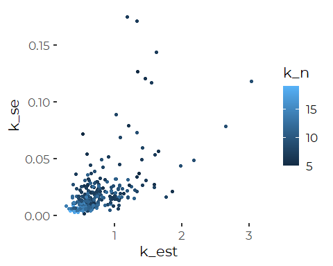
There is a strong location-scale relationship. We have tighter estimates
of k from sites and dates with low k conditions, while precision is much
lower for sites with high k. This presumably reflects either
non-linearities in light extinction, or just higher variance in light
measurements at lower light (higher k).

The pattern is even clearer after log-log transform. (This is
principally for display purposes. The log of the standard error is not
the standard error of the logs).

``` r
ggplot(k_data, aes(log10(k_est), log10(k_se), color = k_n)) +
  geom_point()
```

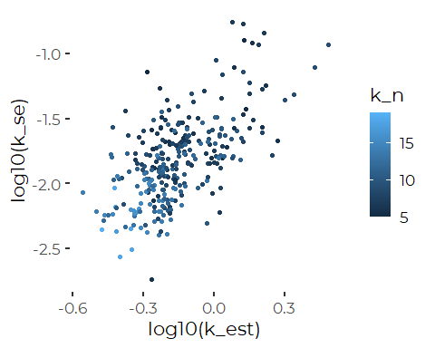

There is a fair amount of scatter between estimated standard error at
each K value. The standard errors are usually about an order of
magnitude to an order of magnitude and a half smaller that the
estimates, so we are talking about differences on the order of a factor
of 10 to 50 times smaller than the estimates. We may be able to get away
with ignoring this in our analysis, but we should be aware that the
problem exists. If we ignore this variation in precision we will
over-represent low-precision high values in any regression.

Given the strong heteroskedasticity and scale-location relationship
(even after log transformation of the K data), simple linear regressions
are likely to be problematic. Weighted analyses are likely perform
better.

## Means and SE of k by Site

These are “raw” estimates and do not account for the uncertainty of
individual estimates of K, as reflected in the standard errors (`k_se`)
in the data.

### Create Geometric Mean Function

``` r
gm_mean <- function(x) {
  exp(mean(log(x), na.rm = TRUE))
}
```

``` r
k_means <- k_data %>%
  group_by(site) %>%
  summarize(site_name = first(site_name),
            k_n_tot = sum(k_n),
            k_vals  =  sum(! is.na(k_est)),
            k_mean  = mean(k_est),
            k_se    = sd(k_est)/sqrt(sum(! is.na(k_est))),
            k_gm    = gm_mean(k_est)) %>%
  relocate(site_name)
k_means
#> # A tibble: 26 x 7
#>    site_name                      site  k_n_tot k_vals k_mean    k_se  k_gm
#>    <chr>                          <fct>   <dbl>  <int>  <dbl>   <dbl> <dbl>
#>  1 CLAPBOARD ISLAND - P7CBI       P7CBI     207     18  0.412  0.0183 0.405
#>  2 FORE RIVER - FR09              FR09      418     30  0.497  0.0128 0.492
#>  3 FORT GORGES - P6FGG            P6FGG     193     18  0.497  0.0241 0.487
#>  4 FORE RIVER - FR07              FR07       43      3  0.564  0.0624 0.557
#>  5 FORE RIVER - FR05A             FR05A      14      1  0.595 NA      0.595
#>  6 HARRASEEKET RIVER - HR05       HR05       42      3  0.608  0.0441 0.605
#>  7 FORE RIVER - FR04              FR04       55      4  0.616  0.0368 0.613
#>  8 BANDM RAILROAD TRESTLE - BMR02 BMR02     237     28  0.629  0.0149 0.624
#>  9 LONG CREEK - LC02              LC02       29      4  0.629  0.0411 0.625
#> 10 HARRASEEKET RIVER - HR04       HR04       39      3  0.646  0.0192 0.645
#> # ... with 16 more rows
```

## Seasonal Patterns

### Graphic

``` r
ggplot(k_data, aes(doy, k_est)) +
  geom_point(aes(color = factor(year))) +
  #geom_smooth(method = 'gam', formula = y~ s(x)) +
  #geom_linerange(aes(ymin = k_est - k_se, ymax = k_est + k_se)) +
  scale_y_log10() +
  scale_color_manual(values = cbep_colors()) +
  theme_cbep(base_size = 10) +
  facet_wrap("site")
```


## Initial Impressions

Highest light attenuation occurs in the Royal River and Cousins River
Sites. These are areas with high levels of suspended sediments.

Most Fore River sites show low light attenuation. This presumably
reflects the high influence of offshore tidal waters on water quality
around Portland.

Time of year matters relatively little for most sites, but it does
appear to be significant for some of the sites where we have more data,
and (suspiciously) for a few where we have very little data.

Seasonal patterns are not consistent among sites. In most cases, light
attenuation drops slightly over the course of the summer. The upper
Presumpscot River site shows an s shaped pattern with time of year,
first increasing, then decreasing and leveling off.

We can fit models looking at light attenuation coefficients by site,
year and day of the year, but site PRV70 shows a complex seasonal
pattern, while other sites do not appear to do so. That forces any
single large model that fully accommodates seasonal patterns to be
fairly complex.

# Analysis

A log transform helps with model diagnostics, although it does not
completely eliminate skewness in the residuals or a marked
location-scale relationship. We extract predicted values from our
regressions by back transforming from the log transform, thus making
predictions akin to geometric means.

## Strategy

We have two main considerations here:

1.  Should we use weighted regressions? We have standard error estimates
    for each estimate of k, so in principle we can weight by the inverse
    of the estimated variances. But this faces some technical
    challenges.

2.  Should we use hierarchical models, so we can “borrow” measures of
    uncertainty from our better sampled sites to enhance uncertainty
    estimates for the less well studied sites?

We tested both approaches by looking only at sites for which we have
substantial data. We then applied our preferred model(s) to the full
data set. Here we skip the preliminary models.

## Linear Models

### Unweighted Models

A log transform helps with model diagnostics, although it does not
completely eliminate skewness in the residuals or a marked
location-scale relationship. We extract predicted values from this
regression by back transforming from the log transform, thus making
these location predictions akin to geometric means.

``` r
lim_lm <- lm(log(k_est) ~ factor(year) +  doy + site + site:doy, data = k_data,
             subset = site %in% preferred_sites)
```

``` r
anova(lim_lm)
#> Analysis of Variance Table
#> 
#> Response: log(k_est)
#>               Df  Sum Sq Mean Sq F value    Pr(>F)    
#> factor(year)   4  1.0993 0.27482  5.4904 0.0003206 ***
#> doy            1  0.1505 0.15052  3.0072 0.0843829 .  
#> site           8 16.8987 2.11234 42.2014 < 2.2e-16 ***
#> doy:site       8  1.2825 0.16031  3.2027 0.0018876 ** 
#> Residuals    207 10.3611 0.05005                      
#> ---
#> Signif. codes:  0 '***' 0.001 '**' 0.01 '*' 0.05 '.' 0.1 ' ' 1
```

``` r
summary(lim_lm)
#> 
#> Call:
#> lm(formula = log(k_est) ~ factor(year) + doy + site + site:doy, 
#>     data = k_data, subset = site %in% preferred_sites)
#> 
#> Residuals:
#>      Min       1Q   Median       3Q      Max 
#> -0.59779 -0.11706 -0.02817  0.08999  0.86243 
#> 
#> Coefficients:
#>                    Estimate Std. Error t value Pr(>|t|)    
#> (Intercept)      -0.9719196  0.2704878  -3.593 0.000408 ***
#> factor(year)2017  0.0222832  0.1410218   0.158 0.874601    
#> factor(year)2018 -0.1171698  0.1395311  -0.840 0.402023    
#> factor(year)2019  0.0306533  0.1391698   0.220 0.825887    
#> factor(year)2020 -0.0671920  0.1403881  -0.479 0.632717    
#> doy               0.0004673  0.0010993   0.425 0.671195    
#> siteFR09          0.0789453  0.3036061   0.260 0.795103    
#> siteP6FGG         0.0397853  0.3372267   0.118 0.906199    
#> siteBMR02         0.3989930  0.3003820   1.328 0.185546    
#> siteEEB18         0.7221121  0.3003820   2.404 0.017099 *  
#> siteCBPR          0.6335105  0.3035770   2.087 0.038129 *  
#> sitePR-28         1.2076890  0.2983046   4.049 7.28e-05 ***
#> sitePR-17         1.5915375  0.3078082   5.171 5.49e-07 ***
#> sitePRV70         1.6552933  0.3080633   5.373 2.07e-07 ***
#> doy:siteFR09      0.0005490  0.0014327   0.383 0.701982    
#> doy:siteP6FGG     0.0006854  0.0015833   0.433 0.665530    
#> doy:siteBMR02     0.0001932  0.0014076   0.137 0.890954    
#> doy:siteEEB18    -0.0011698  0.0014076  -0.831 0.406907    
#> doy:siteCBPR     -0.0007681  0.0014082  -0.545 0.586052    
#> doy:sitePR-28    -0.0029963  0.0013917  -2.153 0.032472 *  
#> doy:sitePR-17    -0.0033581  0.0014303  -2.348 0.019825 *  
#> doy:sitePRV70    -0.0033130  0.0014304  -2.316 0.021528 *  
#> ---
#> Signif. codes:  0 '***' 0.001 '**' 0.01 '*' 0.05 '.' 0.1 ' ' 1
#> 
#> Residual standard error: 0.2237 on 207 degrees of freedom
#> Multiple R-squared:  0.6522, Adjusted R-squared:  0.6169 
#> F-statistic: 18.49 on 21 and 207 DF,  p-value: < 2.2e-16
```

Overall, day of year is not a significant predictor of K, but it is a
significant predictor at several Presumpscot River sites. (Analysis of
all sites suggests that may be true of some other riverine sites too,
but data is to limited at most sites to draw any conclusions (analysis
not shown).

In unweighted models, there is evidence for year to year variation.
There is a pattern with improving light penetration over the course of
the year at some sites. Because of uneven sampling, the sequential sums
of squares are dependent on the sequence in which terms are entered into
the models, but all terms are important.

``` r
oldpar <- par(mfrow = c(2,2))
plot(lim_lm)
```

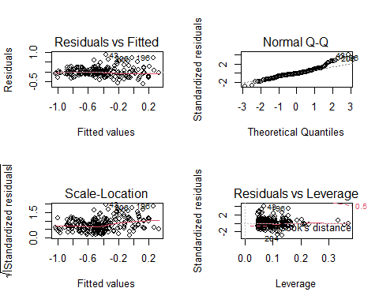

``` r
par(oldpar)
```

Model diagnostics are not great, although they are slightly better when
based only on the sites with substantial data. But all sites and
preferred sites models show strong location-scale patterns.

### Weighted Models

In a conventional weighted linear model, we would weight observations by
the inverse of their estimated variances, but here we are taking the log
transform of our estimates, and conducting regressions on those values.

Ideally, we want to weight by the square of the estimated standard error
of the log of K. We do not have that estimate, so we substitute the
square of the log of the standard error of K. That is not a mathematical
identity, but it should produce a weighted regression that performs
adequately. An alternative would be to formally model the location-scale
relationship, but I believe this makes better use of our knowledge of
model uncertainty that underlies our estimates of k.

``` r
lim_wlm <- lm(log(k_est) ~ factor(year) +  doy + site + site:doy, 
              weights = 1/(log(k_se)^2), data = k_data,
             subset = site %in% preferred_sites)
```

``` r
anova(lim_wlm)
#> Analysis of Variance Table
#> 
#> Response: log(k_est)
#>               Df  Sum Sq  Mean Sq F value    Pr(>F)    
#> factor(year)   4 0.12990 0.032476  8.5272 2.178e-06 ***
#> doy            1 0.03096 0.030957  8.1284  0.004799 ** 
#> site           8 1.29408 0.161760 42.4734 < 2.2e-16 ***
#> doy:site       8 0.08552 0.010690  2.8070  0.005662 ** 
#> Residuals    207 0.78836 0.003809                      
#> ---
#> Signif. codes:  0 '***' 0.001 '**' 0.01 '*' 0.05 '.' 0.1 ' ' 1
```

``` r
summary(lim_wlm)
#> 
#> Call:
#> lm(formula = log(k_est) ~ factor(year) + doy + site + site:doy, 
#>     data = k_data, subset = site %in% preferred_sites, weights = 1/(log(k_se)^2))
#> 
#> Weighted Residuals:
#>       Min        1Q    Median        3Q       Max 
#> -0.169765 -0.031750 -0.007428  0.017384  0.277891 
#> 
#> Coefficients:
#>                    Estimate Std. Error t value Pr(>|t|)    
#> (Intercept)      -1.004e+00  3.442e-01  -2.916  0.00394 ** 
#> factor(year)2017  1.723e-02  1.894e-01   0.091  0.92761    
#> factor(year)2018 -1.358e-01  1.880e-01  -0.722  0.47113    
#> factor(year)2019  4.914e-02  1.876e-01   0.262  0.79359    
#> factor(year)2020 -4.518e-02  1.881e-01  -0.240  0.81041    
#> doy               6.632e-04  1.366e-03   0.486  0.62777    
#> siteFR09          1.312e-01  3.919e-01   0.335  0.73819    
#> siteP6FGG         1.527e-01  4.124e-01   0.370  0.71150    
#> siteBMR02         4.206e-01  3.707e-01   1.135  0.25786    
#> siteEEB18         6.946e-01  3.572e-01   1.944  0.05321 .  
#> siteCBPR          7.992e-01  3.565e-01   2.242  0.02604 *  
#> sitePR-28         1.456e+00  3.611e-01   4.031 7.80e-05 ***
#> sitePR-17         1.819e+00  3.417e-01   5.323 2.64e-07 ***
#> sitePRV70         1.524e+00  3.431e-01   4.441 1.46e-05 ***
#> doy:siteFR09      2.585e-04  1.849e-03   0.140  0.88893    
#> doy:siteP6FGG     2.574e-04  1.939e-03   0.133  0.89454    
#> doy:siteBMR02     4.456e-05  1.742e-03   0.026  0.97962    
#> doy:siteEEB18    -1.129e-03  1.697e-03  -0.666  0.50642    
#> doy:siteCBPR     -1.461e-03  1.672e-03  -0.874  0.38324    
#> doy:sitePR-28    -3.955e-03  1.698e-03  -2.329  0.02081 *  
#> doy:sitePR-17    -4.107e-03  1.614e-03  -2.544  0.01168 *  
#> doy:sitePRV70    -2.502e-03  1.593e-03  -1.570  0.11783    
#> ---
#> Signif. codes:  0 '***' 0.001 '**' 0.01 '*' 0.05 '.' 0.1 ' ' 1
#> 
#> Residual standard error: 0.06171 on 207 degrees of freedom
#> Multiple R-squared:  0.6615, Adjusted R-squared:  0.6271 
#> F-statistic: 19.26 on 21 and 207 DF,  p-value: < 2.2e-16
```

The general conclusions are similar. Time of year matters at several our
riverine sites. Some years are better than others. Sites differ, with
sites influenced by freshwater likely to have higher light extinction
coefficients. (Notice that standard errors are slightly higher in this
model, because of the weighting. That is expected.)

``` r
oldpar <- par(mfrow = c(2,2))
plot(lim_wlm)
```

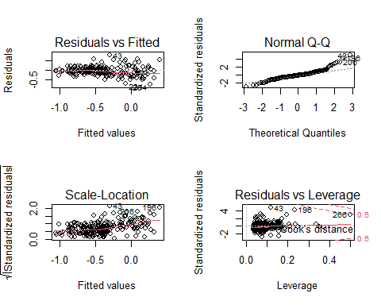

``` r
par(oldpar)
```

Model diagnostics are perhaps slightly better, but still not great.
Residuals tend to be larger (as expected).

#### Reduced Weighted Models

We explore a model that omits the Day of Year. While day of the year is
important in our models, it complicates presentation of results, and has
only modest effect on predictions of “typical” conditions at each site,
which is our main interest here.

``` r
small_wlm <- lm(log(k_est) ~ factor(year) +  site , 
              weights = 1/(log(k_se)^2), data = k_data,
              subset = site %in% preferred_sites)
```

``` r
anova(small_wlm)
#> Analysis of Variance Table
#> 
#> Response: log(k_est)
#>               Df  Sum Sq  Mean Sq F value    Pr(>F)    
#> factor(year)   4 0.12990 0.032476   7.661 8.636e-06 ***
#> site           8 1.28327 0.160408  37.840 < 2.2e-16 ***
#> Residuals    216 0.91566 0.004239                      
#> ---
#> Signif. codes:  0 '***' 0.001 '**' 0.01 '*' 0.05 '.' 0.1 ' ' 1
summary(small_wlm)
#> 
#> Call:
#> lm(formula = log(k_est) ~ factor(year) + site, data = k_data, 
#>     subset = site %in% preferred_sites, weights = 1/(log(k_se)^2))
#> 
#> Weighted Residuals:
#>       Min        1Q    Median        3Q       Max 
#> -0.132023 -0.039964 -0.009383  0.023662  0.315841 
#> 
#> Coefficients:
#>                   Estimate Std. Error t value Pr(>|t|)    
#> (Intercept)      -0.857520   0.206240  -4.158 4.63e-05 ***
#> factor(year)2017 -0.003749   0.198045  -0.019   0.9849    
#> factor(year)2018 -0.145558   0.196430  -0.741   0.4595    
#> factor(year)2019  0.045993   0.195921   0.235   0.8146    
#> factor(year)2020 -0.090300   0.196528  -0.459   0.6464    
#> siteFR09          0.194729   0.092094   2.114   0.0356 *  
#> siteP6FGG         0.208437   0.093822   2.222   0.0273 *  
#> siteBMR02         0.442004   0.087283   5.064 8.79e-07 ***
#> siteEEB18         0.474589   0.085153   5.573 7.41e-08 ***
#> siteCBPR          0.506077   0.085222   5.938 1.14e-08 ***
#> sitePR-28         0.642492   0.086006   7.470 1.96e-12 ***
#> sitePR-17         0.983845   0.083530  11.778  < 2e-16 ***
#> sitePRV70         0.995882   0.084475  11.789  < 2e-16 ***
#> ---
#> Signif. codes:  0 '***' 0.001 '**' 0.01 '*' 0.05 '.' 0.1 ' ' 1
#> 
#> Residual standard error: 0.06511 on 216 degrees of freedom
#> Multiple R-squared:  0.6068, Adjusted R-squared:  0.585 
#> F-statistic: 27.78 on 12 and 216 DF,  p-value: < 2.2e-16
```

``` r
oldpar <- par(mfrow = c(2,2))
plot(small_wlm)
```

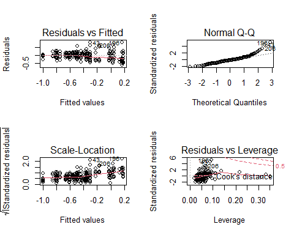

``` r
par(oldpar)
```

Model diagnostics are not great here either, although there are no
points with high leverage, the scale-location relationship is still
strong.

### “Adjusted” Means by Site

``` r
cat("Unweighted Linear Model\n")
#> Unweighted Linear Model
(emms_uw <- emmeans(lim_lm, 'site', at = list(doy = 200), type = 'response'))
#> NOTE: Results may be misleading due to involvement in interactions
#>  site  response     SE  df lower.CL upper.CL
#>  P7CBI    0.405 0.0245 207    0.359    0.456
#>  FR09     0.489 0.0216 207    0.448    0.533
#>  P6FGG    0.483 0.0295 207    0.428    0.545
#>  BMR02    0.627 0.0321 207    0.567    0.694
#>  EEB18    0.659 0.0338 207    0.596    0.729
#>  CBPR     0.654 0.0344 207    0.590    0.725
#>  PR-28    0.744 0.0376 207    0.673    0.821
#>  PR-17    1.015 0.0566 207    0.910    1.133
#>  PRV70    1.092 0.0596 207    0.980    1.216
#> 
#> Results are averaged over the levels of: year 
#> Confidence level used: 0.95 
#> Intervals are back-transformed from the log scale
cat("Weighted Linear Model\n")
#> Weighted Linear Model
(emms_w <- emmeans(lim_wlm, 'site', at = list(doy = 200), type = 'response'))
#> NOTE: Results may be misleading due to involvement in interactions
#>  site  response     SE  df lower.CL upper.CL
#>  P7CBI    0.409 0.0313 207    0.352    0.476
#>  FR09     0.491 0.0290 207    0.437    0.552
#>  P6FGG    0.502 0.0364 207    0.435    0.579
#>  BMR02    0.628 0.0393 207    0.556    0.711
#>  EEB18    0.654 0.0387 207    0.582    0.735
#>  CBPR     0.679 0.0408 207    0.603    0.765
#>  PR-28    0.795 0.0484 207    0.705    0.897
#>  PR-17    1.109 0.0639 207    0.990    1.242
#>  PRV70    1.138 0.0686 207    1.011    1.282
#> 
#> Results are averaged over the levels of: year 
#> Confidence level used: 0.95 
#> Intervals are back-transformed from the log scale
cat("Simpler Weighted Linear Model\n")
#> Simpler Weighted Linear Model
(emms_small <- emmeans(small_wlm, 'site', at = list(doy = 200), 
                       type = 'response'))
#>  site  response     SE  df lower.CL upper.CL
#>  P7CBI    0.408 0.0326 216    0.349    0.478
#>  FR09     0.496 0.0301 216    0.440    0.559
#>  P6FGG    0.503 0.0378 216    0.433    0.583
#>  BMR02    0.635 0.0413 216    0.558    0.722
#>  EEB18    0.656 0.0408 216    0.580    0.741
#>  CBPR     0.677 0.0421 216    0.599    0.765
#>  PR-28    0.776 0.0491 216    0.685    0.879
#>  PR-17    1.092 0.0658 216    0.969    1.229
#>  PRV70    1.105 0.0676 216    0.979    1.246
#> 
#> Results are averaged over the levels of: year 
#> Confidence level used: 0.95 
#> Intervals are back-transformed from the log scale
```

All models are producing similar results. Differences are just large
enough to be of interest.

#### Importance of Interactions?

We have to take the warnings about interactions seriously. The
interaction is with day of the year. We can visualize the patterns as
follows. (Adding standard errors to the plot makes it too complex to
interpret, but SEs are fairly large. We have too little data for most
sites to evaluate trend.)

``` r
emmip(lim_wlm, site ~ doy, variable = 'doy', type = 'predict',
      at = list(doy = seq(100, 300, by = 10)), CIs = FALSE) +
  theme_cbep()
```

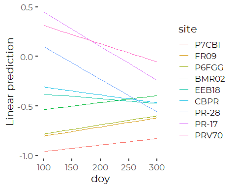

Remember that sites are ordered by mean k value, so values are highest
at the Presumpscot stations, and lowest at the Fore River station.

Remember, this model left out nonlinearities in response to day of year
response at PRV70, hiding a seasonal pattern there.

The Presumpscot River stations see improvements in light penetration
over the course of the spring and summer. They are among our sites with
the highest k values, and remain so regardless of time of year. (Rank
order of sites changes little over the course of the year.) The
interaction does not qualitatively change our understanding.

Unfortunately, for most sites (not shown in this restricted data set),
we have data from too few dates for seasonal relationships to be taken
seriously. A few sites show apparent seasonal trends, based on just a
handful of dates from one year. While those sites influence model
selection, the reality is, the trends can’t be trusted. We would have to
leave those sites out of any analysis that looks at seasonal patterns,
so we need to chose whether to model seasonal trends or include all
sites in the analysis. We chose to include all sites, and thus must omit
the seasonal predictor from the models.

``` r
plot(emms_w) + 
  theme(axis.text.x = element_text(size = 12, angle = 90, vjust = 0.25)) +
  xlab('k (1/m)') +
  ylab('') +
  coord_flip()
```

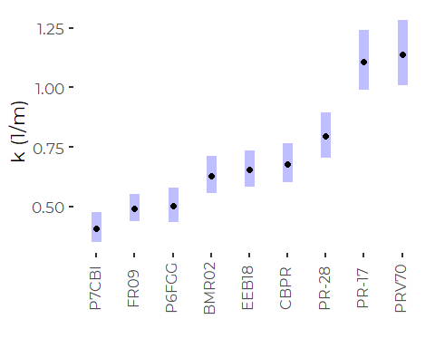

``` r
plot(emms_small) +
  theme(axis.text.x = element_text(size = 12, angle = 90, vjust = 0.25)) +
  xlab('k (1/m)') +
  ylab('') +
  coord_flip()
```

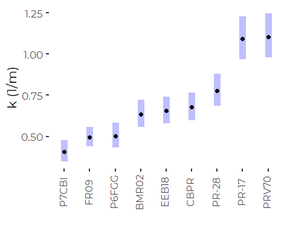

There is no apparent difference in the qualitative meaning we might draw
from these two models.

### Compare Model Estimates and Observed Means

#### Unweighted to Observed

``` r
results <- as_tibble(emms_uw) %>%
  left_join(k_means, by = 'site') %>%
  rename(em_mn = response,
         em_se = SE,
         k_mn = k_mean,
         k_se = k_se)

ggplot(results, aes(k_mn, em_mn)) +
  geom_point() +
  geom_text(aes(label = site), nudge_x = 0.1, size = 2) +
  geom_linerange(aes(ymin = em_mn - em_se, ymax = em_mn + em_se )) +
  geom_linerange(aes(xmin = k_mn - k_se, xmax = k_mn + k_se )) +
  geom_abline(slope = 1, intercept = 0) +
  xlab('Simple Means') +
  ylab('Estimated Marginal Means') +
  coord_equal() +
  ggtitle('Unweighted Regression') +
  theme_cbep(base_size = 12)
```

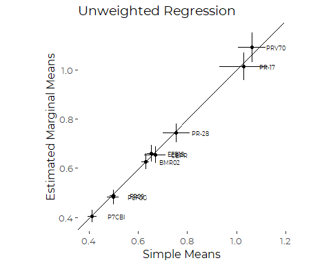

The primary effect of using marginal means from a regression model is to
narrow the standard errors.

#### Weighted to Observed

``` r
results <- as_tibble(emms_w) %>%
  left_join(k_means, by = 'site') %>%
  rename(em_mn = response,
         em_se = SE,
         k_mn = k_mean,
         k_se = k_se)

ggplot(results, aes(k_mn, em_mn)) +
  geom_point() +
  geom_text(aes(label = site), nudge_x = 0.1, size = 2) +
  geom_linerange(aes(ymin = em_mn - em_se, ymax = em_mn + em_se )) +
  geom_linerange(aes(xmin = k_mn - k_se, xmax = k_mn + k_se )) +
  geom_abline(slope = 1, intercept = 0) +
  xlab('Simple Means') +
  ylab('Estimated Marginal Means') +
  coord_equal() +
  ggtitle('Weighted Regression') +
  theme_cbep(base_size = 12)
```

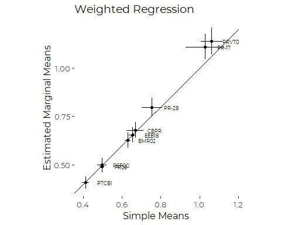

Weighted models downweights the higher k sites, which had higher
uncertainty in the source regressions. The weighted regression does not
match the observed means as closely as the unweighted regression at the
higher end. That is expected, and a direct – and not unreasonable –
consequence of weighting.

#### Small Model to Observed

``` r
results <- as_tibble(emms_small) %>%
  left_join(k_means, by = 'site') %>%
  rename(em_mn = response,
         em_se = SE,
         k_mn = k_mean,
         k_se = k_se)

ggplot(results, aes(k_mn, em_mn)) +
  geom_point() +
  geom_text(aes(label = site), nudge_x = 0.15, size = 2) +
  geom_linerange(aes(ymin = em_mn - em_se, ymax = em_mn + em_se )) +
  geom_linerange(aes(xmin = k_mn - k_se, xmax = k_mn + k_se )) +
  geom_abline(slope = 1, intercept = 0) +
  xlab('Simple Means') +
  ylab('Estimated Marginal Means') +
  coord_equal() +
  ggtitle('Smaller Model') +
  theme_cbep(base_size = 12)
```

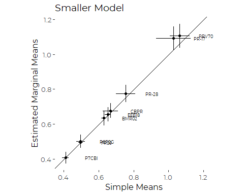
Dropping the Day of the Year term makes almost no difference. We make
that point even more strongly in the next figure.

### Compare Model Results

#### Full Weighted Model to Small Model

``` r
results <- as_tibble(emms_w) %>%
  left_join(as_tibble(emms_small), by = 'site') %>%
  rename(w_est = response.x,
         w_se = SE.x,
         small_est = response.y,
         small_se =SE.y)

ggplot(results, aes(w_est, small_est)) +
  geom_point() +
  geom_text(aes(label = site), nudge_x = 0.1, size = 2) +
  geom_linerange(aes(ymin = small_est - small_se, ymax = small_est + small_se)) +
  geom_linerange(aes(xmin = w_est - w_se, xmax = w_est + w_se )) +
  geom_abline(slope = 1, intercept = 0) +
  xlab('Larger Model') +
  ylab('Smaller Model') +
  coord_equal() +
  ggtitle('Compare With and Without DOY') +
  theme_cbep(base_size = 12)
```

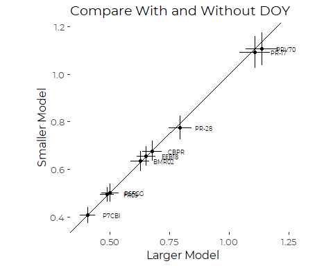

Very little difference.

#### Weighted to Unweighted Models

``` r
results <- as_tibble(emms_w) %>%
  left_join(as_tibble(emms_uw), by = 'site') %>%
  rename(w_est = response.x,
         w_se = SE.x,
         uw_est = response.y,
         uw_se =SE.y)

ggplot(results, aes(w_est, uw_est)) +
  geom_point() +
  geom_text(aes(label = site), nudge_x = 0.1, size = 2) +
  geom_linerange(aes(ymin = uw_est - uw_se, ymax = uw_est + uw_se)) +
  geom_linerange(aes(xmin = w_est - w_se, xmax = w_est + w_se )) +
  geom_abline(slope = 1, intercept = 0) +
  xlab('Weighted Model') +
  ylab('Unweighted Model') +
  coord_equal() +
  ggtitle('Compare Weighted to Unweighted') +
  theme_cbep(base_size = 12)
```

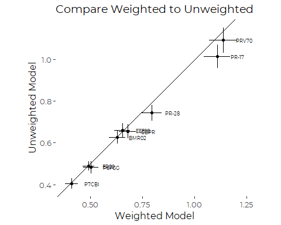

The weighted model alters estimates slightly, (Leading to slightly lower
estimates of means) but it makes no real difference to qualitative
conclusions.

So For the sites where have substantial data:  
1. The “adjusted” marginal means (of several log models) are very close
to the raw means.  
2. Rank order of sites is basically unchanged under any of the models.  
3. Errors from the models are smaller than the standard error of the
means.  
4. The weighted regression model produces estimates close to observed
means for medium and small values, but does not do as well at large
values.  
5. Models with and without a Day of the Year term generate similar
qualitative results.  
5. We have a remaining location-scale relationship, which makes these
models somewhat suspect for estimating standard errors. There is little
we can do with a conventional linear model to address that.

### Hierarchical Model

We would like to map sites by k value using GIS. We want to compare all
sites for which we have data, including those for which we have limited
data, despite different sampling histories. Hierarchical models are a
good way to go. By treating year as a random factor, we can effectively
borrow information from other sites to estimate long-term “typical”
condition for sites that were sampled rarely, while correcting for any
bias introduced by having data from only some years.

We chose to omit consideration of seasonal pattern, largely because the
data is too sparse at most sites to evaluate a full seasonal model We
are leaving out a known source of variation by doing so, but the
previous analysis showed that the effect is small compared do
differences between sites, which is our focus here.

We rely on the `mgcv` package. It provides a convenient approach to
simple hierarchical modeling, by specifying a hierarchical model via a
“random effects” smoother, via `s(x, bs = 're')`.

``` r
the_hmod <- gam(log(k_est) ~ site +  s(yearf, bs = 're'),
                 data = k_data,
              weights = 1/(log(k_se)^2) )
```

``` r
anova(the_hmod)
#> 
#> Family: gaussian 
#> Link function: identity 
#> 
#> Formula:
#> log(k_est) ~ site + s(yearf, bs = "re")
#> 
#> Parametric Terms:
#>      df     F p-value
#> site 25 20.45  <2e-16
#> 
#> Approximate significance of smooth terms:
#>            edf Ref.df     F  p-value
#> s(yearf) 2.493  4.000 3.958 0.000192
```

``` r
oldpar <- par(mfrow = c(2,2))
gam.check(the_hmod)
```

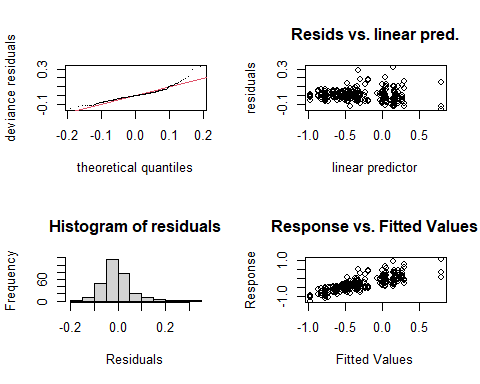

    #> 
    #> Method: GCV   Optimizer: magic
    #> Smoothing parameter selection converged after 9 iterations.
    #> The RMS GCV score gradient at convergence was 2.422093e-07 .
    #> The Hessian was positive definite.
    #> Model rank =  31 / 31 
    #> 
    #> Basis dimension (k) checking results. Low p-value (k-index<1) may
    #> indicate that k is too low, especially if edf is close to k'.
    #> 
    #>            k'  edf k-index p-value
    #> s(yearf) 5.00 2.49      NA      NA
    par(oldpar)

This model performs slightly better than the basic linear models did.
Residuals are still moderately skewed, and we see a bit of what may be a
remaining scale-location relationship. But the diagnostics are not
dreadful.

### Results

``` r
(emms_hm <- emmeans(the_hmod, 'site', at = list(doy = 200), type = 'response'))
#>  site  response     SE  df lower.CL upper.CL
#>  P7CBI    0.405 0.0289 264    0.352    0.466
#>  FR09     0.493 0.0287 264    0.440    0.553
#>  P6FGG    0.499 0.0330 264    0.438    0.569
#>  FR07     0.565 0.1046 264    0.393    0.814
#>  FR05A    0.598 0.2026 264    0.307    1.166
#>  HR05     0.607 0.1124 264    0.422    0.874
#>  FR04     0.615 0.1053 264    0.439    0.861
#>  BMR02    0.627 0.0340 264    0.564    0.698
#>  LC02     0.633 0.0944 264    0.472    0.849
#>  HR04     0.647 0.1181 264    0.451    0.927
#>  EEB18    0.648 0.0328 264    0.587    0.716
#>  CBPR     0.668 0.0338 264    0.605    0.738
#>  FR03     0.693 0.1038 264    0.516    0.931
#>  FR05B    0.722 0.2282 264    0.388    1.345
#>  PR-28    0.766 0.0398 264    0.691    0.848
#>  HR03     0.790 0.1260 264    0.577    1.082
#>  RR-19    0.936 0.1094 264    0.744    1.178
#>  PR-17    1.077 0.0515 264    0.980    1.183
#>  HR02     1.047 0.1675 264    0.765    1.435
#>  PRV70    1.090 0.0535 264    0.990    1.201
#>  RR-01    1.146 0.1019 264    0.962    1.366
#>  RR-13    1.198 0.0987 264    1.019    1.409
#>  RR-06    1.269 0.1110 264    1.068    1.508
#>  RR-20    1.148 0.1627 264    0.868    1.518
#>  CR-31    1.305 0.1523 264    1.037    1.642
#>  CR-44    2.151 0.2520 264    1.708    2.709
#> 
#> Results are averaged over the levels of: yearf 
#> Confidence level used: 0.95 
#> Intervals are back-transformed from the log scale
```

Note that the hierarchical model allows us to estimate means and
standard errors for all sites, even those with data from only a single
year. Those estimates should be viewed with skepticism, but they are
better than no estmates at all.

#### Compare Hierarchical Model To Weighted Linear Model

``` r
results <- as_tibble(emms_small) %>%
  left_join(as_tibble(emms_hm), by = 'site') %>%
  rename(lm_est = response.x,
         lm_se = SE.x,
         hm_est = response.y,
         hm_se =SE.y)

ggplot(results, aes(lm_est, hm_est)) +
  geom_point() +
  geom_text(aes(label = site), nudge_x = 0.15, size = 2) +
  geom_linerange(aes(ymin = hm_est - hm_se, ymax = hm_est + hm_se)) +
  geom_linerange(aes(xmin = lm_est - lm_se, xmax = lm_est + lm_se )) +
  geom_abline(slope = 1, intercept = 0) +
  xlab('Full Model') +
  ylab('Hierarchical Model') +
  coord_equal() +
  ggtitle('Compare Hierarchical Model') +
  theme_cbep(base_size = 12)
```


The hierarchical model produces predictions very similar to a
non-hierarchical model. (In other analysis, we identified that including
a DOY term strongly biases estimates of marginal means at CR-44, where
three K values suggest a very steep and implausible seasonal trend.
Graphic not shown.)

# Save Results

We conclude that the Hierarchical (and weighted) model provides the best
summary of the data for mapping purposes. We assemble a data frame with
the observed means and standard errors, and estimated marginal means and
standard errors from the hierarchical model.

``` r
results <- as_tibble(emms_hm) %>%
  left_join(k_means, by = 'site') %>%
  rename(em_mn = response,
         em_se = SE,
         light_observs = k_n_tot,
         k_observs = k_vals) %>% 
  relocate(site, site_name, k_mean, k_se, k_gm, k_observs, light_observs)
```

# Export Results for GIS

``` r
write_csv(results, file.path(sibling, 'k_summary_by_site.csv') )
```

# Draft Graphics

With the analysis in hand, we can see that different models have
relatively low impact on predictions. The primary value of these models
will be in estimating standard errors in ways that allow us to lean on
data from sites with more data to help constrain variability at sites
where we lack data. The best way to look at that will be through very
simple hierarchical models that treat year as a random variable.

## Point Chart Based on Observed Means

``` r
k_means %>%
  mutate(site = fct_reorder(site, k_mean)) %>%
  ggplot(aes(site, k_mean)) +
  geom_pointrange(aes(ymin = k_mean - 2 * k_se, ymax = k_mean + 2 * k_se),
                  size = .75, color = cbep_colors()[5]) +
  geom_point(data = k_data,  mapping = aes(site, k_est), alpha = 0.25) +
  
  theme_cbep(base_size = 12) +
  ylab(expression(paste('k (',  m^-1, ')', sep = ''))) +
  xlab('') +
  
  theme(axis.text.x = element_text(angle = 90, vjust = 0.25))
#> Warning: Removed 2 rows containing missing values (geom_segment).
```

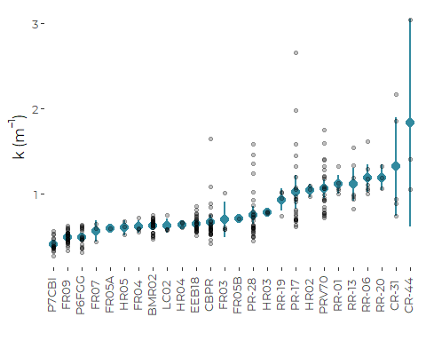

## Point Chart based on Hierarchical Models

``` r
results %>%
  mutate(site = fct_reorder(site, em_mn)) %>%
  ggplot(aes(site, em_mn)) +
 
  geom_pointrange(aes(ymin = lower.CL, ymax = upper.CL),
                  size = .75, color = cbep_colors()[5]) +
  geom_point(data = k_data,  mapping = aes(site, k_est), alpha = 0.25) +
  
  theme_cbep(base_size = 12) +
  ylab(expression(paste('k (',  m^-1, ')', sep = ''))) +
  xlab('') +
  
  theme(axis.text.x = element_text(angle = 90, vjust = 0.25))
```

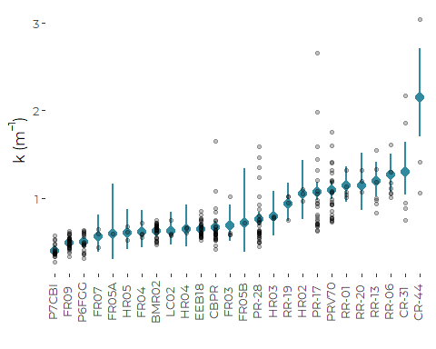
