Analysis of Maine DEP Nutrient Data from Casco Bay
================
Curtis C. Bohlen, Casco Bay Estuary Partnership.
04/26/2021

-   [Introduction](#introduction)
-   [Folder References](#folder-references)
-   [Load Data](#load-data)
-   [Surface Data Only](#surface-data-only)
    -   [Correct Misleading NH4 Values](#correct-misleading-nh4-values)
    -   [Add Shorter Site Names](#add-shorter-site-names)
    -   [Add DIN and Organic N](#add-din-and-organic-n)
-   [Data Subsets](#data-subsets)
    -   [Core Sites Data](#core-sites-data)
-   [Summary of Metadata](#summary-of-metadata)
    -   [QA/QC Samples](#qaqc-samples)
    -   [Data Quality Flags and Censoring
        Flags](#data-quality-flags-and-censoring-flags)
    -   [Units](#units)
-   [Nitrogen](#nitrogen)
    -   [Pairs Plot](#pairs-plot)
        -   [Ternary Diagrams](#ternary-diagrams)
-   [Descriptive Statistics](#descriptive-statistics)
-   [DIN Analysis](#din-analysis)
    -   [Data Prevalence](#data-prevalence)
    -   [Core Sites Data 2018-2020](#core-sites-data-2018-2020)
        -   [Histograms / Distributions](#histograms--distributions)
        -   [Draft Graphic](#draft-graphic)
        -   [Linear Models](#linear-models)
        -   [GAM Model](#gam-model)
-   [TN Analysis](#tn-analysis)
    -   [Core Sites Data 2018-2020](#core-sites-data-2018-2020-1)
        -   [Histograms / Distributions](#histograms--distributions-1)
        -   [Draft Graphic](#draft-graphic-1)
        -   [Linear Models](#linear-models-1)
        -   [GAM Model](#gam-model-1)
-   [N to P Ratios](#n-to-p-ratios)
    -   [Histograms / Distributions](#histograms--distributions-2)
    -   [Descriptive Statistics](#descriptive-statistics-1)
    -   [Draft Graphic](#draft-graphic-2)
    -   [GAM Model](#gam-model-2)
-   [Phosphorus (A Few Graphics)](#phosphorus-a-few-graphics)
-   [Chlorophyll and Phaeophytin (Graphics
    Only)](#chlorophyll-and-phaeophytin-graphics-only)
-   [Chlorophyll and Nutrients](#chlorophyll-and-nutrients)


# Introduction

This R Notebook focuses on analysis of patterns in nutrients
concentrations, especially total nitrogen, from a small number of “core”
locations sampled by Maine DEP regularly in 2018, 2019, and 2020. These
sites are all found close to Portland, Maine.

The focus is on documenting differences among sites, largely for display
in simple graphics and maps. However, we use linear models and GAMS to
check for seasonal patterns and correct for overall year to year
variation, which we (here) assume partially reflects weather and
temporal autocorrelation among sampling dates.

All data is relatively recent, so we do not attempt any trend analysis.

\#Load Libraries

``` r
library(tidyverse)
#> Warning: package 'tidyverse' was built under R version 4.0.5
#> -- Attaching packages --------------------------------------- tidyverse 1.3.1 --
#> v ggplot2 3.3.5     v purrr   0.3.4
#> v tibble  3.1.6     v dplyr   1.0.7
#> v tidyr   1.1.4     v stringr 1.4.0
#> v readr   2.1.0     v forcats 0.5.1
#> Warning: package 'ggplot2' was built under R version 4.0.5
#> Warning: package 'tidyr' was built under R version 4.0.5
#> Warning: package 'dplyr' was built under R version 4.0.5
#> Warning: package 'forcats' was built under R version 4.0.5
#> -- Conflicts ------------------------------------------ tidyverse_conflicts() --
#> x dplyr::filter() masks stats::filter()
#> x dplyr::lag()    masks stats::lag()
library(viridis)  # Normally not called directly, but we need it for the ternary
#> Warning: package 'viridis' was built under R version 4.0.5
#> Loading required package: viridisLite
#> Warning: package 'viridisLite' was built under R version 4.0.5
                  # plot color scale.
library(GGally)
#> Warning: package 'GGally' was built under R version 4.0.5
#> Registered S3 method overwritten by 'GGally':
#>   method from   
#>   +.gg   ggplot2
library(mgcv)
#> Warning: package 'mgcv' was built under R version 4.0.5
#> Loading required package: nlme
#> 
#> Attaching package: 'nlme'
#> The following object is masked from 'package:dplyr':
#> 
#>     collapse
#> This is mgcv 1.8-38. For overview type 'help("mgcv-package")'.
library(emmeans)
#> Warning: package 'emmeans' was built under R version 4.0.5
#> 
#> Attaching package: 'emmeans'
#> The following object is masked from 'package:GGally':
#> 
#>     pigs

library(Ternary) # Base graphics ternary plots
#> Warning: package 'Ternary' was built under R version 4.0.5

library(CBEPgraphics)
load_cbep_fonts()
theme_set(theme_cbep())
```

# Folder References

``` r
sibfldnm <- 'Derived_Data'
parent <- dirname(getwd())
sibling <- paste(parent,sibfldnm, sep = '/')

dir.create(file.path(getwd(), 'figures'), showWarnings = FALSE)
```

# Load Data

``` r
dep_data <- read_csv(file.path(sibling, 'dep_nutrient_data.csv'),
                     col_types = cols(
                       .default = col_logical(),
                       site_name = col_character(),
                       site = col_character(),
                       depth_designation = col_character(),
                       dt = col_date(format = ""),
                       month = col_character(),
                       year = col_double(),
                       time = col_time(format = ""),
                       hour = col_double(),
                       depth = col_double(),
                       chl = col_double(),
                       phaeo = col_double(),
                       nox_n = col_double(),
                       nh4_n = col_double(),
                       tn = col_double(),
                       op_p = col_double(),
                       tp = col_double(),
                       tss = col_double(),
                       `Sample Comments` = col_character(),
                       `Validation Comments` = col_character(),
                       Latitude = col_skip(),
                       Longitude = col_skip())) %>%
  rename(sample_date = dt)
```

# Surface Data Only

``` r
surface_data <- dep_data %>%
  filter(depth <= 1) %>%
  mutate(month = factor(month, levels = month.abb))%>%
  mutate(yearf = factor(year)) %>%
  mutate(doy = as.numeric(format(sample_date, format = '%j'))) %>%
  relocate(yearf, doy, .after = year)
```

There are a few sky-high NH4 values, at nominal concentrations of 0.4 or
4.0 mg.l NH4-N. All are flagged as “censored” (despite high values) and
carry annotations of excessive hold times. We delete them.

### Correct Misleading NH4 Values

``` r
surface_data <- surface_data %>%
  mutate(nh4_n = if_else(nh4_n > 0.3, NA_real_, nh4_n))
```

### Add Shorter Site Names

``` r
site_names <- read_csv(file.path(sibling, "GIS", 'dep_locations.csv')) %>%
  select(site, short_name)
#> Rows: 44 Columns: 5
#> -- Column specification --------------------------------------------------------
#> Delimiter: ","
#> chr (3): site_name, short_name, site
#> dbl (2): Latitude, Longitude
#> 
#> i Use `spec()` to retrieve the full column specification for this data.
#> i Specify the column types or set `show_col_types = FALSE` to quiet this message.
surface_data <- surface_data %>%
  left_join(site_names, by = 'site') %>%
  relocate(short_name, .after = site)
```

### Add DIN and Organic N

We can calculate DIN as the sum of ammonium and nitrate, and organic N
as the difference between DIN and TN

``` r
surface_data <- surface_data %>%
  mutate(din = nh4_n + nox_n,
         din_cens = nh4_n_cens | nox_n_cens,
         din_flag = nh4_n_flag | nox_n_flag,
         on       = tn - din,
         on_flag  = din_flag | tn_flag,
         on_cens_r  = din_flag)    #since this is calculated by difference
```

# Data Subsets

## Core Sites Data

``` r
core_sites <- surface_data %>%
  select(site, year, din) %>%
  filter(year == 2018) %>%
  filter(! is.na(din)) %>%
  select(-year, -din) %>%
  unique %>%
  arrange(site) %>%
  pull
core_sites
#> [1] "BMR02" "CBPR"  "EEB18" "FR09"  "P6FGG" "P7CBI" "PR-17" "PR-28" "PRV70"
```

``` r
core_data <- surface_data %>%
  filter(year > 2017) %>%
  filter(site %in% core_sites) %>%
  mutate(site = fct_reorder(factor(site), tn, na.rm = TRUE),
         short_name = fct_reorder(factor(short_name), tn, na.rm = TRUE))
```

``` r
rm(surface_data)
```

# Summary of Metadata

## QA/QC Samples

We conducted no analysis of QA/QC samples, and simply deleted then from
the data to avoid confusion.

## Data Quality Flags and Censoring Flags

While preparing our working data, we separated raw observations from
text annotations, including data quality flags.

We had “J”, ’J\*“,”B" and “JB” flags to contend with. While the metadata
we received from DEP did not include definitions of all flags, these are
conventionally used to indicate that values are to be treated as
“estimated values” because of uncertain precision, especially for values
between instrument detection and contracted detection or quantitation
limits. Where data quality flags existed after deleting the QA/QC
samples, we collapsed them down to a `TRUE` / `FALSE` flag indicating
whether samples were flagged or not. These flags follow a consistent
naming convention, with the variable name followed by an underscore and
“flag”.

We also had a few “U”, “U&lt;” and “&gt;” flags. These represent
censored values, either right censored ( “&gt;”) for Secchi depth, or
left censored for other parameters. Again, we separated out a `TRUE` /
`FALSE` flag to indicate censored values. These flags also follow a
consistent naming convention, with the variable name followed by an
underscore and “cens”.

## Units

Our derived data sources lack clear indication of units, which were
documented in the source Excel files. We summarize relevant information
here.

| Variable Name      | Meaning                                          | Units                       |
|--------------------|--------------------------------------------------|-----------------------------|
| site\_name         | DEP “Site ID”                                    |                             |
| site               | DEP “Sample Point ID” without depth designation  |                             |
| depth\_designation | DEP depth designation from “Sample Point ID”     |                             |
| sample\_date       | Date of sample collection                        | yyyy-mm-dd format           |
| month              | Month, derived from date                         | Three letter codes          |
| year               | Year, derived from date                          |                             |
| time               | time of sample                                   | 24 hour clock, hh:mm format |
| hour               | hour, derived from time                          |                             |
| depth              | Sample Depth                                     | Meters                      |
| chl                | Chlorophyll A, from "Chlorophyll A - Phaeophytin | UG/L                        |
| phaeo              | Phaeophytin                                      | UG/L                        |
| nox\_n             | Nitrate + Nitrite As N                           | MG/L                        |
| nh4\_n             | Ammonia as Nitrogen                              | MG/L                        |
| tn                 | Total Nitrogen                                   | MG/L                        |
| op\_p              | Orthophosphate as Phosphorus                     | MG/L                        |
| tp                 | Total Phosphorus as P                            | MG/L                        |
| tss                | Total Suspended Solids                           | MG/L                        |
| secchi             | Secchi Depth                                     | M                           |

# Nitrogen

## Pairs Plot

``` r
tmp <- core_data %>%
  select(site, sample_date, nox_n:tp_flag) %>%
  select(where(is.numeric))

ggpairs(log(tmp), progress = FALSE)
#> Warning: Removed 79 rows containing non-finite values (stat_density).
#> Warning in ggally_statistic(data = data, mapping = mapping, na.rm = na.rm, :
#> Removed 93 rows containing missing values
#> Warning in ggally_statistic(data = data, mapping = mapping, na.rm = na.rm, :
#> Removed 132 rows containing missing values
#> Warning in ggally_statistic(data = data, mapping = mapping, na.rm = na.rm, :
#> Removed 83 rows containing missing values
#> Warning in ggally_statistic(data = data, mapping = mapping, na.rm = na.rm, :
#> Removed 79 rows containing missing values
#> Warning: Removed 93 rows containing missing values (geom_point).
#> Warning: Removed 93 rows containing non-finite values (stat_density).
#> Warning in ggally_statistic(data = data, mapping = mapping, na.rm = na.rm, :
#> Removed 146 rows containing missing values
#> Warning in ggally_statistic(data = data, mapping = mapping, na.rm = na.rm, :
#> Removed 97 rows containing missing values
#> Warning in ggally_statistic(data = data, mapping = mapping, na.rm = na.rm, :
#> Removed 93 rows containing missing values
#> Warning: Removed 132 rows containing missing values (geom_point).
#> Warning: Removed 146 rows containing missing values (geom_point).
#> Warning: Removed 57 rows containing non-finite values (stat_density).
#> Warning in ggally_statistic(data = data, mapping = mapping, na.rm = na.rm, :
#> Removed 135 rows containing missing values
#> Warning in ggally_statistic(data = data, mapping = mapping, na.rm = na.rm, :
#> Removed 127 rows containing missing values
#> Warning: Removed 83 rows containing missing values (geom_point).
#> Warning: Removed 97 rows containing missing values (geom_point).
#> Warning: Removed 135 rows containing missing values (geom_point).
#> Warning: Removed 83 rows containing non-finite values (stat_density).
#> Warning in ggally_statistic(data = data, mapping = mapping, na.rm = na.rm, :
#> Removed 83 rows containing missing values
#> Warning: Removed 79 rows containing missing values (geom_point).
#> Warning: Removed 93 rows containing missing values (geom_point).
#> Warning: Removed 127 rows containing missing values (geom_point).
#> Warning: Removed 83 rows containing missing values (geom_point).
#> Warning: Removed 70 rows containing non-finite values (stat_density).
```

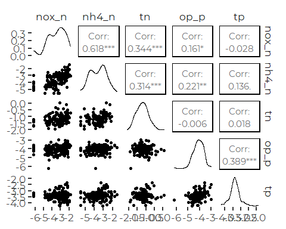

### Ternary Diagrams

``` r
proportion_data <- core_data %>%
  select(site:hour, nox_n:tn_flag, din:on_cens_r) %>%
  relocate(nh4_n, on, tn, .after = nox_n)%>%
  mutate(across(nox_n:on, ~ .x/tn)) %>%
  
  relocate(nh4_n_flag, on_flag, tn_flag, .after = nox_n_flag) %>%
  relocate(nh4_n_cens, on_cens_r, .after = nox_n_cens) %>%
  
  select(site, sample_date, year, nox_n:on_flag, ) %>%
  filter(! is.na(nox_n), ! is.na(nh4_n), ! is.na(on))
```

#### Draft Plots

We borrowed function to simply add alpha values to color palettes from
here:
[Description](https://www.r-bloggers.com/2014/03/colorramppalettealpha-and-addalpha-helper-functions-for-adding-transparency-to-colors-in-r/)
[GitHub](https://github.com/mylesmharrison/colorRampPaletteAlpha/blob/master/colorRampPaletteAlpha.R)

``` r
addalpha <- function(colors, alpha=1.0) {
  r <- col2rgb(colors, alpha=T)
  # Apply alpha
  r[4,] <- alpha*255
  r <- r/255.0
  return(rgb(r[1,], r[2,], r[3,], r[4,]))
}
```

##### Colored by Censored and Flagged Data

``` r
pal = addalpha(cbep_colors(), 0.5)

TernaryPlot(alab = 'Nitrate + Nitrite', blab = 'Ammonium', clab = 'Other N',
            grid.lines = 5, grid.minor.lines = 0)
TernaryPoints(proportion_data[4:6], pch = 16, 
              col = pal[as.numeric(proportion_data$on_flag | 
                                     proportion_data$on_cens_r) + 1])

legend('topleft', ncol = 1,
        cex = .75,
        legend = c('Data OK', 'Data Flag'),
        box.lty = 0,
        pch = 20,
        col = cbep_colors())
```

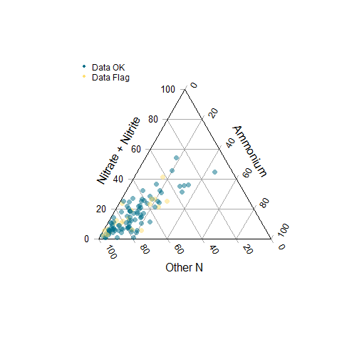

##### Colored by Site

``` r
pal = viridis(9, alpha=0.5)

TernaryPlot(alab = 'Nitrate + Nitrite', blab = 'Ammonium', clab = 'Other N',
            grid.lines = 5, grid.minor.lines = 0)
TernaryPoints(proportion_data[4:6], pch = 16, 
              col = pal[as.numeric(proportion_data$site)])

legend('topleft', ncol = 1,
        cex = .75,
        legend = levels(proportion_data$site),
        box.lty = 0,
        pch = 20,
        col = pal)
```

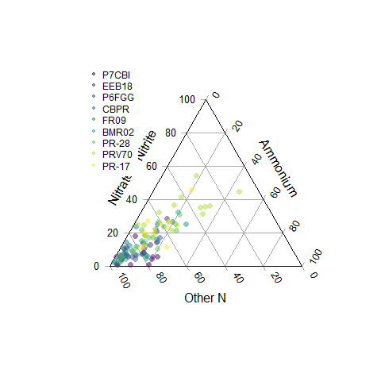

##### Produce PDF

We have slightly more control of size when we specify the graphics
device, as we can specify fonts and base font size.

``` r
cairo_pdf('figures/ternary_core.pdf', width = 3.5, height = 5,
          family = 'Montserrat', pointsize = 8)

TernaryPlot(alab = 'Nitrate + Nitrite', blab = 'Ammonium', clab = 'Other N',
            grid.lines = 5, grid.minor.lines = 0)
TernaryPoints(proportion_data[4:6], pch = 16, 
              col = pal[as.numeric(proportion_data$site)])

legend('topleft', ncol = 1,
        cex = .75,
        legend = levels(proportion_data$site),
        box.lty = 0,
        pch = 20,
        col = pal)
dev.off()
#> png 
#>   2
```

# Descriptive Statistics

``` r
core_results <- core_data %>%
  group_by(site, short_name) %>%
  summarize(across(c(nox_n, nh4_n, din, on, tn, chl, tss),
                   .fns = c(mn = ~ mean(.x, na.rm = TRUE),
                            sd = ~ sd(.x, na.rm = TRUE), 
                            n = ~sum(! is.na(.x)),
                            md = ~ median(.x, na.rm = TRUE),
                            iqr = ~ IQR(.x, na.rm = TRUE),
                            p90 = ~ quantile(.x, .9, na.rm = TRUE),
                            gm = ~ exp(mean(log(.x), na.rm = TRUE)))),
            .groups = 'drop') %>%
  mutate(site = fct_reorder(factor(site), tn_md),
         short_name = fct_reorder(factor(short_name), tn_md))
```

# DIN Analysis

## Data Prevalence

``` r
xtabs(~ month + site, data = core_data, subset = ! is.na(din))%>%
  as_tibble() %>%
  mutate(month = factor(month, levels = month.abb)) %>%
  filter(n>0) %>%

  ggplot(aes(site, month, fill = n)) +
  geom_tile() +
  theme_cbep(base_size = 12) +
  theme(axis.text.x = element_text(angle = 90, hjust = 1, vjust = .25))
```

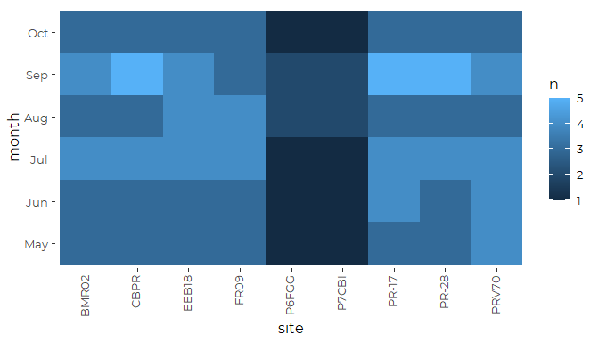

``` r
xtabs(~ year + site, data = core_data, subset = ! is.na(din))%>%
  as_tibble() %>%
  filter(n>0) %>%

  ggplot(aes(site, year, fill = n)) +
  geom_tile() +
  theme_cbep(base_size = 12) +
  theme(axis.text.x = element_text(angle = 90, hjust = 1, vjust = .25))
```

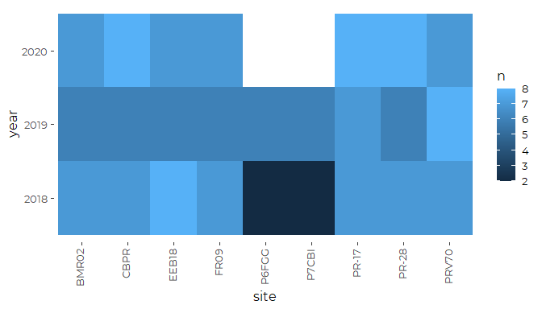

## Core Sites Data 2018-2020

### Histograms / Distributions

Data is distributed fairly close to log-normal, although it is slightly
heavy tailed and more skewed.

``` r
plt <- ggplot(core_data, aes(din)) + 
  geom_histogram(aes(fill = site)) +
  scale_x_log10() +
  theme_cbep(base_size = 10) +
  theme(legend.position = 'None')
plt
#> `stat_bin()` using `bins = 30`. Pick better value with `binwidth`.
#> Warning: Removed 93 rows containing non-finite values (stat_bin).
```

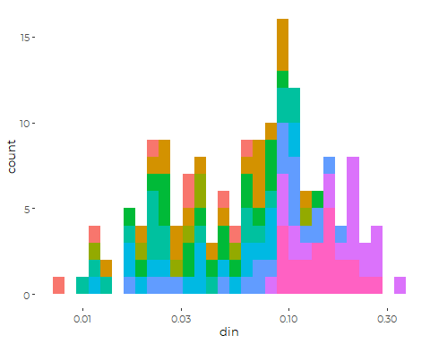

``` r
plt +  facet_wrap (~site)
#> `stat_bin()` using `bins = 30`. Pick better value with `binwidth`.
#> Warning: Removed 93 rows containing non-finite values (stat_bin).
```

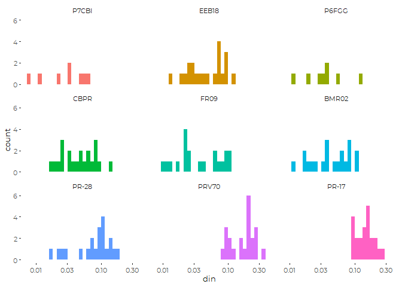

### Draft Graphic

``` r
ggplot(core_data, aes(din, short_name)) +
  geom_point(aes(color = month)) +
  scale_color_manual(values = cbep_colors2(), name = '') +
  
  geom_point(data = core_results, mapping = aes(x = din_md, y = short_name),
             shape = 3, size = 2,
             color = cbep_colors()[3]) +
  
  ylab('') +
  xlab('Dissolved Inorganic Nitrogen (mg/l)') +
  
  theme_cbep(base_size = 12)  +
  #theme(legend.position = 'None' )  +
  scale_x_log10()
#> Warning: Removed 93 rows containing missing values (geom_point).
```

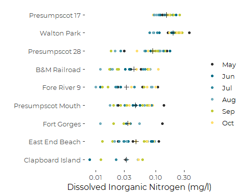

``` r
  
  
ggsave('figures/din_by_site.pdf', device = cairo_pdf, width = 6, height = 4)
#> Warning: Removed 93 rows containing missing values (geom_point).
```

### Linear Models

``` r
core_din_lm_full <- lm(log(din) ~ (site + month + yearf)^2, data = core_data)
anova(core_din_lm_full)
#> Analysis of Variance Table
#> 
#> Response: log(din)
#>             Df Sum Sq Mean Sq F value    Pr(>F)    
#> site         8 59.493  7.4366 38.5161 < 2.2e-16 ***
#> month        5  5.175  1.0350  5.3604 0.0002553 ***
#> yearf        2 10.477  5.2386 27.1321 8.573e-10 ***
#> site:month  40 11.158  0.2789  1.4448 0.0802264 .  
#> site:yearf  14  6.318  0.4513  2.3372 0.0089574 ** 
#> month:yearf 10  6.880  0.6880  3.5632 0.0005831 ***
#> Residuals   83 16.025  0.1931                      
#> ---
#> Signif. codes:  0 '***' 0.001 '**' 0.01 '*' 0.05 '.' 0.1 ' ' 1
```

``` r
core_din_lm <- step(core_din_lm_full)
#> Start:  AIC=-218.09
#> log(din) ~ (site + month + yearf)^2
#> 
#>               Df Sum of Sq    RSS     AIC
#> <none>                     16.025 -218.09
#> - site:month  40   11.5127 27.538 -209.84
#> - site:yearf  14    6.1687 22.194 -193.01
#> - month:yearf 10    6.8797 22.905 -179.87
anova(core_din_lm)
#> Analysis of Variance Table
#> 
#> Response: log(din)
#>             Df Sum Sq Mean Sq F value    Pr(>F)    
#> site         8 59.493  7.4366 38.5161 < 2.2e-16 ***
#> month        5  5.175  1.0350  5.3604 0.0002553 ***
#> yearf        2 10.477  5.2386 27.1321 8.573e-10 ***
#> site:month  40 11.158  0.2789  1.4448 0.0802264 .  
#> site:yearf  14  6.318  0.4513  2.3372 0.0089574 ** 
#> month:yearf 10  6.880  0.6880  3.5632 0.0005831 ***
#> Residuals   83 16.025  0.1931                      
#> ---
#> Signif. codes:  0 '***' 0.001 '**' 0.01 '*' 0.05 '.' 0.1 ' ' 1
```

So year to year variation is substantial, and should probably be
addressed as a random factor in a hierarchical model. But this can also
be treated as a source of additional error.

``` r
core_din_lm_red <- lm(log(din) ~ site + month + year, data = core_data)
anova(core_din_lm_red)
#> Analysis of Variance Table
#> 
#> Response: log(din)
#>            Df Sum Sq Mean Sq F value    Pr(>F)    
#> site        8 59.493  7.4366 25.0069 < 2.2e-16 ***
#> month       5  5.175  1.0350  3.4803  0.005287 ** 
#> year        1  6.845  6.8454 23.0192 3.878e-06 ***
#> Residuals 148 44.012  0.2974                      
#> ---
#> Signif. codes:  0 '***' 0.001 '**' 0.01 '*' 0.05 '.' 0.1 ' ' 1
```

#### Marginal Means

``` r
emmip(core_din_lm, site ~ yearf,
      type = 'response')
#> Warning: Removed 2 rows containing missing values (geom_point).
#> Warning: Removed 2 row(s) containing missing values (geom_path).
```

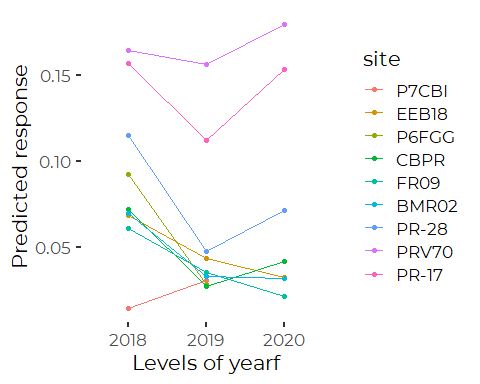

``` r
emmip(core_din_lm, month ~ yearf,
      type = 'response')
#> Warning: Removed 6 rows containing missing values (geom_point).
#> Warning: Removed 6 row(s) containing missing values (geom_path).
```

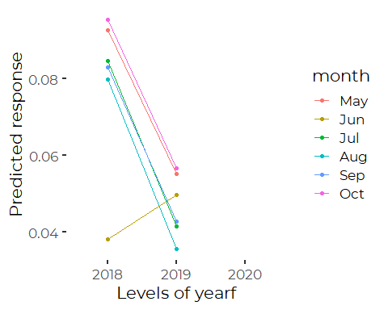

So, those interactions are unlikely to be due to “chance”, but they well
may be due to annual or seasonal autocorrelations. They so not dominate
the patterns among sites, which is our focus here. A hierarchical model
would be better. For now, we advance with the reduced complexity model
that omits the interactions.

``` r
core_din_emms_lm <- emmeans(core_din_lm_red, 'site', type = 'response')
```

``` r
plot(core_din_emms_lm) + coord_flip() + 
  theme(axis.text.x = element_text(angle = 90, vjust = 0.25)) +
  geom_point(data = core_results, aes(y = site, x = din_mn),
             color = 'red') +
  geom_point(data = core_results, aes(y = site, x = din_gm),
             color = 'yellow')
```

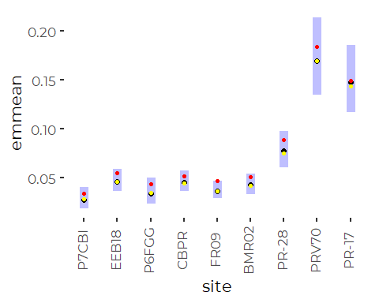

Differences between model predictions and observed means are almost
entirely because the model is predicting geometric, not arithmetic
means. The model’s adjusted geometric means line up well with observed
geometric means.

#### Compare to Observed Means

``` r
compare <- core_results %>%
  select(site, short_name, din_mn, din_sd, din_n) %>%
  full_join(core_din_emms_lm, by = 'site', suffix = c('.data', '.lm'), copy = TRUE)

ggplot(compare, aes(din_mn, response)) +
  geom_abline(slope = 1, intercept = 0) + 
  geom_point(size = 3, color = 'blue') +
  geom_linerange(aes(xmin = din_mn - 2 * din_sd/sqrt(din_n), 
                     xmax = din_mn + 2 * din_sd/sqrt(din_n))) +
  geom_linerange(aes(ymin = lower.CL, ymax = upper.CL)) +
  xlab('Observed ') +
  ylab('Log Linear Model') +
  coord_equal()
```

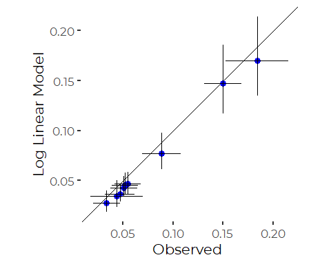
So, this model fits values slightly below observed values, as expected
for geometric means of skewed data, which are slightly lower than
arithmetic means.

#### Model Diagnostics

``` r
oldpar <- par(mfrow = c(2,2))
plot(core_din_lm_red)
```

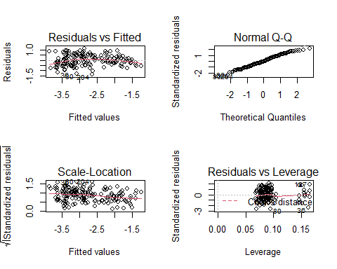

``` r
par(oldpar)
```

The log transform here was a bit too strong, but the diagnostics are not
dreadful.

### GAM Model

``` r
core_din_gam <- gam(log(din) ~ site + s(doy, k = 5) + 
                          s(yearf, bs = 're'), data = core_data)
anova(core_din_gam)
#> 
#> Family: gaussian 
#> Link function: identity 
#> 
#> Formula:
#> log(din) ~ site + s(doy, k = 5) + s(yearf, bs = "re")
#> 
#> Parametric Terms:
#>      df     F p-value
#> site  8 28.13  <2e-16
#> 
#> Approximate significance of smooth terms:
#>            edf Ref.df      F  p-value
#> s(doy)   2.801  3.318  6.699 0.000177
#> s(yearf) 1.890  2.000 17.212  < 2e-16
```

``` r
plot(core_din_gam)
```

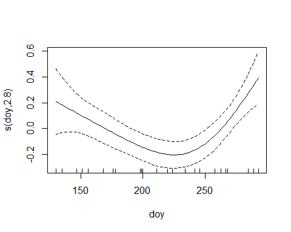

``` r
oldpar = par(mfrow = c(2,2))
gam.check(core_din_gam)
```

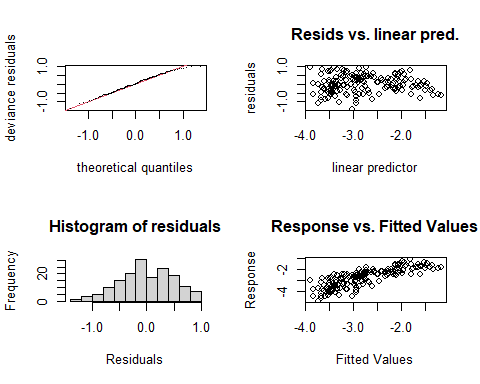

    #> 
    #> Method: GCV   Optimizer: magic
    #> Smoothing parameter selection converged after 7 iterations.
    #> The RMS GCV score gradient at convergence was 6.691998e-06 .
    #> The Hessian was positive definite.
    #> Model rank =  16 / 16 
    #> 
    #> Basis dimension (k) checking results. Low p-value (k-index<1) may
    #> indicate that k is too low, especially if edf is close to k'.
    #> 
    #>            k'  edf k-index p-value    
    #> s(doy)   4.00 2.80    0.77  <2e-16 ***
    #> s(yearf) 3.00 1.89      NA      NA    
    #> ---
    #> Signif. codes:  0 '***' 0.001 '**' 0.01 '*' 0.05 '.' 0.1 ' ' 1
    par(oldpar)

Those diagnostics are pretty good….

#### Marginal Means

The marginal means fit with no specification for the day of year fills
in the day of the year with the observed mean day of the year, Julian
Day \~ 216, which is early August. That corresponds to roughly the
lowest annual level for TN.

The result is that the default marginal means are substantially lower
than observed means and geometric means. One can ameliorate that by
specifying `cov.keep = 'doy`, which has the effect of averaging across
all the actual dates on which data was collected, or specifying
`at = list(doy = c(seq(130,290,10))`, which averages over a regular grid
of days of year across the sampling season.

``` r
emmeans(core_din_gam, 'site', nesting = NULL, type = 'response')
#>  site  response      SE  df lower.CL upper.CL
#>  P7CBI   0.0247 0.00468 149   0.0170   0.0359
#>  EEB18   0.0371 0.00449 149   0.0292   0.0471
#>  P6FGG   0.0310 0.00585 149   0.0213   0.0450
#>  CBPR    0.0361 0.00444 149   0.0284   0.0461
#>  FR09    0.0295 0.00364 149   0.0231   0.0377
#>  BMR02   0.0341 0.00426 149   0.0267   0.0437
#>  PR-28   0.0613 0.00753 149   0.0481   0.0781
#>  PRV70   0.1383 0.01687 149   0.1086   0.1760
#>  PR-17   0.1179 0.01431 149   0.0928   0.1499
#> 
#> Results are averaged over the levels of: yearf 
#> Confidence level used: 0.95 
#> Intervals are back-transformed from the log scale
emmeans(core_din_gam, 'site', cov.keep = 'doy', type = 'response')
#> NOTE: A nesting structure was detected in the fitted model:
#>     doy %in% yearf
#>  site  response      SE  df lower.CL upper.CL
#>  P7CBI   0.0303 0.00555 149   0.0211   0.0435
#>  EEB18   0.0454 0.00503 149   0.0365   0.0565
#>  P6FGG   0.0379 0.00694 149   0.0264   0.0545
#>  CBPR    0.0443 0.00490 149   0.0356   0.0551
#>  FR09    0.0362 0.00410 149   0.0289   0.0452
#>  BMR02   0.0418 0.00473 149   0.0334   0.0523
#>  PR-28   0.0751 0.00831 149   0.0604   0.0934
#>  PRV70   0.1694 0.01828 149   0.1369   0.2097
#>  PR-17   0.1445 0.01559 149   0.1168   0.1789
#> 
#> Results are averaged over the levels of: doy, yearf 
#> Confidence level used: 0.95 
#> Intervals are back-transformed from the log scale
(core_din_emms_gam <- emmeans(core_din_gam, 'site', 
                             at = list(doy = seq(130,290,10)),
                             type = 'response'))
#>  site  response      SE  df lower.CL upper.CL
#>  P7CBI   0.0300 0.00550 149   0.0209   0.0431
#>  EEB18   0.0450 0.00499 149   0.0362   0.0560
#>  P6FGG   0.0376 0.00688 149   0.0262   0.0540
#>  CBPR    0.0439 0.00486 149   0.0353   0.0546
#>  FR09    0.0358 0.00406 149   0.0286   0.0448
#>  BMR02   0.0414 0.00470 149   0.0331   0.0518
#>  PR-28   0.0744 0.00825 149   0.0598   0.0926
#>  PRV70   0.1679 0.01811 149   0.1357   0.2078
#>  PR-17   0.1432 0.01547 149   0.1157   0.1773
#> 
#> Results are averaged over the levels of: doy, yearf 
#> Confidence level used: 0.95 
#> Intervals are back-transformed from the log scale
```

``` r
plot(core_din_emms_gam) + coord_flip() + 
  theme(axis.text.x = element_text(angle = 90, vjust = 0.25)) +
  geom_point(data = core_results, aes(y = site, x = din_mn),
             color = 'red') +
  geom_point(data = core_results, aes(y = site, x = din_gm),
             color = 'yellow')
```

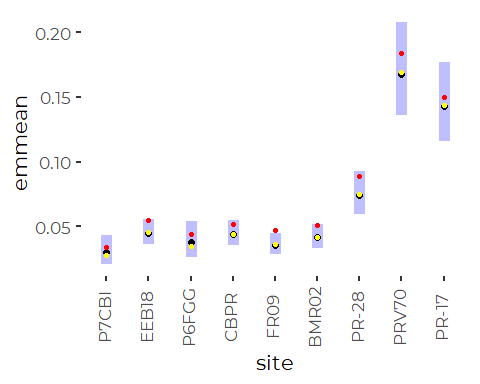
Model Predictions are well below observed means. It’s not entirely
clear….

Differences between model predictions and observed means are almost
entirely because the model is predicting geometric, not arithmetic
means. The model’s adjusted geometric means line up well with observed
geometric means.

#### Compare to Observed Means

``` r
compare <- core_results %>%
  select(site, short_name, din_mn, din_sd, din_n) %>%
  full_join(core_din_emms_gam, by = 'site', suffix = c('.data', '.gam'), copy = TRUE)

ggplot(compare, aes(din_mn, response)) +
  geom_abline(slope = 1, intercept = 0) + 
  geom_point(size = 3, color = 'blue') +
  geom_linerange(aes(xmin = din_mn - 2 * din_sd/sqrt(din_n), 
                     xmax = din_mn + 2 * din_sd/sqrt(din_n))) +
  geom_linerange(aes(ymin = lower.CL, ymax = upper.CL)) +
  xlab('Observed ') +
  ylab('Log Linear Model') +
  coord_equal()
```


# TN Analysis

## Core Sites Data 2018-2020

### Histograms / Distributions

Data is distributed fairly close to log-normal, although it is slightly
heavy tailed and more skewed.

``` r
plt <- ggplot(core_data, aes(tn)) + 
  geom_histogram(aes(fill = site)) +
  scale_x_log10() +
  theme_cbep(base_size = 10) +
  theme(legend.position = 'None') +
  geom_vline(xintercept = 0.35, col = 'grey35') +
  geom_vline(xintercept = 0.6, col = 'grey35')
plt
#> `stat_bin()` using `bins = 30`. Pick better value with `binwidth`.
#> Warning: Removed 57 rows containing non-finite values (stat_bin).
```


The practical difference between eelgrass-oriented standards at about
0.35 mg/l versus dissolved oxygen standards at about 0.6 mg/l could be
huge.

``` r
plt + facet_wrap(~site)
#> `stat_bin()` using `bins = 30`. Pick better value with `binwidth`.
#> Warning: Removed 57 rows containing non-finite values (stat_bin).
```

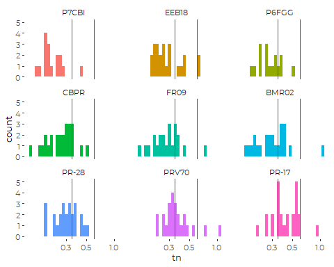

### Draft Graphic

``` r
ggplot(core_data, aes(tn, short_name)) +
  geom_point(aes(color = month)) +
  scale_color_manual(values = cbep_colors2(), name = '') +
  
  geom_point(data = core_results, mapping = aes(x = tn_md, y = short_name),
             shape = 3, size = 3,
             color = cbep_colors()[3]) +
  
  ylab('') +
  xlab('Total Nitrogen (mg/l)') +
  
  theme_cbep(base_size = 12)  +
  #theme(legend.position = 'None' )  +
  scale_x_log10()
#> Warning: Removed 57 rows containing missing values (geom_point).
```

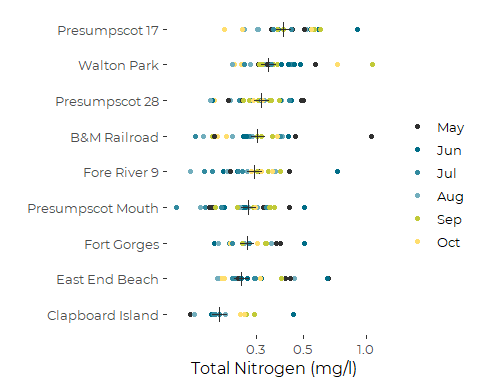

``` r
  
  
ggsave('figures/tn_by_site.pdf', device = cairo_pdf, width = 6, height = 4)
#> Warning: Removed 57 rows containing missing values (geom_point).
```

### Linear Models

``` r
core_tn_lm_full <- lm(log(tn) ~ (site + month + yearf)^2, data = core_data)
anova(core_tn_lm_full)
#> Analysis of Variance Table
#> 
#> Response: log(tn)
#>              Df Sum Sq Mean Sq F value    Pr(>F)    
#> site          8 6.1470 0.76837  9.0835 1.199e-09 ***
#> month         5 2.9988 0.59976  7.0902 7.979e-06 ***
#> yearf         2 0.3109 0.15547  1.8379    0.1637    
#> site:month   40 2.7276 0.06819  0.8061    0.7798    
#> site:yearf   16 1.4406 0.09004  1.0644    0.3968    
#> month:yearf  10 4.5659 0.45659  5.3977 1.532e-06 ***
#> Residuals   117 9.8970 0.08459                      
#> ---
#> Signif. codes:  0 '***' 0.001 '**' 0.01 '*' 0.05 '.' 0.1 ' ' 1
```

``` r
core_tn_lm <- step(core_tn_lm_full)
#> Start:  AIC=-433.21
#> log(tn) ~ (site + month + yearf)^2
#> 
#>               Df Sum of Sq    RSS     AIC
#> - site:month  40    2.0725 11.970 -475.38
#> - site:yearf  16    1.4654 11.362 -437.74
#> <none>                      9.897 -433.21
#> - month:yearf 10    4.5659 14.463 -377.72
#> 
#> Step:  AIC=-475.38
#> log(tn) ~ site + month + yearf + site:yearf + month:yearf
#> 
#>               Df Sum of Sq    RSS     AIC
#> - site:yearf  16    2.0291 13.999 -476.21
#> <none>                     11.970 -475.38
#> - month:yearf 10    4.6631 16.633 -429.90
#> 
#> Step:  AIC=-476.21
#> log(tn) ~ site + month + yearf + month:yearf
#> 
#>               Df Sum of Sq    RSS     AIC
#> <none>                     13.999 -476.21
#> - month:yearf 10    4.6325 18.631 -439.33
#> - site         8    5.9047 19.903 -422.18
anova(core_tn_lm)
#> Analysis of Variance Table
#> 
#> Response: log(tn)
#>              Df  Sum Sq Mean Sq F value    Pr(>F)    
#> site          8  6.1470 0.76837  9.4958 7.503e-11 ***
#> month         5  2.9988 0.59976  7.4120 2.533e-06 ***
#> yearf         2  0.3109 0.15547  1.9214    0.1495    
#> month:yearf  10  4.6325 0.46325  5.7250 2.100e-07 ***
#> Residuals   173 13.9987 0.08092                      
#> ---
#> Signif. codes:  0 '***' 0.001 '**' 0.01 '*' 0.05 '.' 0.1 ' ' 1
```

``` r
core_tn_lm_red <- lm(log(tn) ~ site + month + yearf, data = core_data)
anova(core_tn_lm_red)
#> Analysis of Variance Table
#> 
#> Response: log(tn)
#>            Df  Sum Sq Mean Sq F value    Pr(>F)    
#> site        8  6.1470 0.76837  7.5471 1.074e-08 ***
#> month       5  2.9988 0.59976  5.8910 4.492e-05 ***
#> yearf       2  0.3109 0.15547  1.5271    0.2199    
#> Residuals 183 18.6312 0.10181                      
#> ---
#> Signif. codes:  0 '***' 0.001 '**' 0.01 '*' 0.05 '.' 0.1 ' ' 1
```

#### Marginal Means

``` r
emmip(core_tn_lm, month ~ yearf,
      type = 'response')
```

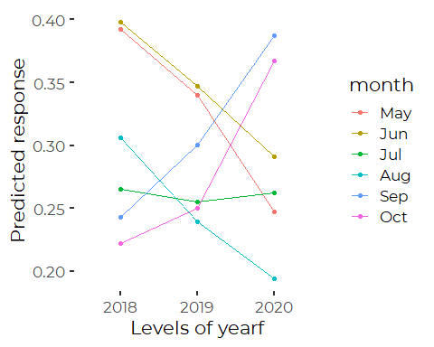

So, those interactions are unlikely to be due to “chance”, but they well
may be due to annual or seasonal autocorrelations. A hierarchical model
may be better. For now, we advance with the reduced complexity model
that omits the interactions.

``` r
core_tn_emms_lm <- emmeans(core_tn_lm_red, 'site', type = 'response')
```

``` r
plot(core_tn_emms_lm) + coord_flip() + 
  theme(axis.text.x = element_text(angle = 90, vjust = 0.25)) +
  geom_point(data = core_results, aes(y = site, x = tn_mn),
             color = 'red') +
  geom_point(data = core_results, aes(y = site, x = tn_gm),
             color = 'yellow')
```


The linear model does an excellent job of returning the observed
geometric means.

#### Compare to Observed Means

``` r
compare <- core_results %>%
  select(site, short_name, tn_mn, tn_sd, tn_n) %>%
  full_join(core_tn_emms_lm, by = 'site', suffix = c('.data', '.lm'), copy = TRUE)

ggplot(compare, aes(tn_mn, response)) +
  geom_abline(slope = 1, intercept = 0) + 
  geom_point(size = 3, color = 'blue') +
  geom_linerange(aes(xmin = tn_mn - 2 * tn_sd/sqrt(tn_n), 
                     xmax = tn_mn + 2 * tn_sd/sqrt(tn_n))) +
  geom_linerange(aes(ymin = lower.CL, ymax = upper.CL)) +
  xlab('Observed ') +
  ylab('Log Linear Model') +
  coord_equal()
```

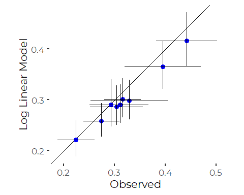

So, this model fits values slightly below observed values, as expected
for geometric means of skewed data, which are slightly lower than
arithmetic means.

#### Model Diagnostics

``` r
oldpar <- par(mfrow = c(2,2))
plot(core_tn_lm_red)
```

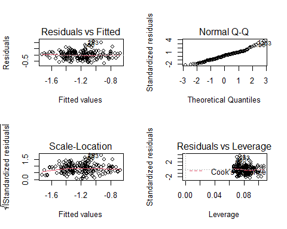

``` r
par(oldpar)
```

Those look excellent.

### GAM Model

``` r
core_tn_gam <- gam(log(tn) ~ site + s(doy, k = 4) + 
                          s(yearf, bs = 're'), data = core_data)
anova(core_tn_gam)
#> 
#> Family: gaussian 
#> Link function: identity 
#> 
#> Formula:
#> log(tn) ~ site + s(doy, k = 4) + s(yearf, bs = "re")
#> 
#> Parametric Terms:
#>      df    F  p-value
#> site  8 7.23 2.39e-08
#> 
#> Approximate significance of smooth terms:
#>                edf    Ref.df     F  p-value
#> s(doy)   2.166e+00 2.544e+00 6.448 0.000904
#> s(yearf) 1.569e-09 3.000e+00 0.000 0.667829
```

``` r
plot(core_tn_gam)
```

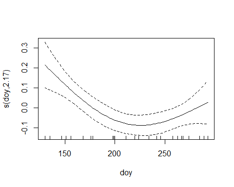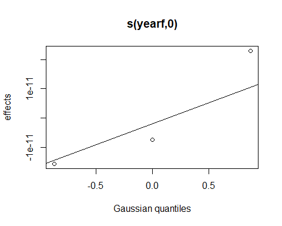

``` r
oldpar = par(mfrow = c(2,2))
gam.check(core_tn_gam)
```


    #> 
    #> Method: GCV   Optimizer: magic
    #> Smoothing parameter selection converged after 10 iterations.
    #> The RMS GCV score gradient at convergence was 4.792932e-08 .
    #> The Hessian was positive definite.
    #> Model rank =  15 / 15 
    #> 
    #> Basis dimension (k) checking results. Low p-value (k-index<1) may
    #> indicate that k is too low, especially if edf is close to k'.
    #> 
    #>                k'      edf k-index p-value   
    #> s(doy)   3.00e+00 2.17e+00    0.78   0.005 **
    #> s(yearf) 3.00e+00 1.57e-09      NA      NA   
    #> ---
    #> Signif. codes:  0 '***' 0.001 '**' 0.01 '*' 0.05 '.' 0.1 ' ' 1
    par(oldpar)

#### Marginal Means

The marginal means fit with no specification for the day of year fills
in the day of the year with the observed mean day of the year, Julian
Day \~ 216, which is early August. That corresponds to roughly the
lowest annual level for TN.

The result is that the default marginal means are substantially lower
than observed means and geometric means. One can ameliorate that by
specifying `cov.keep = 'doy`, which has the effect of averaging across
all the actual dates on which data was collected, or specifying
`at = list(doy = c(seq(130,290,10))`, which averages over a regular grid
of days of year across the sampling season.

``` r
emmeans(core_tn_gam, 'site', nesting = NULL, type = 'response')
#>  site  response     SE  df lower.CL upper.CL
#>  P7CBI    0.199 0.0169 188    0.169    0.236
#>  EEB18    0.268 0.0193 188    0.232    0.309
#>  P6FGG    0.261 0.0222 188    0.221    0.309
#>  CBPR     0.241 0.0168 188    0.210    0.276
#>  FR09     0.262 0.0193 188    0.227    0.303
#>  BMR02    0.275 0.0199 188    0.238    0.317
#>  PR-28    0.280 0.0196 188    0.244    0.322
#>  PRV70    0.339 0.0241 188    0.295    0.390
#>  PR-17    0.387 0.0271 188    0.337    0.444
#> 
#> Results are averaged over the levels of: yearf 
#> Confidence level used: 0.95 
#> Intervals are back-transformed from the log scale
emmeans(core_tn_gam, 'site', cov.keep = 'doy', type = 'response')
#> NOTE: A nesting structure was detected in the fitted model:
#>     doy %in% yearf
#>  site  response     SE  df lower.CL upper.CL
#>  P7CBI    0.216 0.0176 188    0.184    0.254
#>  EEB18    0.290 0.0198 188    0.254    0.332
#>  P6FGG    0.284 0.0231 188    0.242    0.333
#>  CBPR     0.261 0.0170 188    0.230    0.297
#>  FR09     0.285 0.0198 188    0.248    0.327
#>  BMR02    0.298 0.0203 188    0.261    0.341
#>  PR-28    0.304 0.0198 188    0.268    0.346
#>  PRV70    0.368 0.0245 188    0.323    0.420
#>  PR-17    0.420 0.0274 188    0.369    0.478
#> 
#> Results are averaged over the levels of: doy, yearf 
#> Confidence level used: 0.95 
#> Intervals are back-transformed from the log scale
(core_tn_emms_gam <- emmeans(core_tn_gam, 'site', 
                             at = list(doy = seq(130,290,10)),
                             type = 'response'))
#>  site  response     SE  df lower.CL upper.CL
#>  P7CBI    0.217 0.0177 188    0.185    0.255
#>  EEB18    0.291 0.0198 188    0.255    0.333
#>  P6FGG    0.284 0.0232 188    0.242    0.334
#>  CBPR     0.262 0.0171 188    0.230    0.298
#>  FR09     0.285 0.0198 188    0.249    0.327
#>  BMR02    0.299 0.0203 188    0.262    0.342
#>  PR-28    0.305 0.0199 188    0.268    0.347
#>  PRV70    0.369 0.0246 188    0.323    0.421
#>  PR-17    0.421 0.0275 188    0.370    0.479
#> 
#> Results are averaged over the levels of: doy, yearf 
#> Confidence level used: 0.95 
#> Intervals are back-transformed from the log scale
```

``` r
plot(core_tn_emms_gam) + coord_flip() + 
  theme(axis.text.x = element_text(angle = 90, vjust = 0.25)) +
  geom_point(data = core_results, aes(y = site, x = tn_mn),
             color = 'red') +
  geom_point(data = core_results, aes(y = site, x = tn_gm),
             color = 'yellow')
```

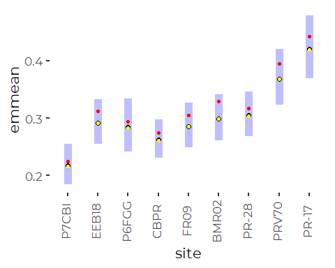

#### Compare to Observed Means

``` r
compare <- core_results %>%
  select(site, short_name, tn_mn, tn_sd, tn_n) %>%
  full_join(core_tn_emms_gam, by = 'site', suffix = c('.data', '.gam'), copy = TRUE)

ggplot(compare, aes(tn_mn, response)) +
  geom_abline(slope = 1, intercept = 0) + 
  geom_point(size = 3, color = 'blue') +
  geom_linerange(aes(xmin = tn_mn - 2 * tn_sd/sqrt(tn_n), 
                     xmax = tn_mn + 2 * tn_sd/sqrt(tn_n))) +
  geom_linerange(aes(ymin = lower.CL, ymax = upper.CL)) +
  xlab('Observed ') +
  ylab('Log Linear Model') +
  coord_equal()
```

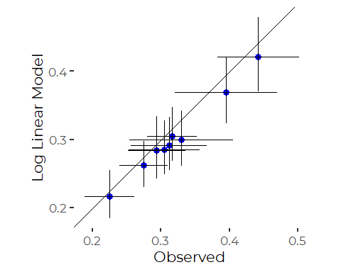

Here the lower values from the GAM model are because we are implicitly
comparing estimated geometric means to arithmetic means.

# N to P Ratios

Generally, our N:P ratios are well below 15, suggesting continued N
limitation. Is that worth reporting on? There may be N:P ratio variation
between sites.

### Histograms / Distributions

``` r
core_data <- core_data %>%
  mutate(n_to_p = tn/tp)
```

Data is somewhat skewed even after log transform.

``` r
plt <- ggplot(core_data, aes(n_to_p)) + 
  geom_histogram(aes(fill = site)) +
  scale_x_log10() +
  theme_cbep(base_size = 10) +
  theme(legend.position = 'None') +
  geom_vline(xintercept = 15,col = 'grey35')

plt +  facet_wrap (~site)
#> `stat_bin()` using `bins = 30`. Pick better value with `binwidth`.
#> Warning: Removed 127 rows containing non-finite values (stat_bin).
```

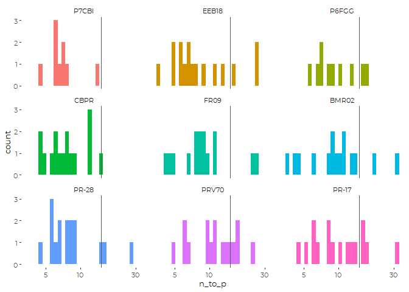

### Descriptive Statistics

``` r
core_n2p_results <- core_data %>%
  group_by(site, short_name) %>%
  summarize(across(c(tn, tp, n_to_p),
                   .fns = c(mn = ~ mean(.x, na.rm = TRUE),
                            sd = ~ sd(.x, na.rm = TRUE), 
                            n = ~sum(! is.na(.x)),
                            md = ~ median(.x, na.rm = TRUE),
                            iqr = ~ IQR(.x, na.rm = TRUE),
                            p90 = ~ quantile(.x, .9, na.rm = TRUE),
                            gm = ~ exp(mean(log(.x), na.rm = TRUE)))),
            .groups = 'drop') %>%
  mutate(site = fct_reorder(factor(site), tn_md),
         short_name = fct_reorder(factor(short_name), tn_md))
```

### Draft Graphic

``` r
ggplot(core_data, aes(n_to_p, short_name)) +
  geom_point(aes(color = month)) +
  scale_color_manual(values = cbep_colors2(), name = '') +
  
  geom_point(data = core_n2p_results, mapping = aes(x = n_to_p_md, y = short_name),
             shape = 3, size = 2,
             color = cbep_colors()[3]) +
  
  geom_vline(xintercept = 15, color = 'gray50', lty = 3) +
  
  ylab('') +
  xlab('N to P Ratio') +
  
  theme_cbep(base_size = 12)
#> Warning: Removed 127 rows containing missing values (geom_point).
```

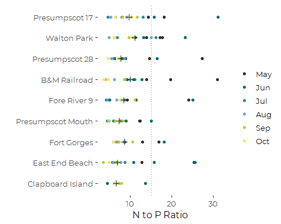

``` r
ggsave('figures/n_to_p_by_site.pdf', device = cairo_pdf, width = 6, height = 4)
#> Warning: Removed 127 rows containing missing values (geom_point).
```

It’s clear there is a seasonal pattern in N to P ratios.

### GAM Model

We are not fitting a year random effect here, because we have data from
only two years, and no reason to expect N:P ratios the vary
systematically by year.

``` r
core_n2p_gam <- gam(log(n_to_p) ~ site + s(doy, k = 4), data = core_data)
anova(core_n2p_gam)
#> 
#> Family: gaussian 
#> Link function: identity 
#> 
#> Formula:
#> log(n_to_p) ~ site + s(doy, k = 4)
#> 
#> Parametric Terms:
#>      df     F p-value
#> site  8 1.807  0.0824
#> 
#> Approximate significance of smooth terms:
#>          edf Ref.df     F p-value
#> s(doy) 1.812  2.191 35.27  <2e-16
```

``` r
plot(core_n2p_gam)
```

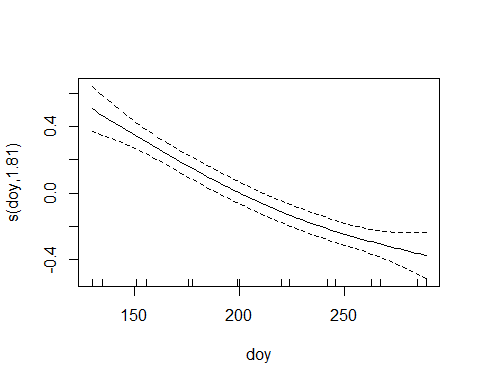

Looks like a linear fit might work just about as well….

``` r
oldpar = par(mfrow = c(2,2))
gam.check(core_n2p_gam)
```

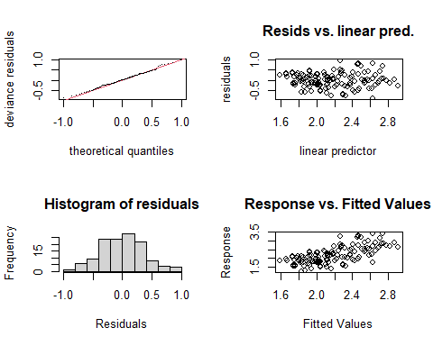

    #> 
    #> Method: GCV   Optimizer: magic
    #> Smoothing parameter selection converged after 5 iterations.
    #> The RMS GCV score gradient at convergence was 6.13908e-07 .
    #> The Hessian was positive definite.
    #> Model rank =  12 / 12 
    #> 
    #> Basis dimension (k) checking results. Low p-value (k-index<1) may
    #> indicate that k is too low, especially if edf is close to k'.
    #> 
    #>          k'  edf k-index p-value  
    #> s(doy) 3.00 1.81    0.83   0.025 *
    #> ---
    #> Signif. codes:  0 '***' 0.001 '**' 0.01 '*' 0.05 '.' 0.1 ' ' 1
    par(oldpar)

Excellent diagnostics.

#### Marginal Means

``` r
(core_n2p_emms_gam <- emmeans(core_n2p_gam, 'site', 
                             at = list(doy = seq(130,290,10)),
                             type = 'response'))
#>  site  response    SE  df lower.CL upper.CL
#>  P7CBI     7.06 0.884 118     5.51     9.05
#>  EEB18     8.25 0.774 118     6.85     9.93
#>  P6FGG     9.18 1.091 118     7.26    11.62
#>  CBPR      7.58 0.711 118     6.29     9.13
#>  FR09      8.53 0.827 118     7.04    10.34
#>  BMR02     9.23 0.896 118     7.62    11.19
#>  PR-28     8.27 0.777 118     6.87     9.97
#>  PRV70    10.96 1.029 118     9.10    13.20
#>  PR-17    10.05 0.943 118     8.34    12.10
#> 
#> Results are averaged over the levels of: doy 
#> Confidence level used: 0.95 
#> Intervals are back-transformed from the log scale
(core_n2p_emms_gam_doy <- emmeans(core_n2p_gam, 'doy', 
                                  at = list(doy = seq(130, 290, 10)),
                             type = 'response'))
#>  doy response    SE  df lower.CL upper.CL
#>  130    14.59 1.104 118    12.56    16.95
#>  140    13.51 0.843 118    11.94    15.28
#>  150    12.51 0.664 118    11.26    13.90
#>  160    11.60 0.563 118    10.54    12.77
#>  170    10.78 0.511 118     9.81    11.84
#>  180    10.04 0.478 118     9.14    11.03
#>  190     9.38 0.446 118     8.54    10.31
#>  200     8.80 0.414 118     8.02     9.66
#>  210     8.30 0.387 118     7.57     9.10
#>  220     7.86 0.367 118     7.16     8.62
#>  230     7.48 0.352 118     6.81     8.21
#>  240     7.15 0.338 118     6.51     7.85
#>  250     6.87 0.326 118     6.25     7.55
#>  260     6.62 0.325 118     6.01     7.30
#>  270     6.41 0.348 118     5.75     7.13
#>  280     6.21 0.399 118     5.46     7.05
#>  290     6.02 0.471 118     5.15     7.03
#> 
#> Results are averaged over the levels of: site 
#> Confidence level used: 0.95 
#> Intervals are back-transformed from the log scale
```

``` r
plot(core_n2p_emms_gam) + coord_flip() + 
  theme(axis.text.x = element_text(angle = 90, vjust = 0.25)) +
  geom_point(data = core_n2p_results, aes(y = site, x = n_to_p_mn),
             color = 'red') +
  geom_point(data = core_n2p_results, aes(y = site, x = n_to_p_gm),
             color = 'yellow')
```

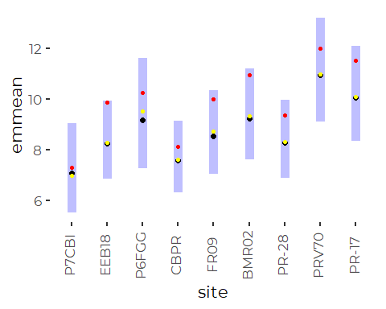

The sites show statistically significant differences as a group, but
with those large error bands, most pairwise comparisons will not be
significant.

``` r
plot(core_n2p_emms_gam_doy) + coord_flip() + 
  theme(axis.text.x = element_text(angle = 90, vjust = 0.25))
```


On the other hand, the is a strong N to p ratio pattern. Since there is
only a little seasonal pattern in the N values, the P values must climb
seasonally.

# Phosphorus (A Few Graphics)

``` r
ggplot(core_data, aes(tp)) + 
  geom_histogram(aes(fill = site, color = tp_cens)) +
  scale_color_manual(values = c('black', 'yellow')) + 
  scale_x_log10()
#> `stat_bin()` using `bins = 30`. Pick better value with `binwidth`.
#> Warning: Removed 70 rows containing non-finite values (stat_bin).
```

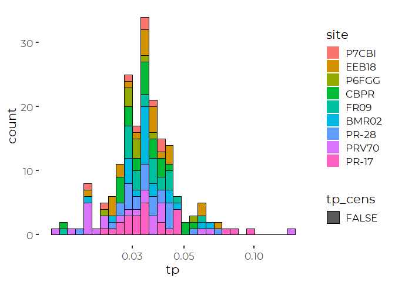

So very little of the data is censored….

``` r
ggplot(core_data, aes(doy, tp)) + 
  geom_point(aes(color = site)) +
  geom_smooth() +
  scale_color_viridis_d() +
  scale_y_log10()
#> `geom_smooth()` using method = 'loess' and formula 'y ~ x'
#> Warning: Removed 70 rows containing non-finite values (stat_smooth).
#> Warning: Removed 70 rows containing missing values (geom_point).
```

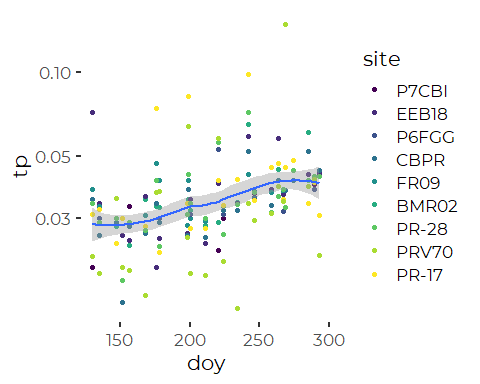

There is a clear seasonal pattern, with lots of scatter.

# Chlorophyll and Phaeophytin (Graphics Only)

This data does not include all chlorophyll data, because of ambiguities
of labeling in the source data.See “DEP\_Nutrients\_Preparation.Rmd” for
details.

``` r
tmp <- core_data %>%
  select(site, sample_date, chl, phaeo)

tmp %>%
  select(chl, phaeo) %>%
  mutate(chl_to_p = chl / phaeo) %>%
  mutate(across(everything(), log)) %>%
  ggpairs(progress = FALSE)
#> Warning: Removed 81 rows containing non-finite values (stat_density).
#> Warning in ggally_statistic(data = data, mapping = mapping, na.rm = na.rm, :
#> Removed 88 rows containing missing values

#> Warning in ggally_statistic(data = data, mapping = mapping, na.rm = na.rm, :
#> Removed 88 rows containing missing values
#> Warning: Removed 88 rows containing missing values (geom_point).
#> Warning: Removed 88 rows containing non-finite values (stat_density).
#> Warning in ggally_statistic(data = data, mapping = mapping, na.rm = na.rm, :
#> Removed 88 rows containing missing values
#> Warning: Removed 88 rows containing missing values (geom_point).

#> Warning: Removed 88 rows containing missing values (geom_point).
#> Warning: Removed 88 rows containing non-finite values (stat_density).
```


We see a lot of samples with phaeophytin well above chlorophyll levels.
that is not impossible, but noteworthy. It’s worth looking at the
scatter plot with a 1:1 reference line.

``` r
tmp <- core_data %>%
  select(site, sample_date,
         tn,
         tp,
         chl, phaeo,
         chl_flag, phaeo_flag, 
         chl_cens, phaeo_cens)

ggplot(tmp, aes(chl, phaeo, color = site)) +
  geom_point(aes(size = tn), alpha = 0.5) +
  geom_abline(slope = 1, intercept = 0) +
  scale_x_log10() + scale_y_log10() +
  coord_equal() +
  scale_color_viridis_d(name = '') +
  theme_cbep(base_size = 12)
#> Warning: Removed 137 rows containing missing values (geom_point).
```

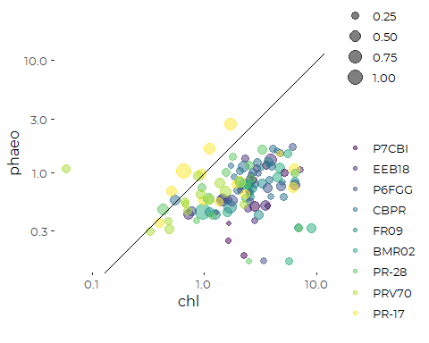

# Chlorophyll and Nutrients

``` r
tmp <- core_data %>%
  select(site, sample_date, chl, phaeo, op_p, tp, tn, din, on, tss)

tmp %>%
  select(-site, -sample_date) %>%
  mutate(across(everything(), log)) %>%
  ggpairs(progress = FALSE)
#> Warning: Removed 81 rows containing non-finite values (stat_density).
#> Warning in ggally_statistic(data = data, mapping = mapping, na.rm = na.rm, :
#> Removed 88 rows containing missing values

#> Warning in ggally_statistic(data = data, mapping = mapping, na.rm = na.rm, :
#> Removed 88 rows containing missing values
#> Warning in ggally_statistic(data = data, mapping = mapping, na.rm = na.rm, :
#> Removed 81 rows containing missing values
#> Warning in ggally_statistic(data = data, mapping = mapping, na.rm = na.rm, :
#> Removed 130 rows containing missing values
#> Warning in ggally_statistic(data = data, mapping = mapping, na.rm = na.rm, :
#> Removed 98 rows containing missing values
#> Warning in ggally_statistic(data = data, mapping = mapping, na.rm = na.rm, :
#> Removed 147 rows containing missing values
#> Warning in ggally_statistic(data = data, mapping = mapping, na.rm = na.rm, :
#> Removed 82 rows containing missing values
#> Warning: Removed 88 rows containing missing values (geom_point).
#> Warning: Removed 88 rows containing non-finite values (stat_density).
#> Warning in ggally_statistic(data = data, mapping = mapping, na.rm = na.rm, :
#> Removed 95 rows containing missing values
#> Warning in ggally_statistic(data = data, mapping = mapping, na.rm = na.rm, :
#> Removed 88 rows containing missing values
#> Warning in ggally_statistic(data = data, mapping = mapping, na.rm = na.rm, :
#> Removed 137 rows containing missing values
#> Warning in ggally_statistic(data = data, mapping = mapping, na.rm = na.rm, :
#> Removed 105 rows containing missing values
#> Warning in ggally_statistic(data = data, mapping = mapping, na.rm = na.rm, :
#> Removed 154 rows containing missing values
#> Warning in ggally_statistic(data = data, mapping = mapping, na.rm = na.rm, :
#> Removed 88 rows containing missing values
#> Warning: Removed 88 rows containing missing values (geom_point).
#> Warning: Removed 95 rows containing missing values (geom_point).
#> Warning: Removed 83 rows containing non-finite values (stat_density).
#> Warning in ggally_statistic(data = data, mapping = mapping, na.rm = na.rm, :
#> Removed 83 rows containing missing values
#> Warning in ggally_statistic(data = data, mapping = mapping, na.rm = na.rm, :
#> Removed 135 rows containing missing values
#> Warning in ggally_statistic(data = data, mapping = mapping, na.rm = na.rm, :
#> Removed 97 rows containing missing values
#> Warning in ggally_statistic(data = data, mapping = mapping, na.rm = na.rm, :
#> Removed 149 rows containing missing values
#> Warning in ggally_statistic(data = data, mapping = mapping, na.rm = na.rm, :
#> Removed 84 rows containing missing values
#> Warning: Removed 81 rows containing missing values (geom_point).
#> Warning: Removed 88 rows containing missing values (geom_point).
#> Warning: Removed 83 rows containing missing values (geom_point).
#> Warning: Removed 70 rows containing non-finite values (stat_density).
#> Warning in ggally_statistic(data = data, mapping = mapping, na.rm = na.rm, :
#> Removed 127 rows containing missing values
#> Warning in ggally_statistic(data = data, mapping = mapping, na.rm = na.rm, :
#> Removed 93 rows containing missing values
#> Warning in ggally_statistic(data = data, mapping = mapping, na.rm = na.rm, :
#> Removed 146 rows containing missing values
#> Warning in ggally_statistic(data = data, mapping = mapping, na.rm = na.rm, :
#> Removed 73 rows containing missing values
#> Warning: Removed 130 rows containing missing values (geom_point).
#> Warning: Removed 137 rows containing missing values (geom_point).
#> Warning: Removed 135 rows containing missing values (geom_point).
#> Warning: Removed 127 rows containing missing values (geom_point).
#> Warning: Removed 57 rows containing non-finite values (stat_density).
#> Warning in ggally_statistic(data = data, mapping = mapping, na.rm = na.rm, :
#> Removed 146 rows containing missing values

#> Warning in ggally_statistic(data = data, mapping = mapping, na.rm = na.rm, :
#> Removed 146 rows containing missing values
#> Warning in ggally_statistic(data = data, mapping = mapping, na.rm = na.rm, :
#> Removed 130 rows containing missing values
#> Warning: Removed 98 rows containing missing values (geom_point).
#> Warning: Removed 105 rows containing missing values (geom_point).
#> Warning: Removed 97 rows containing missing values (geom_point).
#> Warning: Removed 93 rows containing missing values (geom_point).
#> Warning: Removed 146 rows containing missing values (geom_point).
#> Warning: Removed 93 rows containing non-finite values (stat_density).
#> Warning in ggally_statistic(data = data, mapping = mapping, na.rm = na.rm, :
#> Removed 146 rows containing missing values
#> Warning in ggally_statistic(data = data, mapping = mapping, na.rm = na.rm, :
#> Removed 94 rows containing missing values
#> Warning: Removed 147 rows containing missing values (geom_point).
#> Warning: Removed 154 rows containing missing values (geom_point).
#> Warning: Removed 149 rows containing missing values (geom_point).
#> Warning: Removed 146 rows containing missing values (geom_point).

#> Warning: Removed 146 rows containing missing values (geom_point).

#> Warning: Removed 146 rows containing missing values (geom_point).
#> Warning: Removed 146 rows containing non-finite values (stat_density).
#> Warning in ggally_statistic(data = data, mapping = mapping, na.rm = na.rm, :
#> Removed 147 rows containing missing values
#> Warning: Removed 82 rows containing missing values (geom_point).
#> Warning: Removed 88 rows containing missing values (geom_point).
#> Warning: Removed 84 rows containing missing values (geom_point).
#> Warning: Removed 73 rows containing missing values (geom_point).
#> Warning: Removed 130 rows containing missing values (geom_point).
#> Warning: Removed 94 rows containing missing values (geom_point).
#> Warning: Removed 147 rows containing missing values (geom_point).
#> Warning: Removed 73 rows containing non-finite values (stat_density).
```

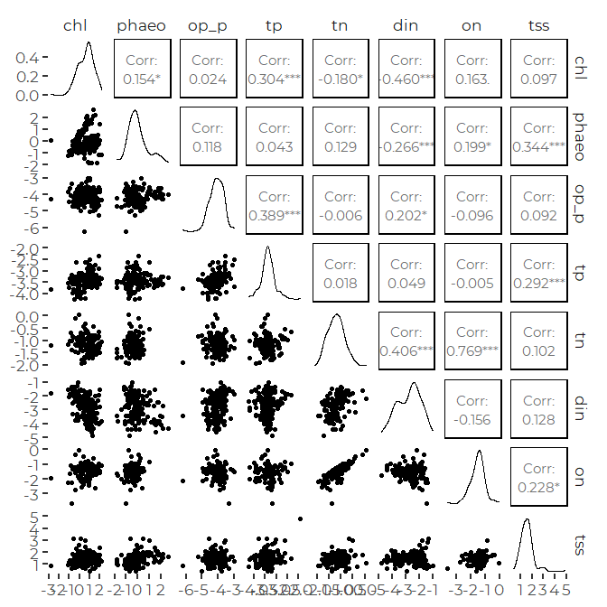

Interestingly, The strongest correlation between chlorophyll and
nutrients is with TP, not TN…. Phaeophytin is correlated with Total N
and organic N as well. Total suspended solids is correlated with most
metrics, suggesting it is functioning here as a surrogate for plankton
abundance, which will be correlated with everything.
