Analysis of DEP Royal River Data From 2017
================
Curtis C. Bohlen, Casco Bay Estuary Partnership.
06/15/2021

-   [Introduction](#introduction)
-   [Folder References](#folder-references)
-   [Load Data](#load-data)
-   [Surface Data Only](#surface-data-only)
    -   [Correct Misleading NH4 Values](#correct-misleading-nh4-values)
    -   [Add Shorter Site Names](#add-shorter-site-names)
    -   [Add DIN and Organic N](#add-din-and-organic-n)
-   [Royal and Cousins Data Subset from
    2017](#royal-and-cousins-data-subset-from-2017)
-   [Summary of Metadata](#summary-of-metadata)
    -   [QA/QC Samples](#qaqc-samples)
    -   [Data Quality Flags and Censoring
        Flags](#data-quality-flags-and-censoring-flags)
    -   [Units](#units)
-   [Nitrogen Pairs Plot](#nitrogen-pairs-plot)
-   [Ternary Diagrams](#ternary-diagrams)
    -   [Colored by Site](#colored-by-site)
    -   [Produce PDF](#produce-pdf)
-   [Descriptive Statistics](#descriptive-statistics)
-   [DIN Analysis](#din-analysis)
    -   [Data Prevalence](#data-prevalence)
    -   [Histograms / Distributions](#histograms--distributions)
    -   [Draft Graphic](#draft-graphic)
    -   [Linear Models](#linear-models)
        -   [Marginal Means](#marginal-means)
        -   [Model Diagnostics](#model-diagnostics)
    -   [GAM Model](#gam-model)
-   [TN Analysis](#tn-analysis)
    -   [Histograms](#histograms)
    -   [Draft Graphic](#draft-graphic-1)
    -   [Linear Models](#linear-models-1)
        -   [Marginal Means](#marginal-means-1)
        -   [Model Diagnostics](#model-diagnostics-1)
    -   [GAM Model](#gam-model-1)
-   [N to P ratios](#n-to-p-ratios)
    -   [Histograms / Distributions](#histograms--distributions-1)
    -   [Descriptive Statistics](#descriptive-statistics-1)
    -   [Draft Graphic](#draft-graphic-2)
-   [Phosphorus (A Few Graphics)](#phosphorus-a-few-graphics)
-   [Chlorophyll and Phaeophytin](#chlorophyll-and-phaeophytin)
    -   [Chlorophyll and Nutrients](#chlorophyll-and-nutrients)


# Introduction

This R Notebook focuses on analysis of patterns in nutrients
concentrations, especially total nitrogen at sites along the Royal and
Cousins estuaries.

The focus is on documenting differences among sites sampled by Maine
DEP.

\#Load Libraries

``` r
#library(readxl)
library(tidyverse)
#> Warning: package 'tidyverse' was built under R version 4.0.5
#> -- Attaching packages --------------------------------------- tidyverse 1.3.1 --
#> v ggplot2 3.3.5     v purrr   0.3.4
#> v tibble  3.1.6     v dplyr   1.0.7
#> v tidyr   1.1.4     v stringr 1.4.0
#> v readr   2.1.0     v forcats 0.5.1
#> Warning: package 'ggplot2' was built under R version 4.0.5
#> Warning: package 'tidyr' was built under R version 4.0.5
#> Warning: package 'dplyr' was built under R version 4.0.5
#> Warning: package 'forcats' was built under R version 4.0.5
#> -- Conflicts ------------------------------------------ tidyverse_conflicts() --
#> x dplyr::filter() masks stats::filter()
#> x dplyr::lag()    masks stats::lag()
library(viridis)  # Normally not called directly, but we need it for the ternary
#> Warning: package 'viridis' was built under R version 4.0.5
#> Loading required package: viridisLite
#> Warning: package 'viridisLite' was built under R version 4.0.5
                  # plot color scale.

library(GGally)
#> Warning: package 'GGally' was built under R version 4.0.5
#> Registered S3 method overwritten by 'GGally':
#>   method from   
#>   +.gg   ggplot2
library(mgcv)
#> Warning: package 'mgcv' was built under R version 4.0.5
#> Loading required package: nlme
#> 
#> Attaching package: 'nlme'
#> The following object is masked from 'package:dplyr':
#> 
#>     collapse
#> This is mgcv 1.8-38. For overview type 'help("mgcv-package")'.
library(emmeans)
#> Warning: package 'emmeans' was built under R version 4.0.5
#> 
#> Attaching package: 'emmeans'
#> The following object is masked from 'package:GGally':
#> 
#>     pigs

library(Ternary) # Base graphics ternary plots
#> Warning: package 'Ternary' was built under R version 4.0.5

library(CBEPgraphics)
load_cbep_fonts()
theme_set(theme_cbep())
```

# Folder References

``` r
sibfldnm <- 'Derived_Data'
parent <- dirname(getwd())
sibling <- paste(parent,sibfldnm, sep = '/')

dir.create(file.path(getwd(), 'figures'), showWarnings = FALSE)
```

# Load Data

``` r
dep_data <- read_csv(file.path(sibling, 'dep_nutrient_data.csv'),
                     col_types = cols(
                       .default = col_logical(),
                       site_name = col_character(),
                       site = col_character(),
                       depth_designation = col_character(),
                       dt = col_date(format = ""),
                       month = col_character(),
                       year = col_double(),
                       time = col_time(format = ""),
                       hour = col_double(),
                       depth = col_double(),
                       chl = col_double(),
                       phaeo = col_double(),
                       nox_n = col_double(),
                       nh4_n = col_double(),
                       tn = col_double(),
                       op_p = col_double(),
                       tp = col_double(),
                       tss = col_double(),
                       `Sample Comments` = col_character(),
                       `Validation Comments` = col_character(),
                       Latitude = col_skip(),
                       Longitude = col_skip())) %>%
  rename(sample_date = dt)
```

# Surface Data Only

``` r
surface_data <- dep_data %>%
  filter(depth <= 1) %>%
  mutate(month = factor(month, levels = month.abb))%>%
  mutate(yearf = factor(year)) %>%
  mutate(doy = as.numeric(format(sample_date, format = '%j'))) %>%
  relocate(yearf, doy, .after = year)
```

There are a few sky-high NH4 values, at nominal concentrations of 0.4 or
4.0 mg.l NH4-N. All are flagged as “censored” (despite high values) and
carry annotations of excessive hold times. We delete them.

### Correct Misleading NH4 Values

``` r
surface_data <- surface_data %>%
  mutate(nh4_n = if_else(nh4_n > 0.3, NA_real_, nh4_n))
```

### Add Shorter Site Names

``` r
site_names <- read_csv(file.path(sibling, "GIS", 'dep_locations.csv')) %>%
  select(site, short_name)
#> Rows: 44 Columns: 5
#> -- Column specification --------------------------------------------------------
#> Delimiter: ","
#> chr (3): site_name, short_name, site
#> dbl (2): Latitude, Longitude
#> 
#> i Use `spec()` to retrieve the full column specification for this data.
#> i Specify the column types or set `show_col_types = FALSE` to quiet this message.
surface_data <- surface_data %>%
  left_join(site_names, by = 'site') %>%
  relocate(short_name, .after = site)
```

### Add DIN and Organic N

We calculate DIN as the sum of ammonium and nitrate, and organic N as
the difference between DIN and TN.

``` r
surface_data <- surface_data %>%
  mutate(din = nh4_n + nox_n,
         din_cens = nh4_n_cens | nox_n_cens,
         din_flag = nh4_n_flag | nox_n_flag,
         on       = tn - din,
         on_flag  = din_flag | tn_flag,
         on_cens_r  = din_flag) %>%   #since this is calculated by difference
  relocate(din:on_cens_r, .after = tn_flag)
```

# Royal and Cousins Data Subset from 2017

``` r
royal_sites <- c('CRTRIB0','CR00', 'CR-31', 'CR-44',
                 #'RR00',                            # This site not present in 2017
                 'RR00_A', 'RR-01', 'RR-06',
                 'RR-13', 'RR-19', 'RR-20')

royal_names <- site_names$short_name[match(royal_sites,site_names$site)]
cbind(royal_sites, royal_names)
#>       royal_sites royal_names   
#>  [1,] "CRTRIB0"   "Cousins Trib"
#>  [2,] "CR00"      "Cousins 00"  
#>  [3,] "CR-31"     "Cousins 31"  
#>  [4,] "CR-44"     "Cousins 44"  
#>  [5,] "RR00_A"    "Royal A"     
#>  [6,] "RR-01"     "Royal 01"    
#>  [7,] "RR-06"     "Royal 06"    
#>  [8,] "RR-13"     "Royal 13"    
#>  [9,] "RR-19"     "Royal 19"    
#> [10,] "RR-20"     "Royal 20"
```

``` r
royal_data_2017 <- surface_data %>%
  filter(year == 2017) %>%
  filter(site %in% royal_sites) %>%
  mutate(site = factor(site, levels = royal_sites),
         short_name = factor(short_name, levels = royal_names))
rm(surface_data, dep_data, site_names, royal_sites)
```

# Summary of Metadata

## QA/QC Samples

We conducted no analysis of QA/QC samples, and simply deleted then from
the data to avoid confusion.

## Data Quality Flags and Censoring Flags

While preparing our working data, we separated raw observations from
text annotations, including data quality flags.

We had “J”, ’J\*“,”B" and “JB” flags to contend with. While the metadata
we received from DEP did not include definitions of all flags, these are
conventionally used to indicate that values are to be treated as
“estimated values” because of uncertain precision, especially for values
between instrument detection and contracted detection or quantitation
limits. Where data quality flags existed after deleting the QA/QC
samples, we collapsed them down to a `TRUE` / `FALSE` flag indicating
whether samples were flagged or not. These flags follow a consistent
naming convention, with the variable name followed by an underscore and
“flag”.

We also had a few “U”, “U&lt;” and “&gt;” flags. These represent
censored values, either right censored ( “&gt;”) for Secchi depth, or
left censored for other parameters. Again, we separated out a `TRUE` /
`FALSE` flag to indicate censored values. These flags also follow a
consistent naming convention, with the variable name followed by an
underscore and “cens”.

## Units

Our derived data sources lack clear indication of units, which were
documented in the source Excel files. We summarize relevant information
here.

| Variable Name      | Meaning                                          | Units                       |
|--------------------|--------------------------------------------------|-----------------------------|
| site\_name         | DEP “Site ID”                                    |                             |
| site               | DEP “Sample Point ID” without depth designation  |                             |
| depth\_designation | DEP depth designation from “Sample Point ID”     |                             |
| sample\_date       | Date of sample collection                        | yyyy-mm-dd format           |
| month              | Month, derived from date                         | Three letter codes          |
| year               | Year, derived from date                          |                             |
| time               | time of sample                                   | 24 hour clock, hh:mm format |
| hour               | hour, derived from time                          |                             |
| depth              | Sample Depth                                     | Meters                      |
| chl                | Chlorophyll A, from "Chlorophyll A - Phaeophytin | UG/L                        |
| phaeo              | Phaeophytin                                      | UG/L                        |
| nox\_n             | Nitrate + Nitrite As N                           | MG/L                        |
| nh4\_n             | Ammonia as Nitrogen                              | MG/L                        |
| tn                 | Total Nitrogen                                   | MG/L                        |
| op\_p              | Orthophosphate as Phosphorus                     | MG/L                        |
| tp                 | Total Phosphorus as P                            | MG/L                        |
| tss                | Total Suspended Solids                           | MG/L                        |
| secchi             | Secchi Depth                                     | M                           |

# Nitrogen Pairs Plot

``` r
tmp <- royal_data_2017 %>%
  select(site, sample_date, nox_n:tp_flag) %>%
  select(where(is.numeric))

ggpairs(log(tmp), progress = FALSE)
#> Warning: Removed 7 rows containing non-finite values (stat_density).
#> Warning in ggally_statistic(data = data, mapping = mapping, na.rm = na.rm, :
#> Removed 7 rows containing missing values

#> Warning in ggally_statistic(data = data, mapping = mapping, na.rm = na.rm, :
#> Removed 7 rows containing missing values

#> Warning in ggally_statistic(data = data, mapping = mapping, na.rm = na.rm, :
#> Removed 7 rows containing missing values

#> Warning in ggally_statistic(data = data, mapping = mapping, na.rm = na.rm, :
#> Removed 7 rows containing missing values
#> Warning in ggally_statistic(data = data, mapping = mapping, na.rm = na.rm, :
#> Removed 8 rows containing missing values
#> Warning in ggally_statistic(data = data, mapping = mapping, na.rm = na.rm, :
#> Removed 7 rows containing missing values
#> Warning: Removed 7 rows containing missing values (geom_point).
#> Warning: Removed 7 rows containing non-finite values (stat_density).
#> Warning in ggally_statistic(data = data, mapping = mapping, na.rm = na.rm, :
#> Removed 7 rows containing missing values

#> Warning in ggally_statistic(data = data, mapping = mapping, na.rm = na.rm, :
#> Removed 7 rows containing missing values

#> Warning in ggally_statistic(data = data, mapping = mapping, na.rm = na.rm, :
#> Removed 7 rows containing missing values
#> Warning in ggally_statistic(data = data, mapping = mapping, na.rm = na.rm, :
#> Removed 8 rows containing missing values
#> Warning in ggally_statistic(data = data, mapping = mapping, na.rm = na.rm, :
#> Removed 7 rows containing missing values
#> Warning: Removed 7 rows containing missing values (geom_point).

#> Warning: Removed 7 rows containing missing values (geom_point).
#> Warning: Removed 7 rows containing non-finite values (stat_density).
#> Warning in ggally_statistic(data = data, mapping = mapping, na.rm = na.rm, :
#> Removed 7 rows containing missing values

#> Warning in ggally_statistic(data = data, mapping = mapping, na.rm = na.rm, :
#> Removed 7 rows containing missing values
#> Warning in ggally_statistic(data = data, mapping = mapping, na.rm = na.rm, :
#> Removed 8 rows containing missing values
#> Warning in ggally_statistic(data = data, mapping = mapping, na.rm = na.rm, :
#> Removed 7 rows containing missing values
#> Warning: Removed 7 rows containing missing values (geom_point).

#> Warning: Removed 7 rows containing missing values (geom_point).

#> Warning: Removed 7 rows containing missing values (geom_point).
#> Warning: Removed 7 rows containing non-finite values (stat_density).
#> Warning in ggally_statistic(data = data, mapping = mapping, na.rm = na.rm, :
#> Removed 7 rows containing missing values
#> Warning in ggally_statistic(data = data, mapping = mapping, na.rm = na.rm, :
#> Removed 8 rows containing missing values
#> Warning in ggally_statistic(data = data, mapping = mapping, na.rm = na.rm, :
#> Removed 7 rows containing missing values
#> Warning: Removed 7 rows containing missing values (geom_point).

#> Warning: Removed 7 rows containing missing values (geom_point).

#> Warning: Removed 7 rows containing missing values (geom_point).

#> Warning: Removed 7 rows containing missing values (geom_point).
#> Warning: Removed 7 rows containing non-finite values (stat_density).
#> Warning in ggally_statistic(data = data, mapping = mapping, na.rm = na.rm, :
#> Removed 8 rows containing missing values
#> Warning in ggally_statistic(data = data, mapping = mapping, na.rm = na.rm, :
#> Removed 7 rows containing missing values
#> Warning: Removed 8 rows containing missing values (geom_point).

#> Warning: Removed 8 rows containing missing values (geom_point).

#> Warning: Removed 8 rows containing missing values (geom_point).

#> Warning: Removed 8 rows containing missing values (geom_point).

#> Warning: Removed 8 rows containing missing values (geom_point).
#> Warning: Removed 8 rows containing non-finite values (stat_density).
#> Warning in ggally_statistic(data = data, mapping = mapping, na.rm = na.rm, :
#> Removed 8 rows containing missing values
#> Warning: Removed 7 rows containing missing values (geom_point).

#> Warning: Removed 7 rows containing missing values (geom_point).

#> Warning: Removed 7 rows containing missing values (geom_point).

#> Warning: Removed 7 rows containing missing values (geom_point).

#> Warning: Removed 7 rows containing missing values (geom_point).
#> Warning: Removed 8 rows containing missing values (geom_point).
#> Warning: Removed 7 rows containing non-finite values (stat_density).
```

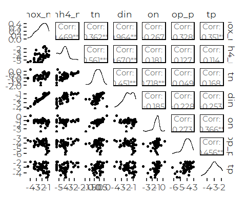

The N species are generally correlated, as are the P species.

# Ternary Diagrams

``` r
proportion_data <- royal_data_2017 %>%
  select(site:hour, nox_n:tn_flag, din:on_cens_r) %>%
  relocate(nh4_n, on, tn, .after = nox_n)%>%
  mutate(across(nox_n:on, ~ .x/tn)) %>%
  
  relocate(nh4_n_flag, on_flag, tn_flag, .after = nox_n_flag) %>%
  relocate(nh4_n_cens, on_cens_r, .after = nox_n_cens) %>%
  
  select(site, sample_date, year, nox_n:on_flag, ) %>%
  filter(! is.na(nox_n), ! is.na(nh4_n), ! is.na(on))
```

## Colored by Site

``` r
pal = viridis(10, alpha =  0.75)

TernaryPlot(alab = 'Nitrate + Nitrite', blab = 'Ammonium', clab = 'Other N',
            grid.lines = 5, grid.minor.lines = 0)
TernaryPoints(proportion_data[4:6], pch = 16, cex = 2 * proportion_data$tn,
              col = pal[as.numeric(proportion_data$site)])

legend('topleft', ncol = 2,
       cex = .75,
        legend = levels(proportion_data$site),
        box.lty = 0,
        pch = 20,
        col = pal)
```

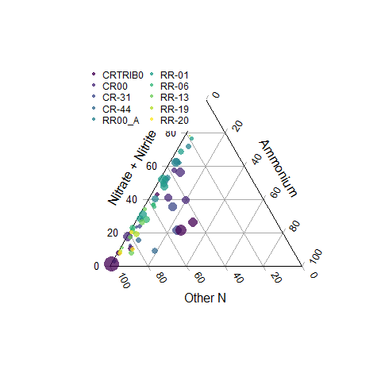

So, we see that most samples on the Royal have low ammonium, with
variable levels of NOx versus organic N. The sites with the highest
proportion of NOx tend to be from the upper tributaries / head of tide.
High TN samples may be slightly more likely to have extreme proportions,
but they do not fall in any particular area of the plot.

## Produce PDF

We have slightly more control of size of fonts when we specify the
graphics device, as we can specify fonts and base font size.

``` r
cairo_pdf('figures/ternary_royal.pdf', width = 3.5, height = 5,
          family = 'Montserrat', pointsize = 8)

TernaryPlot(alab = 'Nitrate + Nitrite', blab = 'Ammonium', clab = 'Other N',
            grid.lines = 5, grid.minor.lines = 0)
TernaryPoints(proportion_data[4:6], pch = 16, 
              col = pal[as.numeric(proportion_data$site)])

legend('topleft', ncol = 2,
       cex = .75,
        legend = levels(proportion_data$site),
        box.lty = 0,
        pch = 20,
        col = pal)
dev.off()
#> png 
#>   2
```

# Descriptive Statistics

``` r
royal_results <- royal_data_2017 %>%
  group_by(site, short_name) %>%
  summarize(across(c(nox_n, nh4_n, din, on, tn, chl, tss),
                   .fns = c(mn = ~ mean(.x, na.rm = TRUE),
                            sd = ~ sd(.x, na.rm = TRUE), 
                            n = ~sum(! is.na(.x)),
                            md = ~ median(.x, na.rm = TRUE),
                            iqr = ~ IQR(.x, na.rm = TRUE),
                            p90 = ~ quantile(.x, .9, na.rm = TRUE),
                            gm = ~ exp(mean(log(.x), na.rm = TRUE)))),
            .groups = 'drop') %>%
  mutate(site = fct_reorder(factor(site), tn_md),
         short_name = fct_reorder(factor(short_name), tn_md))
```

A Seasonal Pattern appears likely. Variances do not appear equal.

# DIN Analysis

## Data Prevalence

``` r
xtabs(~ month + site, data = royal_data_2017, subset = ! is.na(din))%>%
  as_tibble() %>%
  mutate(month = factor(month, levels = month.abb)) %>%
  filter(n>0) %>%

  ggplot(aes(site, month, fill = sqrt(n))) +
  geom_tile() +
  theme_cbep(base_size = 12) +
  theme(axis.text.x = element_text(angle = 90, hjust = 1, vjust = .25))
```

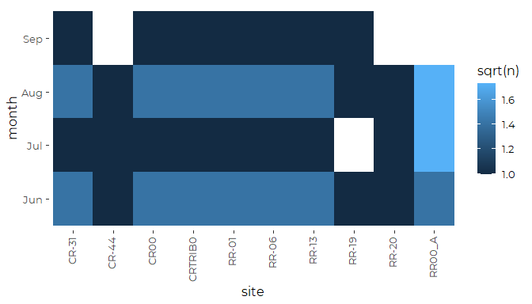

We might consider dropping the September samples to avoid model-induced
bias.

## Histograms / Distributions

``` r
plt <- ggplot(royal_data_2017, aes(din)) + 
  geom_histogram(aes(fill = site)) +
  scale_x_log10() +
  theme_cbep(base_size = 10) +
  theme(legend.position = 'None')
plt
#> `stat_bin()` using `bins = 30`. Pick better value with `binwidth`.
#> Warning: Removed 7 rows containing non-finite values (stat_bin).
```

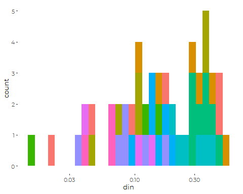

Data is relatively sparse for each site, so complex models are not an
option here. Differences between sites appear likely.

## Draft Graphic

``` r
ggplot(royal_data_2017, aes(din, short_name)) +
  geom_point(aes(color = doy)) +
  scale_color_viridis_c(name = 'Day of Year') +
  
  geom_point(data = royal_results, mapping = aes(x = din_md, y = short_name),
             shape = 3, size = 2,
             color = cbep_colors()[3]) +
  
  ylab('') +
  xlab('Dissolved Inorganic Nitrogen (mg/l)') +
  
  theme_cbep(base_size = 12)
#> Warning: Removed 7 rows containing missing values (geom_point).
```

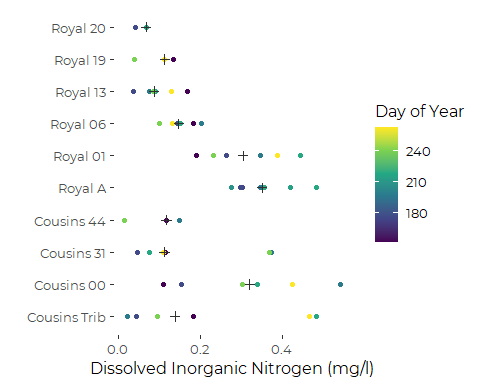

``` r
  #theme(legend.position = 'None' )  +
  #scale_x_log10()
  
ggsave('figures/din_by_site_royal.pdf', device = cairo_pdf, width = 6, height = 4)
#> Warning: Removed 7 rows containing missing values (geom_point).
```

## Linear Models

``` r
royal_din_lm_full <- lm(log(din) ~ site + month, data = royal_data_2017)
anova(royal_din_lm_full)
#> Analysis of Variance Table
#> 
#> Response: log(din)
#>           Df Sum Sq Mean Sq F value    Pr(>F)    
#> site       9 18.644 2.07154  4.4723 0.0004225 ***
#> month      3  1.730 0.57665  1.2450 0.3062114    
#> Residuals 40 18.527 0.46319                      
#> ---
#> Signif. codes:  0 '***' 0.001 '**' 0.01 '*' 0.05 '.' 0.1 ' ' 1
```

``` r
royal_din_lm <- step(royal_din_lm_full)
#> Start:  AIC=-29.7
#> log(din) ~ site + month
#> 
#>         Df Sum of Sq    RSS     AIC
#> - month  3     1.730 20.257 -30.974
#> <none>               18.528 -29.705
#> - site   9    18.499 37.027 -11.009
#> 
#> Step:  AIC=-30.97
#> log(din) ~ site
#> 
#>        Df Sum of Sq    RSS     AIC
#> <none>              20.257 -30.974
#> - site  9    18.644 38.901 -14.391
anova(royal_din_lm)
#> Analysis of Variance Table
#> 
#> Response: log(din)
#>           Df Sum Sq Mean Sq F value  Pr(>F)    
#> site       9 18.644  2.0715  4.3972 0.00041 ***
#> Residuals 43 20.258  0.4711                    
#> ---
#> Signif. codes:  0 '***' 0.001 '**' 0.01 '*' 0.05 '.' 0.1 ' ' 1
```

### Marginal Means

``` r
royal_din_emms_lm <- emmeans(royal_din_lm, 'site', type = 'response')
```

``` r
plot(royal_din_emms_lm) + coord_flip() + 
  theme(axis.text.x = element_text(angle = 90, vjust = 0.25)) +
  geom_point(data = royal_results, aes(y = site, x = din_mn),
             color = 'red') +
  geom_point(data = royal_results, aes(y = site, x = din_gm),
             color = 'yellow')
```

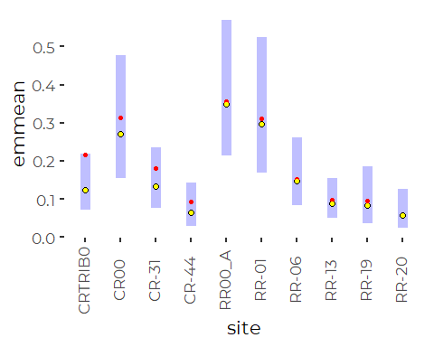

Differences between model predictions and observed means are entirely
because the model is predicting geometric, not arithmetic means.

### Model Diagnostics

``` r
oldpar <- par(mfrow = c(2,2))
plot(royal_din_lm)
```

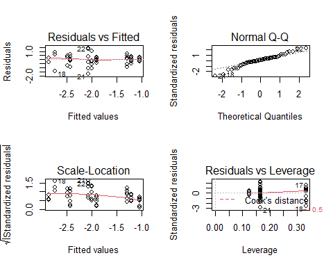

``` r
par(oldpar)
```

The log transform here was a bit too strong, but the diagnostics are not
dreadful, and they are better than diagnostics on untransformed data.
However, we know the variances are probably not uniform across sites, so
we should treat error estimates and estimates of statistical
significance with considerable skepticism.

## GAM Model

``` r
royal_din_gam <- gam(log(din) ~ site + s(doy, k = 5), data = royal_data_2017)
anova(royal_din_gam)
#> 
#> Family: gaussian 
#> Link function: identity 
#> 
#> Formula:
#> log(din) ~ site + s(doy, k = 5)
#> 
#> Parametric Terms:
#>      df     F  p-value
#> site  9 4.395 0.000436
#> 
#> Approximate significance of smooth terms:
#>        edf Ref.df     F p-value
#> s(doy)   1      1 0.911   0.345
```

So the GAM term is not statistically meaningful with such small samples,
but it does appear to better address model specification, generating a
nicer distribution of residuals. Still, there is little value to
continuing down this road.

``` r
oldpar = par(mfrow = c(2,2))
gam.check(royal_din_gam)
```

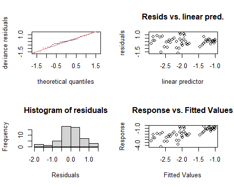

    #> 
    #> Method: GCV   Optimizer: magic
    #> Smoothing parameter selection converged after 12 iterations.
    #> The RMS GCV score gradient at convergence was 1.780294e-07 .
    #> The Hessian was positive definite.
    #> Model rank =  14 / 14 
    #> 
    #> Basis dimension (k) checking results. Low p-value (k-index<1) may
    #> indicate that k is too low, especially if edf is close to k'.
    #> 
    #>        k' edf k-index p-value
    #> s(doy)  4   1    0.94    0.29
    par(oldpar)

# TN Analysis

## Histograms

``` r
plt <- ggplot(royal_data_2017, aes(tn)) + 
  geom_histogram(aes(fill = site)) +
  scale_x_log10() +
  theme_cbep(base_size = 10) +
  theme(legend.position = 'None') +
  geom_vline(xintercept = 0.35, col = 'grey35') +
  geom_vline(xintercept = 0.6, col = 'grey35')

plt + facet_wrap(~site)
#> `stat_bin()` using `bins = 30`. Pick better value with `binwidth`.
#> Warning: Removed 7 rows containing non-finite values (stat_bin).
```

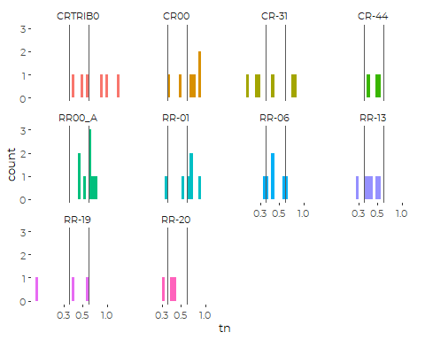

The tributaries appear to have the highest TN values.

## Draft Graphic

``` r
ggplot(royal_data_2017, aes(tn, short_name)) +
  geom_point(aes(color = doy)) +
  scale_color_viridis_c(name = 'Day of Year') +
  
  geom_point(data = royal_results, mapping = aes(x = tn_md, y = short_name),
             shape = 3, size = 3,
             color = cbep_colors()[3]) +
  
  ylab('') +
  xlab('Total Nitrogen (mg/l)') +
  
  theme_cbep(base_size = 12)  +
  #theme(legend.position = 'None' )  +
  scale_x_log10()
#> Warning: Removed 7 rows containing missing values (geom_point).
```

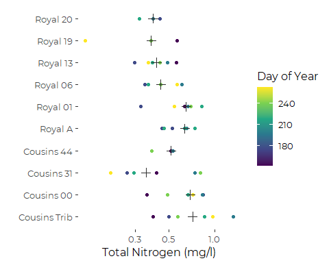

``` r
  
  
ggsave('figures/tn_by_site_royal.pdf', device = cairo_pdf, width = 6, height = 4)
#> Warning: Removed 7 rows containing missing values (geom_point).
```

## Linear Models

``` r
royal_tn_lm_full <- lm(log(tn) ~ site + month, data = royal_data_2017)
anova(royal_tn_lm_full)
#> Analysis of Variance Table
#> 
#> Response: log(tn)
#>           Df Sum Sq Mean Sq F value  Pr(>F)  
#> site       9 2.8918 0.32131  2.8218 0.01147 *
#> month      3 1.0525 0.35082  3.0810 0.03814 *
#> Residuals 40 4.5546 0.11387                  
#> ---
#> Signif. codes:  0 '***' 0.001 '**' 0.01 '*' 0.05 '.' 0.1 ' ' 1
```

``` r
royal_tn_lm <- step(royal_tn_lm_full)
#> Start:  AIC=-104.07
#> log(tn) ~ site + month
#> 
#>         Df Sum of Sq    RSS      AIC
#> <none>               4.5546 -104.070
#> - month  3    1.0525 5.6071  -99.052
#> - site   9    2.6969 7.2515  -97.421
anova(royal_tn_lm)
#> Analysis of Variance Table
#> 
#> Response: log(tn)
#>           Df Sum Sq Mean Sq F value  Pr(>F)  
#> site       9 2.8918 0.32131  2.8218 0.01147 *
#> month      3 1.0525 0.35082  3.0810 0.03814 *
#> Residuals 40 4.5546 0.11387                  
#> ---
#> Signif. codes:  0 '***' 0.001 '**' 0.01 '*' 0.05 '.' 0.1 ' ' 1
```

``` r
summary(royal_tn_lm)
#> 
#> Call:
#> lm(formula = log(tn) ~ site + month, data = royal_data_2017)
#> 
#> Residuals:
#>      Min       1Q   Median       3Q      Max 
#> -0.71790 -0.17591  0.01256  0.16846  0.67103 
#> 
#> Coefficients:
#>             Estimate Std. Error t value Pr(>|t|)   
#> (Intercept) -0.44706    0.15300  -2.922  0.00570 **
#> siteCR00    -0.12671    0.19482  -0.650  0.51915   
#> siteCR-31   -0.57769    0.19482  -2.965  0.00508 **
#> siteCR-44   -0.47343    0.24033  -1.970  0.05580 . 
#> siteRR00_A  -0.28016    0.18515  -1.513  0.13810   
#> siteRR-01   -0.17869    0.19482  -0.917  0.36453   
#> siteRR-06   -0.45014    0.19482  -2.311  0.02610 * 
#> siteRR-13   -0.53719    0.19482  -2.757  0.00874 **
#> siteRR-19   -0.74948    0.24033  -3.119  0.00336 **
#> siteRR-20   -0.69266    0.24033  -2.882  0.00632 **
#> monthJul     0.37043    0.13325   2.780  0.00825 **
#> monthAug     0.13928    0.11431   1.218  0.23017   
#> monthSep    -0.05167    0.15445  -0.335  0.73971   
#> ---
#> Signif. codes:  0 '***' 0.001 '**' 0.01 '*' 0.05 '.' 0.1 ' ' 1
#> 
#> Residual standard error: 0.3374 on 40 degrees of freedom
#>   (7 observations deleted due to missingness)
#> Multiple R-squared:  0.4641, Adjusted R-squared:  0.3033 
#> F-statistic: 2.887 on 12 and 40 DF,  p-value: 0.005861
```

So the month of July had higher than expected TN, and that is unlikely
to be solely due to chance (if we view each Site as independent, which
in this setting, we do not). We have too little data to conclude that
there is a meaningful seasonal pattern. All we know is “July is high”
which may reflect the year’s peculiar weather or something. We proceed
with a simpler model here.

``` r
royal_tn_lm_red <- lm(log(tn) ~ site, data = royal_data_2017)
anova(royal_tn_lm_red)
#> Analysis of Variance Table
#> 
#> Response: log(tn)
#>           Df Sum Sq Mean Sq F value  Pr(>F)  
#> site       9 2.8918 0.32131  2.4641 0.02307 *
#> Residuals 43 5.6071 0.13040                  
#> ---
#> Signif. codes:  0 '***' 0.001 '**' 0.01 '*' 0.05 '.' 0.1 ' ' 1
```

### Marginal Means

``` r
royal_tn_emms_lm <- emmeans(royal_tn_lm_red, 'site', type = 'response')
```

``` r
plot(royal_tn_emms_lm) + coord_flip() + 
  theme(axis.text.x = element_text(angle = 90, vjust = 0.25)) +
  geom_point(data = royal_results, aes(y = site, x = tn_mn),
             color = 'red') +
  geom_point(data = royal_results, aes(y = site, x = tn_gm),
             color = 'yellow')
```

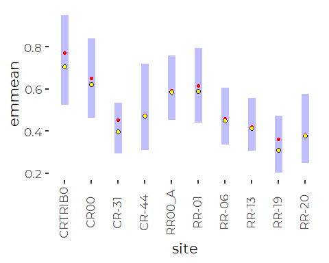

The linear model does an excellent job of returning the observed
geometric means, as expected.

### Model Diagnostics

``` r
oldpar <- par(mfrow = c(2,2))
plot(royal_tn_lm_red)
```

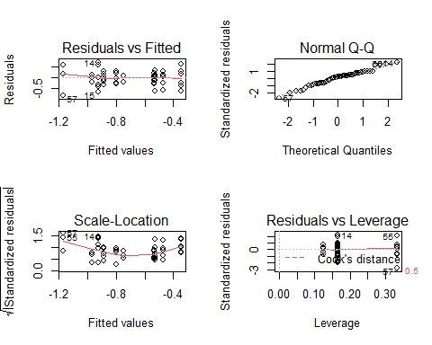

``` r
par(oldpar)
```

Those look excellent, except for the possible scale-location pattern.
However, since that pattern reflects discrete site predictions, it
likely only reflects low variability at one site – for unknown reasons.

## GAM Model

``` r
royal_tn_gam <- gam(log(tn) ~ site + s(doy, k = 4), data = royal_data_2017)
anova(royal_tn_gam)
#> 
#> Family: gaussian 
#> Link function: identity 
#> 
#> Formula:
#> log(tn) ~ site + s(doy, k = 4)
#> 
#> Parametric Terms:
#>      df     F p-value
#> site  9 2.365  0.0294
#> 
#> Approximate significance of smooth terms:
#>          edf Ref.df     F p-value
#> s(doy) 1.636  2.000 0.633   0.535
```

``` r
plot(royal_tn_gam)
```


``` r
oldpar = par(mfrow = c(2,2))
gam.check(royal_tn_gam)
```

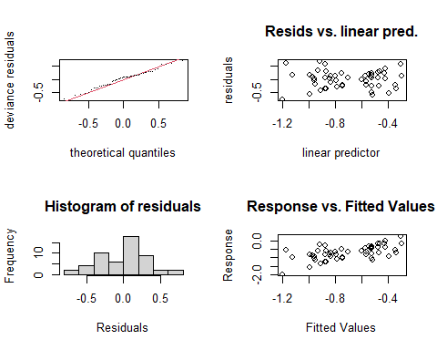

    #> 
    #> Method: GCV   Optimizer: magic
    #> Smoothing parameter selection converged after 4 iterations.
    #> The RMS GCV score gradient at convergence was 1.864233e-06 .
    #> The Hessian was positive definite.
    #> Model rank =  13 / 13 
    #> 
    #> Basis dimension (k) checking results. Low p-value (k-index<1) may
    #> indicate that k is too low, especially if edf is close to k'.
    #> 
    #>          k'  edf k-index p-value
    #> s(doy) 3.00 1.64    0.93    0.23
    par(oldpar)

# N to P ratios

## Histograms / Distributions

``` r
royal_data_2017 <- royal_data_2017 %>%
  mutate(n_to_p = tn/tp)
```

``` r
plt <- ggplot(royal_data_2017, aes(n_to_p)) + 
  geom_histogram(aes(fill = site)) +
  scale_x_log10() +
  theme_cbep(base_size = 10) +
  theme(legend.position = 'None') +
  geom_vline(xintercept = 15,col = 'grey35')
plt
#> `stat_bin()` using `bins = 30`. Pick better value with `binwidth`.
#> Warning: Removed 7 rows containing non-finite values (stat_bin).
```

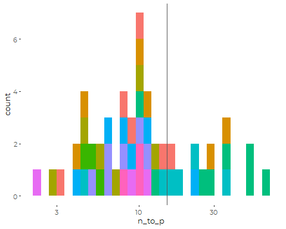

Generally, our N:P ratios are well below 15, suggesting continued N
limitation. Is that worth reporting on? There is clearly some variation
between sites. The highest N:P ratios occur at the Royal River head of
tide, suggesting high N and low P in freshwater loading to the estuary,
and possible P limitation.

``` r
plt +  facet_wrap (~site)
#> `stat_bin()` using `bins = 30`. Pick better value with `binwidth`.
#> Warning: Removed 7 rows containing non-finite values (stat_bin).
```

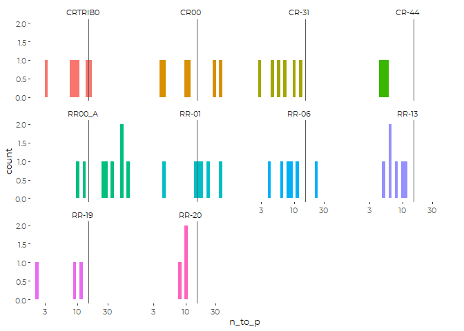

## Descriptive Statistics

``` r
royal_n2p_results <- royal_data_2017 %>%
  group_by(site, short_name) %>%
  summarize(across(c(tn, tp, n_to_p),
                   .fns = c(mn = ~ mean(.x, na.rm = TRUE),
                            sd = ~ sd(.x, na.rm = TRUE), 
                            n = ~sum(! is.na(.x)),
                            md = ~ median(.x, na.rm = TRUE),
                            iqr = ~ IQR(.x, na.rm = TRUE),
                            p90 = ~ quantile(.x, .9, na.rm = TRUE),
                            gm = ~ exp(mean(log(.x), na.rm = TRUE)))),
            .groups = 'drop') %>%
  mutate(site = fct_reorder(factor(site), tn_md),
         short_name = fct_reorder(factor(short_name), tn_md))
```

## Draft Graphic

``` r
ggplot(royal_data_2017, aes(n_to_p, short_name)) +
  geom_point(aes(color = month)) +
  scale_color_manual(values = cbep_colors2(), name = '') +
  
  geom_point(data = royal_n2p_results, mapping = aes(x = n_to_p_md, y = short_name),
             shape = 3, size = 2,
             color = cbep_colors()[3]) +
  
  geom_vline(xintercept = 15, color = 'gray35') +
  
  ylab('') +
  xlab('Dissolved Inorganic Nitrogen (mg/l)') +
  
  theme_cbep(base_size = 12)  +
  #theme(legend.position = 'None' )  +
  scale_x_log10()
#> Warning: Removed 7 rows containing missing values (geom_point).
```

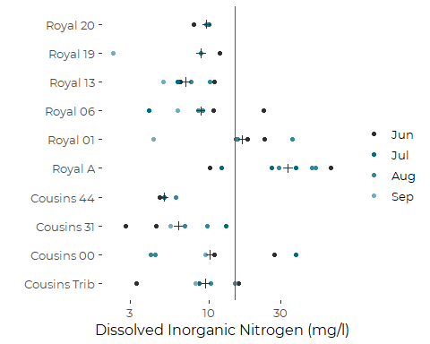

``` r
  
ggsave('figures/n_to_p_by_site_royal.pdf', device = cairo_pdf, width = 6, height = 4)
#> Warning: Removed 7 rows containing missing values (geom_point).
```

# Phosphorus (A Few Graphics)

``` r
ggplot(royal_data_2017, aes(tp)) + 
  geom_histogram(aes(fill = site, color = tp_cens)) +
  scale_color_manual(values = c('black', 'yellow')) + 
  scale_x_log10()
#> `stat_bin()` using `bins = 30`. Pick better value with `binwidth`.
#> Warning: Removed 7 rows containing non-finite values (stat_bin).
```

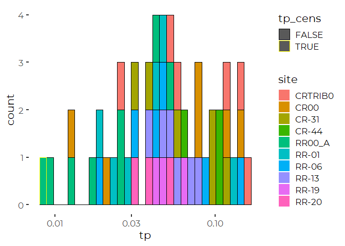
So very little of the data is censored.

``` r
ggplot(royal_data_2017, aes(site, tp)) + 
  geom_point(aes(color = doy)) +
  geom_smooth(method = 'lm') +
  scale_color_viridis_c() +
  scale_y_log10() +
  theme_cbep(base_size = 12) +
  theme(axis.text.x = element_text(angle = 90, vjust = 0.25, hjust = 1))
#> `geom_smooth()` using formula 'y ~ x'
#> Warning: Removed 7 rows containing non-finite values (stat_smooth).
#> Warning: Removed 7 rows containing missing values (geom_point).
```

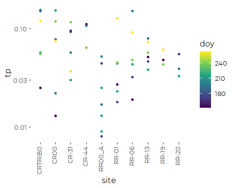

``` r
ggplot(royal_data_2017, aes(doy, tp)) + 
  geom_point(aes(color = site)) +
  geom_smooth(method = 'lm') +
  scale_color_viridis_d() +
  scale_y_log10()
#> `geom_smooth()` using formula 'y ~ x'
#> Warning: Removed 7 rows containing non-finite values (stat_smooth).
#> Warning: Removed 7 rows containing missing values (geom_point).
```

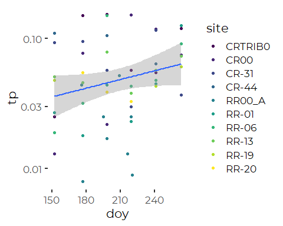

There is a possibility of a seasonal pattern here.

# Chlorophyll and Phaeophytin

This data does not include all chlorophyll data, because of ambiguities
of labeling in the source data.See “DEP\_Nutrients\_Preparation.Rmd” for
details.

``` r
tmp <- royal_data_2017 %>%
  select(site, sample_date, chl, phaeo)

tmp %>%
  select(chl, phaeo) %>%
  mutate(chl_to_p = chl / phaeo) %>%
  mutate(across(everything(), log)) %>%
  ggpairs(progress = FALSE)
#> Warning: Removed 15 rows containing non-finite values (stat_density).
#> Warning in ggally_statistic(data = data, mapping = mapping, na.rm = na.rm, :
#> Removed 15 rows containing missing values

#> Warning in ggally_statistic(data = data, mapping = mapping, na.rm = na.rm, :
#> Removed 15 rows containing missing values
#> Warning: Removed 15 rows containing missing values (geom_point).
#> Warning: Removed 15 rows containing non-finite values (stat_density).
#> Warning in ggally_statistic(data = data, mapping = mapping, na.rm = na.rm, :
#> Removed 15 rows containing missing values
#> Warning: Removed 15 rows containing missing values (geom_point).

#> Warning: Removed 15 rows containing missing values (geom_point).
#> Warning: Removed 15 rows containing non-finite values (stat_density).
```

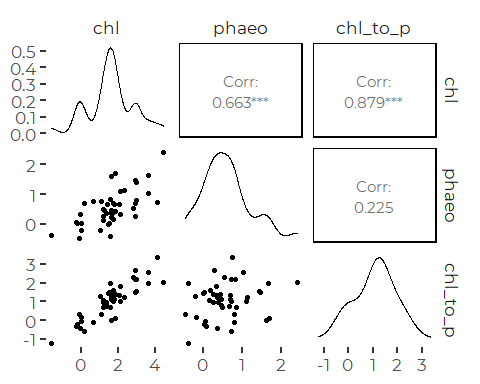

Generally, Chl and Phaeo are correlated.

``` r
tmp <- royal_data_2017 %>%
  select(site, sample_date,
         chl, phaeo,
         chl_flag, phaeo_flag, 
         chl_cens, phaeo_cens)

ggplot(tmp, aes(chl, phaeo)) +
  geom_point(aes(color = chl_flag | phaeo_flag), alpha = 0.5) +
  geom_abline(slope = 1, intercept = 0) +
  scale_x_log10() + scale_y_log10() +
  coord_equal() +
  scale_color_manual(values = cbep_colors(), name = 'Data Quality Flag') +
  theme_cbep(base_size = 12)
#> Warning: Removed 15 rows containing missing values (geom_point).
```

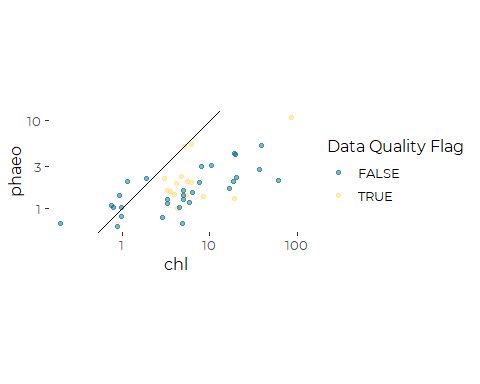

## Chlorophyll and Nutrients

``` r
tmp <- royal_data_2017 %>%
  select(site, sample_date, chl, phaeo, op_p, tp, tn, din, on, tss)

tmp %>%
  select(-site, -sample_date
         ) %>%
  mutate(across(everything(), log)) %>%
  ggpairs(progress = FALSE)
#> Warning: Removed 15 rows containing non-finite values (stat_density).
#> Warning in ggally_statistic(data = data, mapping = mapping, na.rm = na.rm, :
#> Removed 15 rows containing missing values
#> Warning in ggally_statistic(data = data, mapping = mapping, na.rm = na.rm, :
#> Removed 21 rows containing missing values

#> Warning in ggally_statistic(data = data, mapping = mapping, na.rm = na.rm, :
#> Removed 21 rows containing missing values

#> Warning in ggally_statistic(data = data, mapping = mapping, na.rm = na.rm, :
#> Removed 21 rows containing missing values

#> Warning in ggally_statistic(data = data, mapping = mapping, na.rm = na.rm, :
#> Removed 21 rows containing missing values

#> Warning in ggally_statistic(data = data, mapping = mapping, na.rm = na.rm, :
#> Removed 21 rows containing missing values
#> Warning in ggally_statistic(data = data, mapping = mapping, na.rm = na.rm, :
#> Removed 16 rows containing missing values
#> Warning: Removed 15 rows containing missing values (geom_point).
#> Warning: Removed 15 rows containing non-finite values (stat_density).
#> Warning in ggally_statistic(data = data, mapping = mapping, na.rm = na.rm, :
#> Removed 21 rows containing missing values

#> Warning in ggally_statistic(data = data, mapping = mapping, na.rm = na.rm, :
#> Removed 21 rows containing missing values

#> Warning in ggally_statistic(data = data, mapping = mapping, na.rm = na.rm, :
#> Removed 21 rows containing missing values

#> Warning in ggally_statistic(data = data, mapping = mapping, na.rm = na.rm, :
#> Removed 21 rows containing missing values

#> Warning in ggally_statistic(data = data, mapping = mapping, na.rm = na.rm, :
#> Removed 21 rows containing missing values
#> Warning in ggally_statistic(data = data, mapping = mapping, na.rm = na.rm, :
#> Removed 16 rows containing missing values
#> Warning: Removed 21 rows containing missing values (geom_point).

#> Warning: Removed 21 rows containing missing values (geom_point).
#> Warning: Removed 8 rows containing non-finite values (stat_density).
#> Warning in ggally_statistic(data = data, mapping = mapping, na.rm = na.rm, :
#> Removed 8 rows containing missing values

#> Warning in ggally_statistic(data = data, mapping = mapping, na.rm = na.rm, :
#> Removed 8 rows containing missing values

#> Warning in ggally_statistic(data = data, mapping = mapping, na.rm = na.rm, :
#> Removed 8 rows containing missing values

#> Warning in ggally_statistic(data = data, mapping = mapping, na.rm = na.rm, :
#> Removed 8 rows containing missing values
#> Warning in ggally_statistic(data = data, mapping = mapping, na.rm = na.rm, :
#> Removed 22 rows containing missing values
#> Warning: Removed 21 rows containing missing values (geom_point).

#> Warning: Removed 21 rows containing missing values (geom_point).
#> Warning: Removed 8 rows containing missing values (geom_point).
#> Warning: Removed 7 rows containing non-finite values (stat_density).
#> Warning in ggally_statistic(data = data, mapping = mapping, na.rm = na.rm, :
#> Removed 7 rows containing missing values

#> Warning in ggally_statistic(data = data, mapping = mapping, na.rm = na.rm, :
#> Removed 7 rows containing missing values

#> Warning in ggally_statistic(data = data, mapping = mapping, na.rm = na.rm, :
#> Removed 7 rows containing missing values
#> Warning in ggally_statistic(data = data, mapping = mapping, na.rm = na.rm, :
#> Removed 22 rows containing missing values
#> Warning: Removed 21 rows containing missing values (geom_point).

#> Warning: Removed 21 rows containing missing values (geom_point).
#> Warning: Removed 8 rows containing missing values (geom_point).
#> Warning: Removed 7 rows containing missing values (geom_point).
#> Warning: Removed 7 rows containing non-finite values (stat_density).
#> Warning in ggally_statistic(data = data, mapping = mapping, na.rm = na.rm, :
#> Removed 7 rows containing missing values

#> Warning in ggally_statistic(data = data, mapping = mapping, na.rm = na.rm, :
#> Removed 7 rows containing missing values
#> Warning in ggally_statistic(data = data, mapping = mapping, na.rm = na.rm, :
#> Removed 22 rows containing missing values
#> Warning: Removed 21 rows containing missing values (geom_point).

#> Warning: Removed 21 rows containing missing values (geom_point).
#> Warning: Removed 8 rows containing missing values (geom_point).
#> Warning: Removed 7 rows containing missing values (geom_point).

#> Warning: Removed 7 rows containing missing values (geom_point).
#> Warning: Removed 7 rows containing non-finite values (stat_density).
#> Warning in ggally_statistic(data = data, mapping = mapping, na.rm = na.rm, :
#> Removed 7 rows containing missing values
#> Warning in ggally_statistic(data = data, mapping = mapping, na.rm = na.rm, :
#> Removed 22 rows containing missing values
#> Warning: Removed 21 rows containing missing values (geom_point).

#> Warning: Removed 21 rows containing missing values (geom_point).
#> Warning: Removed 8 rows containing missing values (geom_point).
#> Warning: Removed 7 rows containing missing values (geom_point).

#> Warning: Removed 7 rows containing missing values (geom_point).

#> Warning: Removed 7 rows containing missing values (geom_point).
#> Warning: Removed 7 rows containing non-finite values (stat_density).
#> Warning in ggally_statistic(data = data, mapping = mapping, na.rm = na.rm, :
#> Removed 22 rows containing missing values
#> Warning: Removed 16 rows containing missing values (geom_point).

#> Warning: Removed 16 rows containing missing values (geom_point).
#> Warning: Removed 22 rows containing missing values (geom_point).

#> Warning: Removed 22 rows containing missing values (geom_point).

#> Warning: Removed 22 rows containing missing values (geom_point).

#> Warning: Removed 22 rows containing missing values (geom_point).

#> Warning: Removed 22 rows containing missing values (geom_point).
#> Warning: Removed 15 rows containing non-finite values (stat_density).
```

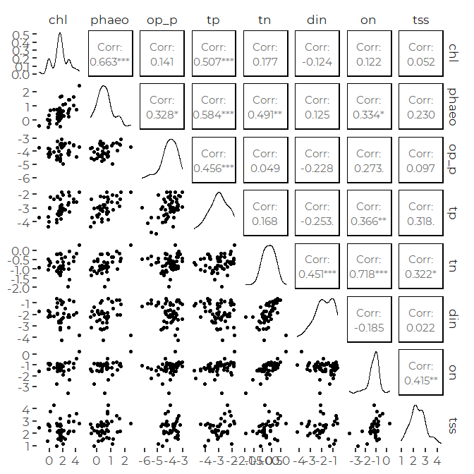

The strongest correlation between chlorophyll and nutrients is with TP,
not TN.
