Initial Review of Maine DEP Vertical Profile Data from Sondes
================
Curtis C. Bohlen, Casco Bay Estuary Partnership.
04/26/2021

-   [Introduction](#introduction)
-   [Folder References](#folder-references)
-   [Load Data](#load-data)
-   [Summary of Metadata](#summary-of-metadata)
    -   [QA/QC Samples](#qaqc-samples)
    -   [Censoring Flags](#censoring-flags)
    -   [Units](#units)
-   [Review of Sonde Data](#review-of-sonde-data)
    -   [How often was each site
        sampled?](#how-often-was-each-site-sampled)
-   [Analysis Goals and
    Considerations](#analysis-goals-and-considerations)
-   [Save List of High Frequency Sonde
    Sites](#save-list-of-high-frequency-sonde-sites)
    -   [Restrict\_data](#restrict_data)
-   [Graphical Review](#graphical-review)
    -   [Seasonal Variation](#seasonal-variation)
        -   [Temperature](#temperature)
        -   [Salinity](#salinity)
        -   [Oxygen](#oxygen)
        -   [Percent Saturation](#percent-saturation)
        -   [Chlorophyll](#chlorophyll)
        -   [Turbidity](#turbidity)
-   [Presumpscort Estuary Series](#presumpscort-estuary-series)
    -   [Dot Plot Examples](#dot-plot-examples)
        -   [Salinity Plot May](#salinity-plot-may)
        -   [Salinity Plot September
            2018](#salinity-plot-september-2018)
        -   [Salinity, September](#salinity-september)
        -   [Dissolved Oxygen, September](#dissolved-oxygen-september)
        -   [Chlorophyll, September](#chlorophyll-september)


# Introduction

Sonde “downcast” data generates a huge volume of data, which can be
difficult to analyze or summarize. Consequently, the data is often
presented largely in graphical form. Formal statistical analyses are of
less interest, as we expect variation by depth, time, and location.
Unexplained variation is also fairly common.

Here we focus on producing graphical summaries of the DEP sonde downcast
data, looking at:

1.  Variation by time of year for each site and year, and

2.  Patterns along a spatial transect from the head of the Presumpscot
    estuary to out past the mouth of Portland Harbor.

We make use of a small graphics package we produced, `tdggraph`, that
encapsulates some of the logic needed to generate time by depth graphics
succinctly. That package is available
[here](https://github.com/CBEEP-SoCB/tdggraph).

\#Load libraries

``` r
#library(readxl)
library(tidyverse)
#> Warning: package 'tidyverse' was built under R version 4.0.5
#> -- Attaching packages --------------------------------------- tidyverse 1.3.1 --
#> v ggplot2 3.3.5     v purrr   0.3.4
#> v tibble  3.1.6     v dplyr   1.0.7
#> v tidyr   1.1.4     v stringr 1.4.0
#> v readr   2.1.0     v forcats 0.5.1
#> Warning: package 'ggplot2' was built under R version 4.0.5
#> Warning: package 'tidyr' was built under R version 4.0.5
#> Warning: package 'dplyr' was built under R version 4.0.5
#> Warning: package 'forcats' was built under R version 4.0.5
#> -- Conflicts ------------------------------------------ tidyverse_conflicts() --
#> x dplyr::filter() masks stats::filter()
#> x dplyr::lag()    masks stats::lag()

library(GGally)
#> Warning: package 'GGally' was built under R version 4.0.5
#> Registered S3 method overwritten by 'GGally':
#>   method from   
#>   +.gg   ggplot2
#library(mgcv)

library(CBEPgraphics)
load_cbep_fonts()
theme_set(theme_cbep())

library(tdggraph)
```

# Folder References

``` r
sibfldnm <- 'Derived_Data'
parent <- dirname(getwd())
sibling <- paste(parent,sibfldnm, sep = '/')

#dir.create(file.path(getwd(), 'figures'), showWarnings = FALSE)
```

# Load Data

``` r
sonde_data <- read_csv(file.path(sibling, 'dep_sonde_data.csv')) %>%
  mutate(yearf = factor(year))
#> Rows: 2679 Columns: 16
#> -- Column specification --------------------------------------------------------
#> Delimiter: ","
#> chr   (3): site_name, site, month
#> dbl  (10): year, hour, depth, temp, salinity, ph, pctsat, do, chl_a_sonde, t...
#> lgl   (1): turbidity_cens
#> date  (1): dt
#> time  (1): time
#> 
#> i Use `spec()` to retrieve the full column specification for this data.
#> i Specify the column types or set `show_col_types = FALSE` to quiet this message.
```

# Summary of Metadata

## QA/QC Samples

We conducted no analysis of QA/QC samples, and simply deleted then from
the data to avoid confusion.

## Censoring Flags

While preparing our working data, we separated raw observations from
text annotations, including data quality flags. In the sonde-related
data, we only had to contend with (1) left censoring of turbidity data ,
and (2) data quality flags on all chlorophyll data.

Since all sonde-related chlorophyll data was flagged as of questionable
accuracy (with “J” flags), it does us no good to track that information
during further analysis. We retain all data, but recognize that it’s
accuracy is suspect, especially in comparison to laboratory results. We
believe the “J” flags reflect the fact that these are “raw” estimates of
chlorophyll based only on observed fluorescence, never recalibrated
based on laboratory samples.

We also had a few “U&lt;” flags in the Turbidity data. We separated out
a `TRUE` / `FALSE` flag to indicated censored values, with the name
’turbidity\_cens\`.

## Units

Our derived data files lack any indication of units. Units were
documented in the source Excel files. We summarize relevant information
here.

| Variable Name | Meaning                                         | Units                       |
|---------------|-------------------------------------------------|-----------------------------|
| site\_name    | DEP “Site ID”                                   |                             |
| site          | DEP “Sample Point ID” without depth designation |                             |
| dt            | Date of sample collection                       | yyyy-mm-dd format           |
| month         | Month, derived from date                        | Three letter codes          |
| year          | Year, derived from date                         |                             |
| time          | time of sample                                  | 24 hour clock, hh:mm format |
| hour          | hour, derived from time                         |                             |
| depth         | Sample Depth                                    | Meters                      |
| temp          | Water Temperature                               | DEG C                       |
| salinity      | Salinity                                        | PPTH                        |
| ph            | pH                                              |                             |
| pctsat        | Dissolved Oxygen Saturation                     | %                           |
| do            | Dissolved Oxygen                                | MG/L                        |
| turbidity     | Turbidity                                       | NTU                         |
| chl\_a\_sonde | Chlorophyll A, measured with a sonde            | UG/L                        |

# Review of Sonde Data

Judging only by site codes, there may be some data overlap with the FOCB
“profile” site downcast data. We have not double checked that yet.

## How often was each site sampled?

We make an assumption here that sampling on one day is related.

``` r
tmp <- sonde_data %>%
  group_by(site, year) %>%
  summarize(was_sampled = sum(! is.na(depth)) > 1,
            .groups = 'drop')
xt <- xtabs(~ year + site, data = tmp)
```

``` r
rowSums(xt)
#> 2016 2017 2018 2019 2020 
#>   14   17    9    9    7
```

``` r
sonde_data %>%
  group_by(site, year, dt) %>%
  summarize(was_sampled = sum(! is.na(depth)) > 1,
            .groups = 'drop_last') %>%
  summarize(n_sampled = sum(was_sampled),
            .groups = 'drop') %>%
  pivot_wider(names_from = year, values_from = n_sampled)
#> # A tibble: 28 x 6
#>    site    `2017` `2018` `2019` `2020` `2016`
#>    <chr>    <int>  <int>  <int>  <int>  <int>
#>  1 BMR02        6      8      8      7     NA
#>  2 CBPR         6      8      9      8     NA
#>  3 CR-31        6     NA     NA     NA     NA
#>  4 CR-44        3     NA     NA     NA     NA
#>  5 CR00         2     NA     NA     NA     NA
#>  6 CRTRIB0      3     NA     NA     NA     NA
#>  7 EEB18        6      8      8      7     NA
#>  8 FR03        NA     NA     NA     NA      3
#>  9 FR04        NA     NA     NA     NA      3
#> 10 FR05A       NA     NA     NA     NA      2
#> # ... with 18 more rows
```

Certain sites had sonde data collected in only one year, while a handful
of sites had data collected in three, four or five years.

Year 2017 gives has the highest number of sites tracked, with 2016 not
far behind. However,at these sites, data was often only collected a few
times, making seasonal analysis problematic. In 2016, DEP samples
focused on the Haraseeket and the Fore. In 2017, on the Royal and the
Cousins.

We may be able to get broader seasonal and geographic coverage based on
FOCB profile sites.

# Analysis Goals and Considerations

There is no simple (one value) summary of profile data to derive and
present in State of Casco Bay. Given space constraints, our primary use
of these data is likely to be as examples showing vertical profiles in a
side bar.

We thus focus on graphical review of those high frequency sites and
years, where we can look closely at profiles over the course of the
season.

``` r
tmp <- sonde_data %>%
  group_by(site, dt) %>%
  summarize(was_sampled = sum(! is.na(depth)) > 1,
            .groups = 'drop')

xt <- xtabs(~ dt + site, data = tmp)
(tot <- colSums(xt))
#>   BMR02    CBPR   CR-31   CR-44    CR00 CRTRIB0   EEB18    FR03    FR04   FR05A 
#>      29      31       6       3       6       6      29       3       3       2 
#>   FR05B    FR07    FR09    HR02    HR03    HR04    HR05    LC02   P6FGG   P7CBI 
#>       1       3      31       3       5       5       3       3      17      16 
#>   PR-17   PR-28   PRV70   RR-01   RR-06   RR-13   RR-19   RR-20 
#>      25      31      30       6       8       8       5       3
(preferred_sites <- names(tot[tot > 15]))
#> [1] "BMR02" "CBPR"  "EEB18" "FR09"  "P6FGG" "P7CBI" "PR-17" "PR-28" "PRV70"
rm(tmp, xt, tot)
```

We lose little by restricting ourselves to only the regularly sampled
sites.

An alternative would be to look at all sites sampled regularly in some
single year, perhaps 2017.

We focus on data from the high frequency sites sites, which may clarify
what is going on.

# Save List of High Frequency Sonde Sites

``` r
write_csv(tibble(site = preferred_sites), 
          file.path(sibling, 'high_freq_sonde_sites.csv') )
```

## Restrict\_data

``` r
smaller_data <- sonde_data %>%
  filter(site %in% preferred_sites) %>%
  filter (year > 2016)
```

``` r
smaller_data %>%
  group_by(site, year, dt) %>%
  summarize(was_sampled = sum(! is.na(depth)) > 1,
            .groups = 'drop_last') %>%
  summarize(n_sampled = sum(was_sampled),
            .groups = 'drop') %>%
  pivot_wider(names_from = year, values_from = n_sampled)
#> # A tibble: 9 x 5
#>   site  `2017` `2018` `2019` `2020`
#>   <chr>  <int>  <int>  <int>  <int>
#> 1 BMR02      6      8      8      7
#> 2 CBPR       6      8      9      8
#> 3 EEB18      6      8      8      7
#> 4 FR09       6      8      8      6
#> 5 P6FGG      6      8      3     NA
#> 6 P7CBI      6      8      2     NA
#> 7 PR-17     NA      8      9      8
#> 8 PR-28      6      8      9      8
#> 9 PRV70      6      8      8      8
```

# Graphical Review

## Seasonal Variation

We created a small package (`tdggraph`)to generate `ggplot2` graphics to
depict profile data. We use it here to quickly review a lot of
information in condensed form. The `tdggraph` functions do not yet work
with `facet_wrap()`, so we use a nested tibble to generate graphics for
review.

``` r
nested <- smaller_data %>%
  rename(dates = dt) %>%
  group_by(site) %>%
  nest()
```

### Temperature

``` r
 nested <- nested %>%
  mutate(tmp2017 = map(data, function(d) ptdots( d[d$year == 2017,], 
                                                 .x  = dates, 
                                                 .y   = depth, 
                                                 .val = temp) + 
                        ggtitle(site) +
                        theme_cbep(base_size = 10)),
         tmp2018 = map(data, function(d) ptdots( d[d$year == 2018,], 
                                                 .x  = dates, 
                                                 .y   = depth, 
                                                 .val = temp) + 
                        ggtitle(site) +
                        theme_cbep(base_size = 10)),
         tmp2019 = map(data, function(d) ptdots( d[d$year == 2019,], 
                                                 .x  = dates, 
                                                 .y   = depth, 
                                                 .val = temp) + 
                        ggtitle(site) +
                        theme_cbep(base_size = 10)),
         tmp2020 = map(data, function(d) ptdots( d[d$year == 2020,], 
                                                 .x  = dates, 
                                                 .y   = depth, 
                                                 .val = temp) + 
                        ggtitle(site) +
                        theme_cbep(base_size = 10)))
```

#### 2017

``` r
for (s in seq_along(nested$site))
  print(nested$tmp2017[[s]] +
              scale_color_distiller(palette = 7, direction = 2, 
                        limits = c(10, 25),
                        na.value = 'gray95',
                                  ) +
          coord_cartesian(ylim = c(20,0)) +
          guides(color = guide_colorbar(barwidth = unit(0.25, 'cm'))))
```

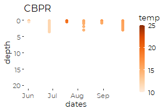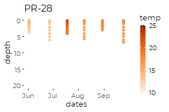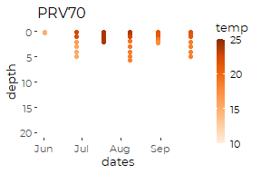

#### 2018

``` r
for (s in seq_along(nested$site))
  print(nested$tmp2018[[s]] +
              scale_color_distiller(palette = 7, direction = 2, 
                        limits = c(10, 25),
                        na.value = 'gray95',
                                  ) +
          coord_cartesian(ylim = c(20,0)) +
          guides(color = guide_colorbar(barwidth = unit(0.25, 'cm'))))
```

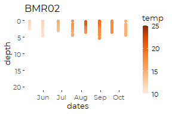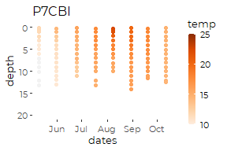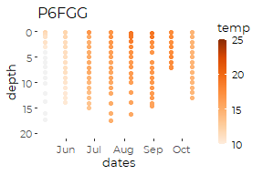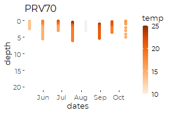

#### 2019

``` r
for (s in seq_along(nested$site))
  print(nested$tmp2019[[s]] +
              scale_color_distiller(palette = 7, direction = 2, 
                        limits = c(10, 25),
                        na.value = 'gray95',
                                  ) +
          coord_cartesian(ylim = c(22,0)) +
          guides(color = guide_colorbar(barwidth = unit(0.25, 'cm'))))
```

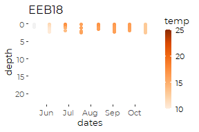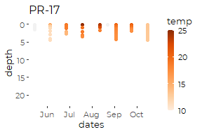

#### 2020

``` r
for (s in seq_along(nested$site))
  print(nested$tmp2017[[s]] +
              scale_color_distiller(palette = 7, direction = 2, 
                        limits = c(10, 25),
                        na.value = 'gray95',
                                  ) +
          coord_cartesian(ylim = c(22,0)) +
          guides(color = guide_colorbar(barwidth = unit(0.25, 'cm'))))
```

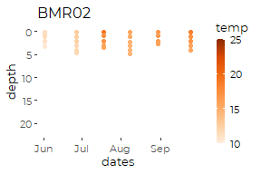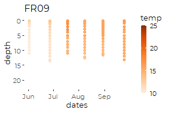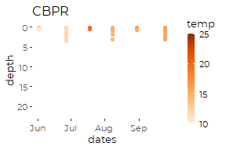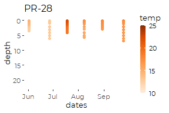

What we see is that vertical thermal structure is common, but generally
not very strong at most sites. Temperatures change by a degree C every
couple of meters or so. This is enough to be meaningful, and slow
vertical mixing, but this is not evidence of string thermal
stratification as occurs in Maine lakes.

Reverse thermal stratification occurs sometimes on the Presumpscot
Estuary, presumably because of salinity gradients that stabilize thermal
patterns.

### Salinity

``` r
 nested <- nested %>%
  mutate(sal2017 = map(data, function(d) ptdots( d[d$year == 2017,], 
                                                 .x  = dates, 
                                                 .y   = depth, 
                                                 .val = salinity) + 
                        ggtitle(site) +
                        theme_cbep(base_size = 10)),
         sal2018 = map(data, function(d) ptdots( d[d$year == 2018,],
                                                 .x  = dates, 
                                                 .y   = depth, 
                                                 .val = salinity) + 
                        ggtitle(site) +
                        theme_cbep(base_size = 10)),
         sal2019 = map(data, function(d) ptdots( d[d$year == 2019,], 
                                                 .x  = dates, 
                                                 .y   = depth, 
                                                 .val = salinity) + 
                        ggtitle(site) +
                        theme_cbep(base_size = 10)),
         sal2020 = map(data, function(d) ptdots( d[d$year == 2020,], 
                                                 .x  = dates, 
                                                 .y   = depth, 
                                                 .val = salinity) + 
                        ggtitle(site) +
                        theme_cbep(base_size = 10)))
```

#### 2017

``` r
for (s in seq_along(nested$site))
  print(nested$sal2017[[s]] +
            scale_color_distiller(palette = 3, direction = 2, 
                                 # limits = c(10, 32)
                                  ) +
          coord_cartesian(ylim = c(22,0)) +
          guides(color = guide_colorbar(barwidth = unit(0.25, 'cm'))))
```

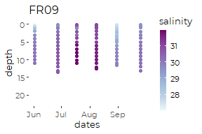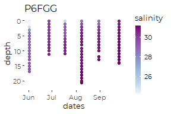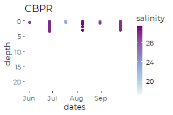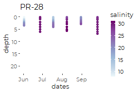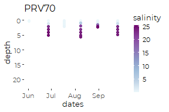

#### 2018

``` r
for (s in seq_along(nested$site))
  print(nested$sal2018[[s]] +
            scale_color_distiller(palette = 3, direction = 2, 
                                 # limits = c(10, 32)
                                  ) +
          coord_cartesian(ylim = c(22,0)) +
          guides(color = guide_colorbar(barwidth = unit(0.25, 'cm'))))
```

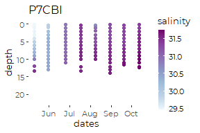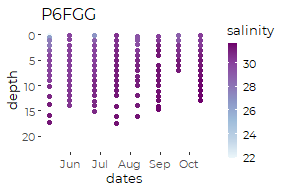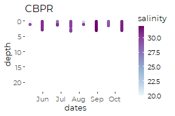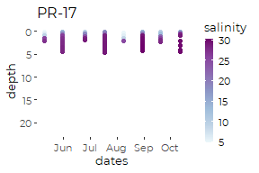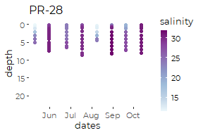

#### 2019

``` r
for (s in seq_along(nested$site))
  print(nested$sal2019[[s]] +
            scale_color_distiller(palette = 3, direction = 2, 
                                 # limits = c(10, 32)
                                  ) +
          coord_cartesian(ylim = c(22,0)) +
          guides(color = guide_colorbar(barwidth = unit(0.25, 'cm'))))
```

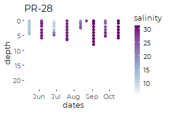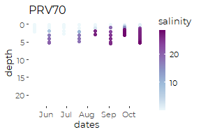

#### 2020

``` r
for (s in seq_along(nested$site))
  print(nested$sal2020[[s]] +
            scale_color_distiller(palette = 3, direction = 2, 
                                 # limits = c(10, 32)
                                  ) +
          coord_cartesian(ylim = c(22,0)) +
          guides(color = guide_colorbar(barwidth = unit(0.25, 'cm'))))
```

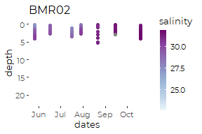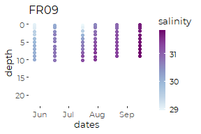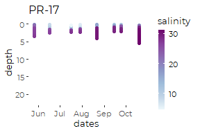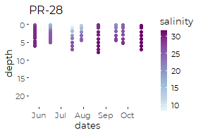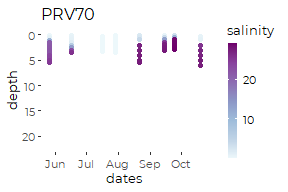

No real surprise. At all sites we see a tendency towards lower
salinities in the spring and at shallower depths. But those differences
are usually fairly small – just a few PPT.

So, the combined effect of salinity and temperature is almost always to
stabilize the water column, reducing vertical mixing. We do not have the
capability to look at stability calculation in any detail for State of
Casco Bay.

### Oxygen

``` r
 nested <- nested %>%
  mutate(do2017 = map(data, function(d) ptdots( d[d$year == 2017,], .x  = dates, 
                                                 .y   = depth, 
                                                 .val = do) + 
                        ggtitle(site) +
                        theme_cbep(base_size = 10)),
         do2018 = map(data, function(d) ptdots( d[d$year == 2018,], .x  = dates, 
                                                 .y   = depth, 
                                                 .val = do) + 
                        ggtitle(site) +
                        theme_cbep(base_size = 10)),
         do2019 = map(data, function(d) ptdots( d[d$year == 2019,], .x  = dates, 
                                                 .y   = depth, 
                                                 .val = do) + 
                        ggtitle(site) +
                        theme_cbep(base_size = 10)),
         do2020 = map(data, function(d) ptdots( d[d$year == 2020,], .x  = dates, 
                                                 .y   = depth, 
                                                 .val = do) + 
                        ggtitle(site) +
                        theme_cbep(base_size = 10)))
```

#### 2017

``` r
for (s in seq_along(nested$site))
  print(nested$do2017[[s]] +
            scale_color_distiller(palette = 4, direction = 2, 
                                  limits = c(6, 12)
                                  ) +
          coord_cartesian(ylim = c(22,0)) +
          guides(color = guide_colorbar(barwidth = unit(0.25, 'cm'))))
```

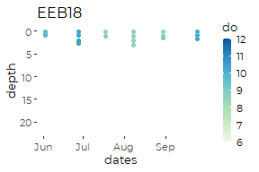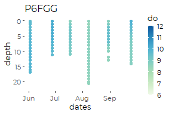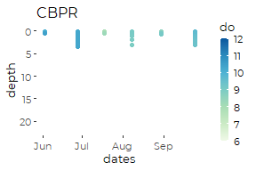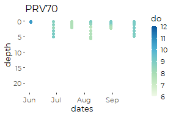

#### 2018

``` r
for (s in seq_along(nested$site))
  print(nested$do2018[[s]] +
            scale_color_distiller(palette = 4, direction = 2, 
                                 limits = c(6, 12)
                                  ) +
          coord_cartesian(ylim = c(22,0)) +
          guides(color = guide_colorbar(barwidth = unit(0.25, 'cm'))))
```

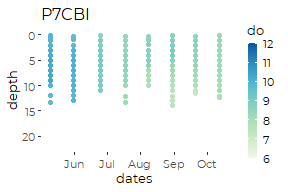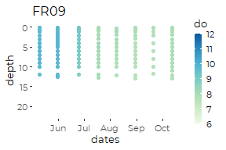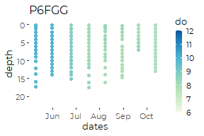

#### 2019

``` r
for (s in seq_along(nested$site))
  print(nested$do2019[[s]] +
            scale_color_distiller(palette = 4, direction = 2, 
                                 limits = c(6, 12)
                                  ) +
          coord_cartesian(ylim = c(22,0)) +
          guides(color = guide_colorbar(barwidth = unit(0.25, 'cm'))))
```

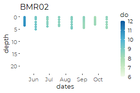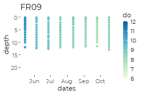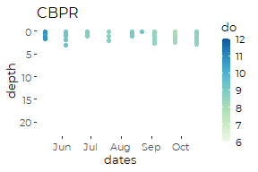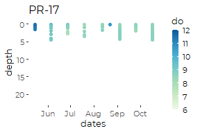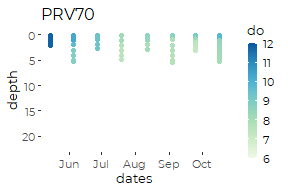

#### 2020

``` r
for (s in seq_along(nested$site))
  print(nested$do2020[[s]] +
            scale_color_distiller(palette = 4, direction = 2, 
                                 limits = c(6, 12)
                                  ) +
          coord_cartesian(ylim = c(22,0)) +
          guides(color = guide_colorbar(barwidth = unit(0.25, 'cm'))))
```

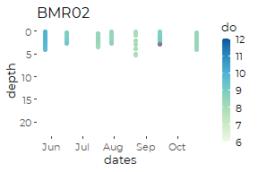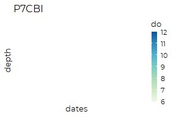

The strongest patterns for oxygen are seasonal. We do see some
differentiation with depth at the deeper sites, especially P7CBI, FR09
and PRV70.

### Percent Saturation

``` r
 nested <- nested %>%
  mutate(pctsat2017 = map(data, function(d) ptdots( d[d$year == 2017,], .x  = dates, 
                                                 .y   = depth, 
                                                 .val = pctsat) + 
                        ggtitle(site) +
                        theme_cbep(base_size = 10)),
         pctsat2018 = map(data, function(d) ptdots( d[d$year == 2018,], .x  = dates, 
                                                 .y   = depth, 
                                                 .val = pctsat) + 
                        ggtitle(site) +
                        theme_cbep(base_size = 10)),
         pctsat2019 = map(data, function(d) ptdots( d[d$year == 2019,], .x  = dates, 
                                                 .y   = depth, 
                                                 .val = pctsat) + 
                        ggtitle(site) +
                        theme_cbep(base_size = 10)),
         pctsat2020 = map(data, function(d) ptdots( d[d$year == 2020,], .x  = dates, 
                                                 .y   = depth, 
                                                 .val = pctsat) + 
                        ggtitle(site) +
                        theme_cbep(base_size = 10)))
```

#### 2017

``` r
for (s in seq_along(nested$site))
  print(nested$pctsat2017[[s]] +
            scale_color_distiller(palette = 4, direction = 2, 
                                  limits = c(90, 135)
                                  ) +
          coord_cartesian(ylim = c(22,0)) +
          guides(color = guide_colorbar(barwidth = unit(0.25, 'cm'))))
```

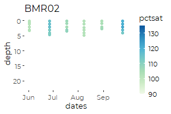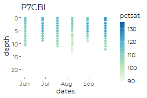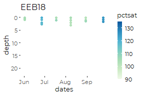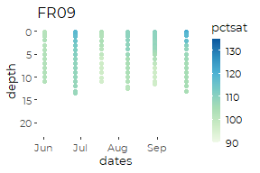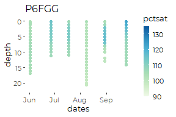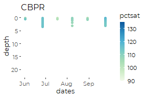

#### 2018

``` r
for (s in seq_along(nested$site))
  print(nested$pctsat2018[[s]] +
            scale_color_distiller(palette = 4, direction = 2, 
                                 limits = c(90, 135)
                                  ) +
          coord_cartesian(ylim = c(22,0)) +
          guides(color = guide_colorbar(barwidth = unit(0.25, 'cm'))))
```


#### 2019

(Note different color scale!)

``` r
for (s in seq_along(nested$site))
  print(nested$pctsat2019[[s]] +
            scale_color_distiller(palette = 4, direction = 2, 
                                 limits = c(80, 125)
                                  ) +
          coord_cartesian(ylim = c(22,0)) +
          guides(color = guide_colorbar(barwidth = unit(0.25, 'cm'))))
```


#### 2020

``` r
for (s in seq_along(nested$site))
  print(nested$pctsat2020[[s]] +
            scale_color_distiller(palette = 4, direction = 2, 
                                 limits = c(80, 125)
                                  ) +
          coord_cartesian(ylim = c(22,0)) +
          guides(color = guide_colorbar(barwidth = unit(0.25, 'cm'))))
```


### Chlorophyll

``` r
 nested <- nested %>%
  mutate(chl2017 = map(data, function(d) ptdots( d[d$year == 2017,], .x  = dates, 
                                                 .y   = depth, 
                                                 .val = chl_a_sonde) + 
                        ggtitle(site) +
                        theme_cbep(base_size = 10)),
         chl2018 = map(data, function(d) ptdots( d[d$year == 2018,], .x  = dates, 
                                                 .y   = depth, 
                                                 .val = chl_a_sonde) + 
                        ggtitle(site) +
                        theme_cbep(base_size = 10)),
         chl2019 = map(data, function(d) ptdots( d[d$year == 2019,], .x  = dates, 
                                                 .y   = depth, 
                                                 .val = chl_a_sonde) + 
                        ggtitle(site) +
                        theme_cbep(base_size = 10)),
         chl2020 = map(data, function(d) ptdots( d[d$year == 2020,], .x  = dates, 
                                                 .y   = depth, 
                                                 .val = chl_a_sonde) + 
                        ggtitle(site) +
                        theme_cbep(base_size = 10)))
```

#### 2017

``` r
for (s in seq_along(nested$site))
  print(nested$chl2017[[s]] +
            scale_color_distiller(palette = 5, direction = 2, 
                                  #limits = c(90, 135)
                                  ) +
          coord_cartesian(ylim = c(22,0)) +
          guides(color = guide_colorbar(barwidth = unit(0.25, 'cm'))))
```


#### 2018

``` r
for (s in seq_along(nested$site))
  print(nested$chl2018[[s]] +
            scale_color_distiller(palette = 5, direction = 2, 
                                 #limits = c(90, 135)
                                  ) +
          coord_cartesian(ylim = c(22,0)) +
          guides(color = guide_colorbar(barwidth = unit(0.25, 'cm'))))
```


#### 2019

Data is limited.

``` r
for (s in seq_along(nested$site))
  print(nested$chl2019[[s]] +
            scale_color_distiller(palette = 5, direction = 2, 
                                 #limits = c(80, 125)
                                  ) +
          coord_cartesian(ylim = c(22,0)) +
          guides(color = guide_colorbar(barwidth = unit(0.25, 'cm'))))
```


#### 2020

``` r
for (s in seq_along(nested$site))
  print(nested$chl2020[[s]] +
            scale_color_distiller(palette = 5, direction = 2, 
                                 #limits = c(80, 125)
                                  ) +
          coord_cartesian(ylim = c(22,0)) +
          guides(color = guide_colorbar(barwidth = unit(0.25, 'cm'))))
```


A common pattern is a chlorophyll maximum down a couple of meters.

### Turbidity

``` r
 nested <- nested %>%
  mutate(turb2017 = map(data, function(d) ptdots( d[d$year == 2017,], .x  = dates, 
                                                 .y   = depth, 
                                                 .val = turbidity) + 
                        ggtitle(site) +
                        theme_cbep(base_size = 10)),
         turb2018 = map(data, function(d) ptdots( d[d$year == 2018,], .x  = dates, 
                                                 .y   = depth, 
                                                 .val = turbidity) + 
                        ggtitle(site) +
                        theme_cbep(base_size = 10)),
         turb2019 = map(data, function(d) ptdots( d[d$year == 2019,], .x  = dates, 
                                                 .y   = depth, 
                                                 .val = turbidity) + 
                        ggtitle(site) +
                        theme_cbep(base_size = 10)),
         turb2020 = map(data, function(d) ptdots( d[d$year == 2020,], .x  = dates, 
                                                 .y   = depth, 
                                                 .val = turbidity) + 
                        ggtitle(site) +
                        theme_cbep(base_size = 10)))
```

#### 2017

``` r
for (s in seq_along(nested$site))
  print(nested$turb2017[[s]] +
            scale_color_distiller(palette = 6, direction = 2, 
                                  #limits = c(90, 135)
                                  ) +
          coord_cartesian(ylim = c(22,0)) +
          guides(color = guide_colorbar(barwidth = unit(0.25, 'cm'))))
```


#### 2018

``` r
for (s in seq_along(nested$site))
  print(nested$turb2018[[s]] +
            scale_color_distiller(palette = 6, direction = 2, 
                                 limits = c(0, 16)
                                  ) +
          coord_cartesian(ylim = c(22,0)) +
          guides(color = guide_colorbar(barwidth = unit(0.25, 'cm'))))
```


#### 2019

Data is limited.

``` r
for (s in seq_along(nested$site))
  print(nested$turb2019[[s]] +
            scale_color_distiller(palette = 6, direction = 2, 
                                 limits = c(0, 16)
                                  ) +
          coord_cartesian(ylim = c(22,0)) +
          guides(color = guide_colorbar(barwidth = unit(0.25, 'cm'))))
```


#### 2020

``` r
for (s in seq_along(nested$site))
  print(nested$turb2020[[s]] +
            scale_color_distiller(palette = 6, direction = 2, 
                                 limits = c(0, 16)
                                  ) +
          coord_cartesian(ylim = c(22,0)) +
          guides(color = guide_colorbar(barwidth = unit(0.25, 'cm'))))
```


Turbidity often tends to be maximum at depth, but differences ar small.
Otherwise, it looks like day to day variation is dominant.

# Presumpscort Estuary Series

It might be worth looking at patterns headed down the Presumpscot
Estuary, as follows:

``` r
presumpscot_transect <- smaller_data %>%
  rename(dates = dt) %>%
  filter(site %in% c('PRV70', 'PR-17', 'PR-28', 'CBPR', 'P6FGG')) %>%
  filter(year == 2018) %>%

  mutate(site = factor(site, 
                       levels = c('PRV70', 'PR-17', 
                                  'PR-28', 'CBPR', 'P6FGG')))
```

## Dot Plot Examples

### Salinity Plot May

``` r
presumpscot_transect %>%
  filter(month == 'May') %>%
ptdots(.x  = site,  .y  = depth,  .val = salinity, size = 5) + 
  theme_cbep(base_size = 12) +
  scale_color_distiller(palette = 3, direction = 2, 
                                 limits = c(0, 32)
                                  ) +
  coord_cartesian(ylim = c(10,0)) +
          guides(color = guide_colorbar(barwidth = unit(0.25, 'cm')))
```


### Salinity Plot September 2018

``` r
presumpscot_transect %>%
  filter(month == 'Sep') %>%
ptdots(.x  = site,  .y  = depth,  .val = salinity, size = 5) + 
  theme_cbep(base_size = 12) +
  scale_color_distiller(palette = 3, direction = 2, 
                                 limits = c(0, 32)
                                  ) +
          coord_cartesian(ylim = c(10,0))
```


\#\# Smoothed Plots \#\#\# Temperature, September

``` r
tmp <- presumpscot_transect %>%
  filter(month == 'Sep') %>%
  mutate(sitenum = as.numeric(site) ) %>%
  select(site, sitenum,depth, temp)

ptsmooth(tmp, .x  = sitenum,  .y  = depth,  .val = temp, 
         .res_x = 0.01, .res_y = .1,
         y_grow_grid = FALSE, y_with_zero = FALSE) +
  
  scale_fill_distiller(palette = 7, direction = 2, 
                        #limits = c(6, 9),
                        na.value = 'gray95',
                                  ) +
  theme_cbep(base_size = 12) +
  theme(legend.position = 'bottom') +
  guides(fill = guide_colorbar(title = 'Temperature (C)', 
                               title.position = 'top',
                               barheight = unit(0.2, 'cm'))) +
  
  geom_point(mapping = aes(sitenum, depth), data= tmp,
             shape = 21, fill = NA, color = 'gray30', size = 3) +
  scale_x_continuous(breaks = 1:5, 
                     labels = c('PRV70', 'PR-17', 'PR-28', 'CBPR', 'P6FGG')) +
  geom_vline(xintercept = 3.05, lty = 2) +
  geom_text(aes(x = 3.2, y = 7, label = "Martin's Point Bridge"), 
            angle = 90, size = 3, hjust = 0) +
  xlab('Site') +
  ylab('Depth (m)') +
  ggtitle('September 2018')
```


### Salinity, September

The following is not right, since it has filled in areas where we have
no data, but it is close to what we might want.

``` r
tmp <- presumpscot_transect %>%
  filter(month == 'Sep') %>%
  mutate(sitenum = as.numeric(site) ) %>%
  select(site, sitenum,depth, salinity)

ptsmooth(tmp, .x  = sitenum,  .y  = depth,  .val = salinity, 
         .res_x = 0.01, .res_y = .1,
         y_grow_grid = FALSE, y_with_zero = FALSE) +
  scale_fill_distiller(palette = 3, direction = 2, 
                      limits = c(0, 32),
                      na.value = 'gray95'
                                  ) +
  theme_cbep(base_size = 12) +
  theme(legend.position = 'bottom') +
  guides(fill = guide_colorbar(title = 'Salinity (PSU)', 
                               title.position = 'top',
                               barheight = unit(0.2, 'cm'))) +

  geom_point(mapping = aes(sitenum, depth), data= tmp,
             shape = 21, fill = NA, color = 'gray70', size = 3) +
  scale_x_continuous(breaks = 1:5, 
                     labels = c('PRV70', 'PR-17', 'PR-28', 'CBPR', 'P6FGG')) +
  geom_vline(xintercept = 3.05, lty = 2) +
  geom_text(aes(x = 3.25, y = 7, label = "Martin's Point Bridge"), 
            angle = 90, size = 3, hjust = 0) +
  xlab('Site') +
  ylab('Depth (m)') +
  ggtitle('September 2018')
```


### Dissolved Oxygen, September

``` r
tmp <- presumpscot_transect %>%
  filter(month == 'Sep') %>%
  mutate(sitenum = as.numeric(site) ) %>%
  select(site, sitenum,depth, do)

ptsmooth(tmp, .x  = sitenum,  .y  = depth,  .val = do, 
         .res_x = 0.01, .res_y = .1,
         y_grow_grid = FALSE, y_with_zero = FALSE) +
  scale_fill_distiller(palette = 4, direction = 2, 
                        limits = c(6, 9),
                        na.value = 'gray95',
                                  ) +
  theme_cbep(base_size = 12) +
  theme(legend.position = 'bottom') +
  guides(fill = guide_colorbar(title = 'Dissolved Oxygen (mg/l)', 
                               title.position = 'top',
                               barheight = unit(0.2, 'cm'))) +
  
  geom_point(mapping = aes(sitenum, depth), data= tmp,
             shape = 21, fill = NA, color = 'gray30', size = 3) +
  scale_x_continuous(breaks = 1:5, 
                     labels = c('PRV70', 'PR-17', 'PR-28', 'CBPR', 'P6FGG')) +
  geom_vline(xintercept = 3.05, lty = 2) +
  geom_text(aes(x = 3.25, y = 7, label = "Martin's Point Bridge"), 
            angle = 90, size = 3, hjust = 0) +
  xlab('Site') +
  ylab('Depth (m)') +
  ggtitle('September 2018')
```


### Chlorophyll, September

``` r
tmp <- presumpscot_transect %>%
  filter(month == 'Sep') %>%
  mutate(sitenum = as.numeric(site) ) %>%
  select(site, sitenum,depth, chl_a_sonde)

ptsmooth(tmp, .x  = sitenum,  .y  = depth,  .val = chl_a_sonde, 
         .res_x = 0.01, .res_y = .1,
         y_grow_grid = FALSE, y_with_zero = FALSE) +
  scale_fill_distiller(palette = 5, direction = 2, 
                        #limits = c(6, 9),
                        na.value = 'gray95',
                                  ) +
  theme_cbep(base_size = 12) +
  theme(legend.position = 'bottom') +
  guides(fill = guide_colorbar(title = 'Chlorophyll A (mg/l)', 
                               title.position = 'top',
                               barheight = unit(0.2, 'cm'))) +
  
  geom_point(mapping = aes(sitenum, depth), data= tmp,
             shape = 21, fill = NA, color = 'gray30', size = 3) +
  scale_x_continuous(breaks = 1:5, 
                     labels = c('PRV70', 'PR-17', 'PR-28', 'CBPR', 'P6FGG')) +
  geom_vline(xintercept = 3.05, lty = 2) +
  geom_text(aes(x = 3.25, y = 7, label = "Martin's Point Bridge"), 
            angle = 90, size = 3, hjust = 0) +
  xlab('Site') +
  ylab('Depth (m)') +
  ggtitle('September 2018')
```


