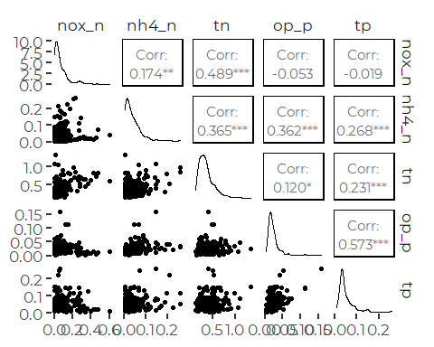
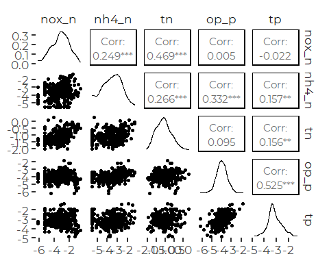
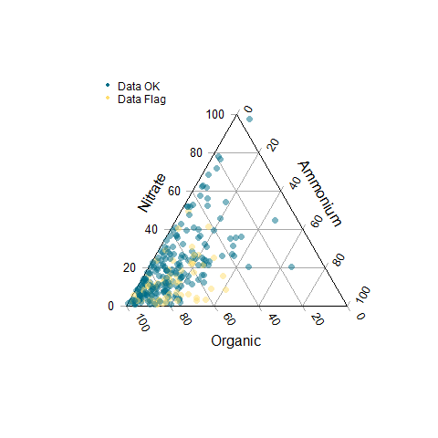
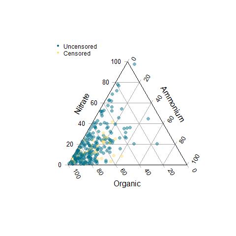
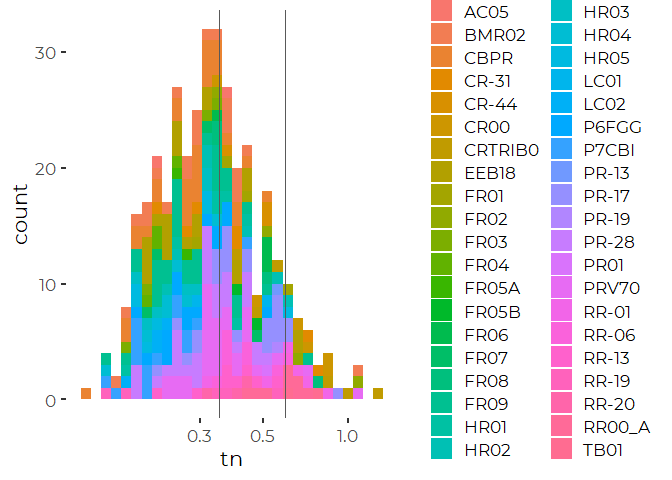
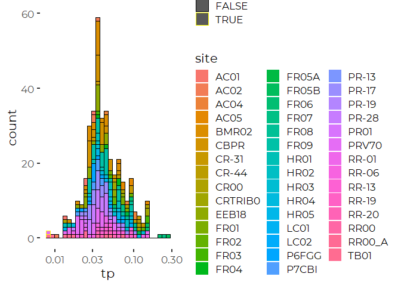
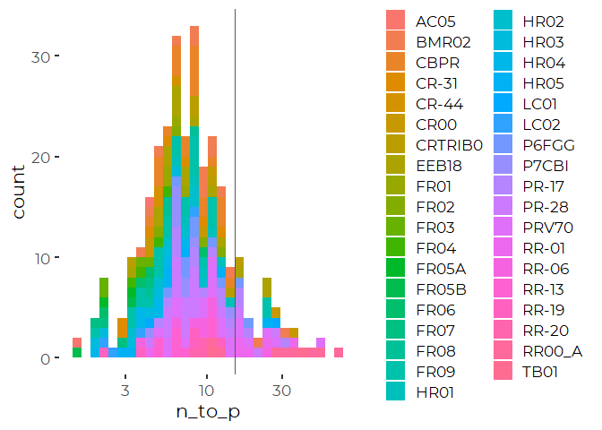
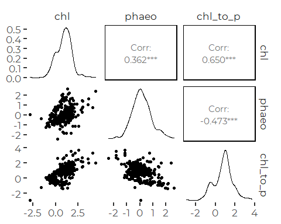
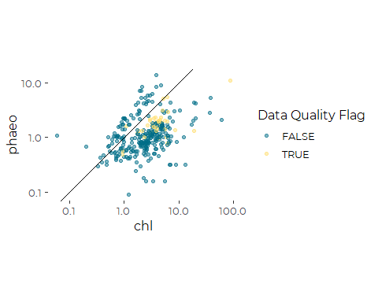
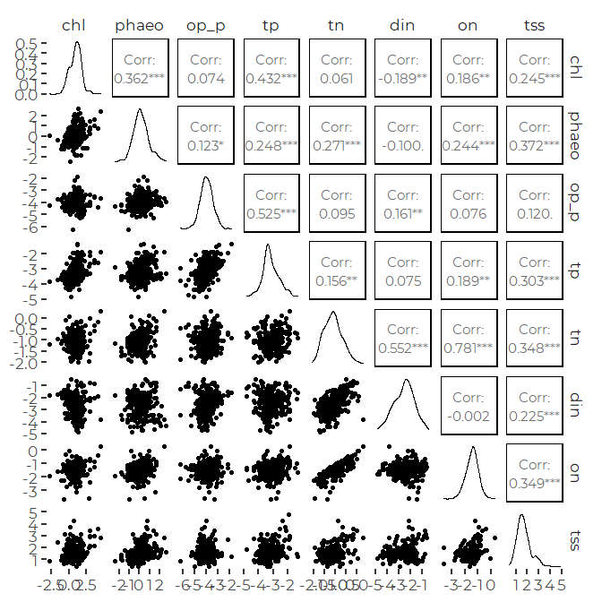

Initial Review of Friends of Casco Bay Nutrient Data
================
Curtis C. Bohlen, Casco Bay Estuary Partnership.
04/26/2021

-   [Introduction](#introduction)
-   [Load Data](#load-data)
-   [Summary of Metadata](#summary-of-metadata)
    -   [QA/QC Samples](#qaqc-samples)
    -   [Data Quality Flags and Censoring
        Flags](#data-quality-flags-and-censoring-flags)
    -   [Units](#units)
    -   [Cross Occurrances of Data](#cross-occurrances-of-data)
-   [Depth Distribution of Samples](#depth-distribution-of-samples)
-   [Surface Data Only](#surface-data-only)
    -   [Nutrients](#nutrients)
        -   [Correct Misleading NH4
            values](#correct-misleading-nh4-values)
        -   [Nitrogen](#nitrogen)
        -   [Phosphorus](#phosphorus)
    -   [N to P ratios](#n-to-p-ratios)
    -   [Chlorophyll and Phaeophytin](#chlorophyll-and-phaeophytin)
    -   [Chlorophyll and Nutrients](#chlorophyll-and-nutrients)


# Introduction

This R Notebook focuses on continued review of contents of the DEP
nutrient data. We focus here on data on concentration of nitrogen
species, and examine the spatial and temporal distribution of data.

\#Load libraries

``` r
#library(readxl)
library(tidyverse)
#> Warning: package 'tidyverse' was built under R version 4.0.5
#> -- Attaching packages --------------------------------------- tidyverse 1.3.1 --
#> v ggplot2 3.3.5     v purrr   0.3.4
#> v tibble  3.1.6     v dplyr   1.0.7
#> v tidyr   1.1.4     v stringr 1.4.0
#> v readr   2.1.0     v forcats 0.5.1
#> Warning: package 'ggplot2' was built under R version 4.0.5
#> Warning: package 'tidyr' was built under R version 4.0.5
#> Warning: package 'dplyr' was built under R version 4.0.5
#> Warning: package 'forcats' was built under R version 4.0.5
#> -- Conflicts ------------------------------------------ tidyverse_conflicts() --
#> x dplyr::filter() masks stats::filter()
#> x dplyr::lag()    masks stats::lag()

library(GGally)
#> Warning: package 'GGally' was built under R version 4.0.5
#> Registered S3 method overwritten by 'GGally':
#>   method from   
#>   +.gg   ggplot2
#library(mgcv)

library(Ternary) # Base graphics ternary plots
#> Warning: package 'Ternary' was built under R version 4.0.5


library(CBEPgraphics)
load_cbep_fonts()
theme_set(theme_cbep())
```

# Load Data

``` r
dep_data <- read_csv('dep_nutrient_data.csv',
                     col_types = cols(
                       .default = col_logical(),
                       site_name = col_character(),
                       site = col_character(),
                       depth_designation = col_character(),
                       dt = col_date(format = ""),
                       month = col_character(),
                       year = col_double(),
                       time = col_time(format = ""),
                       hour = col_double(),
                       depth = col_double(),
                       chl = col_double(),
                       phaeo = col_double(),
                       nox_n = col_double(),
                       nh4_n = col_double(),
                       tn = col_double(),
                       op_p = col_double(),
                       tp = col_double(),
                       tss = col_double(),
                       `Sample Comments` = col_character(),
                       `Validation Comments` = col_character(),
                       Latitude = col_skip(),
                       Longitude = col_skip())) %>%
  rename(sample_date = dt)
```

# Summary of Metadata

## QA/QC Samples

We conducted no analysis of QA/QC samples, and simply deleted then from
the data to avoid confusion.

## Data Quality Flags and Censoring Flags

While preparing our working data, we separated raw observations from
text annotations, including data quality flags.

We had “J”, ’J\*“,”B" and “JB” flags to contend with. While the metadata
we received from DEP did not include definitions of all flags, these are
conventionally used to indicate that values are to be treated as
“estimated values” because of uncertain precision, especially for values
between instrument detection and contracted detection or quantitation
limits. Where data quality flags existed after deleting the QA/QC
samples, we collapsed them down to a `TRUE` / `FALSE` flag indicating
whether samples were flagged or not. These flags follow a consistent
naming convention, with the variable name followed by an underscore and
“flag”.

We also had a few “U”, “U&lt;” and “&gt;” flags. These represent
censored values, either right censored ( “&gt;”) for Secchi depth, or
left censored for other parameters. Again, we separated out a `TRUE` /
`FALSE` flag to indicated censored values. These flags also follow a
consistent naming convention, with the variable name followed by an
underscore and “cens”.

## Units

Our derived data sources lack clear indication of units, which were
documented in the source Excel files. We summarize relevant information
here.

| Variable Name      | Meaning                                          | Units                       |
|--------------------|--------------------------------------------------|-----------------------------|
| site\_name         | DEP “Site ID”                                    |                             |
| site               | DEP “Sample Point ID” without depth designation  |                             |
| depth\_designation | DEP depth designation from “Sample Point ID”     |                             |
| sample\_date       | Date of sample collection                        | yyyy-mm-dd format           |
| month              | Month, derived from date                         | Three letter codes          |
| year               | Year, derived from date                          |                             |
| time               | time of sample                                   | 24 hour clock, hh:mm format |
| hour               | hour, derived from time                          |                             |
| depth              | Sample Depth                                     | Meters                      |
| chl                | Chlorophyll A, from "Chlorophyll A - Phaeophytin | UG/L                        |
| phaeo              | Phaeophytin                                      | UG/L                        |
| nox\_n             | Nitrate + Nitrite As N                           | MG/L                        |
| nh4\_n             | Ammonia as Nitrogen                              | MG/L                        |
| tn                 | Total Nitrogen                                   | MG/L                        |
| op\_p              | Orthophosphate as Phosphorus                     | MG/L                        |
| tp                 | Total Phosphorus as P                            | MG/L                        |
| tss                | Total Suspended Solids                           | MG/L                        |
| secchi             | Secchi Depth                                     | M                           |

## Cross Occurrances of Data

We are interested in figuring out what data occurs with other data. A
giant `xtab()` is possible, but unwieldy for more than three variables.

We instead reducing all VARIABLES to the value 1 if data exists, and
zero otherwise. We then look at correlations between data categories.

``` r
tmp <- dep_data %>%
  select(chl:tss) %>%
  select_if(is.numeric) %>%
  mutate(across(everything(), ~ as.numeric( ! is.na(.x))))
round(cor(tmp, use = 'pairwise'),2)
#>         chl phaeo nox_n nh4_n    tn op_p    tp   tss
#> chl    1.00  0.90  0.48  0.56 -0.04 0.46  0.45  0.76
#> phaeo  0.90  1.00  0.50  0.59 -0.02 0.48  0.48  0.67
#> nox_n  0.48  0.50  1.00  0.88  0.03 0.95  0.91  0.38
#> nh4_n  0.56  0.59  0.88  1.00  0.22 0.87  0.83  0.46
#> tn    -0.04 -0.02  0.03  0.22  1.00 0.03 -0.02 -0.16
#> op_p   0.46  0.48  0.95  0.87  0.03 1.00  0.90  0.36
#> tp     0.45  0.48  0.91  0.83 -0.02 0.90  1.00  0.42
#> tss    0.76  0.67  0.38  0.46 -0.16 0.36  0.42  1.00
```

# Depth Distribution of Samples

``` r
ggplot(dep_data, aes(depth)) + geom_histogram(binwidth = 1)
```


So we still need to worry about depths.

``` r
tmp <- dep_data %>%
  mutate(dclass = cut(depth,c(0,1,2, 5, 20)))
         
 xtabs(~ dclass + depth_designation, data = tmp, addNA = TRUE)
#>         depth_designation
#> dclass   BOT MAX SUR <NA>
#>   (0,1]    0   0 171  288
#>   (1,2]    0   1   0    0
#>   (2,5]    0   2   0    0
#>   (5,20]  26   0   0    9
```

So overall, it looks like the depth designations are *almost*
consistent. There are nine samples that lack a depth designation that
were collected at depth. These are likely to be bottom samples, as all
have depth reported as over 10 meters. We treat them as such here, and
give them the depth designation of “bot” (lowercase) so we remember that
the designation has been added, and was not part of the original data.

``` r
dep_data %>%
  filter(depth > 5, is.na(depth_designation))
#> # A tibble: 9 x 33
#>   site_name     site  depth_designati~ sample_date month  year time   hour depth
#>   <chr>         <chr> <chr>            <date>      <chr> <dbl> <tim> <dbl> <dbl>
#> 1 FORE RIVER -~ FR04  <NA>             2016-06-27  Jun    2016 14:40    14  12.6
#> 2 FORE RIVER -~ FR04  <NA>             2016-07-21  Jul    2016 14:15    14  13.3
#> 3 FORE RIVER -~ FR04  <NA>             2016-08-23  Aug    2016 13:00    13  12.6
#> 4 FORE RIVER -~ FR04  <NA>             2016-09-19  Sep    2016 15:30    15  11.2
#> 5 FORE RIVER -~ FR05A <NA>             2016-07-21  Jul    2016 14:51    14  10.4
#> 6 FORE RIVER -~ FR07  <NA>             2016-06-27  Jun    2016 13:25    13  11.9
#> 7 FORE RIVER -~ FR07  <NA>             2016-07-21  Jul    2016 15:28    15  12.4
#> 8 FORE RIVER -~ FR07  <NA>             2016-08-23  Aug    2016 11:29    11  11.5
#> 9 FORE RIVER -~ FR07  <NA>             2016-09-19  Sep    2016 16:30    16  12  
#> # ... with 24 more variables: chl <dbl>, chl_cens <lgl>, chl_flag <lgl>,
#> #   phaeo <dbl>, phaeo_flag <lgl>, phaeo_cens <lgl>, nox_n <dbl>,
#> #   nox_n_cens <lgl>, nox_n_flag <lgl>, nh4_n <dbl>, nh4_n_cens <lgl>,
#> #   nh4_n_flag <lgl>, tn <dbl>, tn_flag <lgl>, op_p <dbl>, op_p_flag <lgl>,
#> #   tp <dbl>, tp_cens <lgl>, tp_flag <lgl>, tss <dbl>, tss_cens <lgl>,
#> #   tss_flag <lgl>, Sample Comments <chr>, Validation Comments <chr>
```

``` r
dep_data <- dep_data %>%
  mutate(depth_designation = if_else(depth > 5 & is.na(depth_designation),
                                     'bot', depth_designation))

tmp <- dep_data %>%
  mutate(dclass = cut(depth,c(0,1,2, 5, 20)))
xtabs(~ dclass + depth_designation, data = tmp, addNA = TRUE)
#>         depth_designation
#> dclass   bot BOT MAX SUR <NA>
#>   (0,1]    0   0   0 171  288
#>   (1,2]    0   0   1   0    0
#>   (2,5]    0   0   2   0    0
#>   (5,20]   9  26   0   0    0
```

There are VERY few samples collected at maximum chlorophyll, so these
data are not be of much use.

# Surface Data Only

## Nutrients

``` r
surface_data <- dep_data %>%
  filter(depth_designation == 'SUR' | is.na(depth_designation))
```

There are a few sky-high NH4 values. Let see where they occurred.

``` r
surface_data %>%
  filter(nh4_n > 2.5)
#> # A tibble: 6 x 33
#>   site_name     site  depth_designati~ sample_date month  year time   hour depth
#>   <chr>         <chr> <chr>            <date>      <chr> <dbl> <tim> <dbl> <dbl>
#> 1 BANDM RAILRO~ BMR02 SUR              2019-06-05  Jun    2019 11:00    11   0.2
#> 2 CLAPBOARD IS~ P7CBI SUR              2019-06-05  Jun    2019 10:21    10   0.2
#> 3 EAST END BEA~ EEB18 SUR              2019-06-05  Jun    2019 10:40    10   0.2
#> 4 FORT GORGES ~ P6FGG SUR              2019-06-05  Jun    2019 10:58    10   0.2
#> 5 PRESUMPSCOT ~ CBPR  <NA>             2019-06-05  Jun    2019 11:15    11   0.2
#> 6 PRESUMPSCOT ~ PR-28 <NA>             2019-06-05  Jun    2019 11:40    11   0.2
#> # ... with 24 more variables: chl <dbl>, chl_cens <lgl>, chl_flag <lgl>,
#> #   phaeo <dbl>, phaeo_flag <lgl>, phaeo_cens <lgl>, nox_n <dbl>,
#> #   nox_n_cens <lgl>, nox_n_flag <lgl>, nh4_n <dbl>, nh4_n_cens <lgl>,
#> #   nh4_n_flag <lgl>, tn <dbl>, tn_flag <lgl>, op_p <dbl>, op_p_flag <lgl>,
#> #   tp <dbl>, tp_cens <lgl>, tp_flag <lgl>, tss <dbl>, tss_cens <lgl>,
#> #   tss_flag <lgl>, Sample Comments <chr>, Validation Comments <chr>
```

All have identical values of NH$ = 4, and all are flagged as being
outside of normal hold times, and all had flags indicating they are
censored as “&lt;4” these are probably best handled as missing data, so
we delete the nh4-n data.

We have a few more NH4 values at `nh4_n == 0.4`, which are clearly also
oddballs.

``` r
surface_data %>%
  filter(nh4_n < 2.5, nh4_n > 0.3)
#> # A tibble: 8 x 33
#>   site_name     site  depth_designati~ sample_date month  year time   hour depth
#>   <chr>         <chr> <chr>            <date>      <chr> <dbl> <tim> <dbl> <dbl>
#> 1 BANDM RAILRO~ BMR02 SUR              2019-05-15  May    2019 13:00    13   0.2
#> 2 EAST END BEA~ EEB18 SUR              2019-05-15  May    2019 12:40    12   0.2
#> 3 FORE RIVER -~ FR09  SUR              2019-05-15  May    2019 11:35    11   0.2
#> 4 FORE RIVER -~ FR09  SUR              2019-06-05  Jun    2019 10:09    10   0.2
#> 5 FORT GORGES ~ P6FGG SUR              2019-05-15  May    2019 13:21    13   0.2
#> 6 PRESUMPSCOT ~ CBPR  <NA>             2019-05-15  May    2019 13:20    13   0.2
#> 7 PRESUMPSCOT ~ PR-17 <NA>             2019-05-15  May    2019 14:15    14   0.2
#> 8 PRESUMPSCOT ~ PR-28 <NA>             2019-05-15  May    2019 13:40    13   0.2
#> # ... with 24 more variables: chl <dbl>, chl_cens <lgl>, chl_flag <lgl>,
#> #   phaeo <dbl>, phaeo_flag <lgl>, phaeo_cens <lgl>, nox_n <dbl>,
#> #   nox_n_cens <lgl>, nox_n_flag <lgl>, nh4_n <dbl>, nh4_n_cens <lgl>,
#> #   nh4_n_flag <lgl>, tn <dbl>, tn_flag <lgl>, op_p <dbl>, op_p_flag <lgl>,
#> #   tp <dbl>, tp_cens <lgl>, tp_flag <lgl>, tss <dbl>, tss_cens <lgl>,
#> #   tss_flag <lgl>, Sample Comments <chr>, Validation Comments <chr>
```

Again, all have identical values of 0.4, all are flagged as censored,
and all are flagged as being outside of hold times.

### Correct Misleading NH4 values

``` r
surface_data <- surface_data %>%
  mutate(nh4_n = if_else(nh4_n > 0.3, NA_real_, nh4_n))
```

### Nitrogen

#### Pairs Plot

``` r
tmp <- surface_data %>%
  select(site, sample_date, nox_n:tp_flag) %>%
  select(where(is.numeric))

ggpairs(tmp, progress = FALSE)
#> Warning: Removed 98 rows containing non-finite values (stat_density).
#> Warning in ggally_statistic(data = data, mapping = mapping, na.rm = na.rm, :
#> Removed 131 rows containing missing values
#> Warning in ggally_statistic(data = data, mapping = mapping, na.rm = na.rm, :
#> Removed 171 rows containing missing values
#> Warning in ggally_statistic(data = data, mapping = mapping, na.rm = na.rm, :
#> Removed 103 rows containing missing values
#> Warning in ggally_statistic(data = data, mapping = mapping, na.rm = na.rm, :
#> Removed 98 rows containing missing values
#> Warning: Removed 131 rows containing missing values (geom_point).
#> Warning: Removed 130 rows containing non-finite values (stat_density).
#> Warning in ggally_statistic(data = data, mapping = mapping, na.rm = na.rm, :
#> Removed 184 rows containing missing values
#> Warning in ggally_statistic(data = data, mapping = mapping, na.rm = na.rm, :
#> Removed 135 rows containing missing values
#> Warning in ggally_statistic(data = data, mapping = mapping, na.rm = na.rm, :
#> Removed 130 rows containing missing values
#> Warning: Removed 171 rows containing missing values (geom_point).
#> Warning: Removed 184 rows containing missing values (geom_point).
#> Warning: Removed 92 rows containing non-finite values (stat_density).
#> Warning in ggally_statistic(data = data, mapping = mapping, na.rm = na.rm, :
#> Removed 174 rows containing missing values
#> Warning in ggally_statistic(data = data, mapping = mapping, na.rm = na.rm, :
#> Removed 165 rows containing missing values
#> Warning: Removed 103 rows containing missing values (geom_point).
#> Warning: Removed 135 rows containing missing values (geom_point).
#> Warning: Removed 174 rows containing missing values (geom_point).
#> Warning: Removed 102 rows containing non-finite values (stat_density).
#> Warning in ggally_statistic(data = data, mapping = mapping, na.rm = na.rm, :
#> Removed 102 rows containing missing values
#> Warning: Removed 98 rows containing missing values (geom_point).
#> Warning: Removed 130 rows containing missing values (geom_point).
#> Warning: Removed 165 rows containing missing values (geom_point).
#> Warning: Removed 102 rows containing missing values (geom_point).
#> Warning: Removed 86 rows containing non-finite values (stat_density).
```



``` r
ggpairs(log(tmp), progress = FALSE)
#> Warning: Removed 98 rows containing non-finite values (stat_density).
#> Warning in ggally_statistic(data = data, mapping = mapping, na.rm = na.rm, :
#> Removed 131 rows containing missing values
#> Warning in ggally_statistic(data = data, mapping = mapping, na.rm = na.rm, :
#> Removed 171 rows containing missing values
#> Warning in ggally_statistic(data = data, mapping = mapping, na.rm = na.rm, :
#> Removed 103 rows containing missing values
#> Warning in ggally_statistic(data = data, mapping = mapping, na.rm = na.rm, :
#> Removed 98 rows containing missing values
#> Warning: Removed 131 rows containing missing values (geom_point).
#> Warning: Removed 130 rows containing non-finite values (stat_density).
#> Warning in ggally_statistic(data = data, mapping = mapping, na.rm = na.rm, :
#> Removed 184 rows containing missing values
#> Warning in ggally_statistic(data = data, mapping = mapping, na.rm = na.rm, :
#> Removed 135 rows containing missing values
#> Warning in ggally_statistic(data = data, mapping = mapping, na.rm = na.rm, :
#> Removed 130 rows containing missing values
#> Warning: Removed 171 rows containing missing values (geom_point).
#> Warning: Removed 184 rows containing missing values (geom_point).
#> Warning: Removed 92 rows containing non-finite values (stat_density).
#> Warning in ggally_statistic(data = data, mapping = mapping, na.rm = na.rm, :
#> Removed 174 rows containing missing values
#> Warning in ggally_statistic(data = data, mapping = mapping, na.rm = na.rm, :
#> Removed 165 rows containing missing values
#> Warning: Removed 103 rows containing missing values (geom_point).
#> Warning: Removed 135 rows containing missing values (geom_point).
#> Warning: Removed 174 rows containing missing values (geom_point).
#> Warning: Removed 102 rows containing non-finite values (stat_density).
#> Warning in ggally_statistic(data = data, mapping = mapping, na.rm = na.rm, :
#> Removed 102 rows containing missing values
#> Warning: Removed 98 rows containing missing values (geom_point).
#> Warning: Removed 130 rows containing missing values (geom_point).
#> Warning: Removed 165 rows containing missing values (geom_point).
#> Warning: Removed 102 rows containing missing values (geom_point).
#> Warning: Removed 86 rows containing non-finite values (stat_density).
```



None of those correlations are especially high. The highest are for tn
and nox\_n, and op and tp. Neither is surprising.

Note discrete nature of low values for nox\_n and nh4\_n. those should
mostly be censored observations, but we can’t be sure here.

#### DIN and Organic N

We can calculate DIN as the sum of ammonium and nitrate, and organic N
as the difference between DIN and TN.

``` r
surface_data <- surface_data %>%
  mutate(din = nh4_n + nox_n,
         din_cens = nh4_n_cens | nox_n_cens,
         din_flag = nh4_n_flag | nox_n_flag,
         on       = tn - din,
         on_flag  = din_flag | tn_flag,
         on_cens_r  = din_flag)    #since this is calculated by difference
```

##### Ternary Diagrams

``` r
proportion_data <- surface_data %>%
  select(site:hour, nox_n:tn_flag, din:on_cens_r) %>%
  relocate(nh4_n, on, tn, .after = nox_n)%>%
  mutate(across(nox_n:on, ~ .x/tn)) %>%
  
  relocate(nh4_n_flag, on_flag, tn_flag, .after = nox_n_flag) %>%
  relocate(nh4_n_cens, on_cens_r, .after = nox_n_cens) %>%
  
  select(site, sample_date, year, nox_n:on_flag, ) %>%
  filter(! is.na(nox_n), ! is.na(nh4_n), ! is.na(on))
```

###### Draft Plots

We borrowed function to simply add alpha values to color palettes from
here:
[Description](https://www.r-bloggers.com/2014/03/colorramppalettealpha-and-addalpha-helper-functions-for-adding-transparency-to-colors-in-r/)
[GitHub](https://github.com/mylesmharrison/colorRampPaletteAlpha/blob/master/colorRampPaletteAlpha.R)

``` r
addalpha <- function(colors, alpha=1.0) {
  r <- col2rgb(colors, alpha=T)
  # Apply alpha
  r[4,] <- alpha*255
  r <- r/255.0
  return(rgb(r[1,], r[2,], r[3,], r[4,]))
}
```

###### Colored by Censored Data

``` r
pal = addalpha(cbep_colors(), 0.5)

TernaryPlot(alab = 'Nitrate', blab = 'Ammonium', clab = 'Organic',
            grid.lines = 5, grid.minor.lines = 0)
TernaryPoints(proportion_data[4:6], pch = 16, 
              col = pal[as.numeric(proportion_data$on_flag) + 1])

legend('topleft', ncol = 1,
        cex = .75,
        legend = c('Data OK', 'Data Flag'),
        box.lty = 0,
        pch = 20,
        col = cbep_colors())
```



###### Colored by Censored Data

``` r
pal = addalpha(cbep_colors(), 0.5)

TernaryPlot(alab = 'Nitrate', blab = 'Ammonium', clab = 'Organic',
            grid.lines = 5, grid.minor.lines = 0)
TernaryPoints(proportion_data[4:6], pch = 16, 
              col = pal[as.numeric(proportion_data$on_cens_r) + 1])

legend('topleft', ncol = 1,
       cex = .75,
        legend = c('Uncensored', 'Censored'),
        box.lty = 0,
        pch = 20,
        col = cbep_colors()[1:2])
```



Note the one point that falls outside of is basically a site where TN is
very close to DIN, so there was a slight negative estimate of ON. It’s
from TB01 from 07/21/2016. Other “low” ON sites are not related in any
obvious way.

###### Produce PDF

We have slightly more control of size when we specify the graphics
device, as we can specify fonts and base font size.

``` r
cairo_pdf('ternary.pdf', width = 3.5, height = 5,
          family = 'Montserrat', pointsize = 8)

TernaryPlot(alab = 'Nitrate', blab = 'Ammonium', clab = 'Organic',
            grid.lines = 5, grid.minor.lines = 0)
TernaryPoints(proportion_data[4:6], pch = 16, 
              col = pal[as.numeric(proportion_data$on_flag) + 1])

legend('topleft', ncol = 1,
       cex = .75,
        legend = c('Data OK', 'Data Flag'),
        box.lty = 0,
        pch = 20,
        col = cbep_colors())
dev.off()
#> png 
#>   2
```

##### Histograms / Distributions

Data is distributed fairly close to log-normal, although it is slightly
heavy tailed and more skewed.

``` r
ggplot(surface_data, aes(tn)) + 
  geom_histogram(aes(fill = site)) +
  scale_x_log10() +
  geom_vline(xintercept = 0.35, col = 'grey35') +
    geom_vline(xintercept = 0.6, col = 'grey35')
#> `stat_bin()` using `bins = 30`. Pick better value with `binwidth`.
#> Warning: Removed 92 rows containing non-finite values (stat_bin).
```



So, in these data, the difference between eelgrass-oriented standards at
about 0.35 mg/l versus dissolved oxygen standards at about 0.6 mg/l is
huge.

### Phosphorus

``` r
ggplot(surface_data, aes(tp)) + 
  geom_histogram(aes(fill = site, color = tp_cens)) +
  scale_color_manual(values = c('black', 'yellow')) + 
  scale_x_log10()
#> `stat_bin()` using `bins = 30`. Pick better value with `binwidth`.
#> Warning: Removed 86 rows containing non-finite values (stat_bin).
```



So very little of the data is censored.

## N to P ratios

``` r
surface_data <- surface_data %>%
  mutate(n_to_p = tn/tp)
```

``` r
ggplot(surface_data, aes(n_to_p)) + 
  geom_histogram(aes(fill = site)) +
  scale_x_log10() +
  geom_vline(xintercept = 15, col = 'grey35')
#> `stat_bin()` using `bins = 30`. Pick better value with `binwidth`.
#> Warning: Removed 165 rows containing non-finite values (stat_bin).
```



Generally, our N:P ratios are well below 15, suggesting continued N
limitation. Is that worth reporting on? There may be N:P ratio variation
between sites.

## Chlorophyll and Phaeophytin

This data does not include all chlorophyll data, because of ambiguities
of labeling in the source data.See “DEP\_Nutrients\_Preparation.Rmd” for
details.

``` r
tmp <- surface_data %>%
  select(site, sample_date, chl, phaeo)
```

``` r
tmp %>%
  select(chl, phaeo) %>%
  mutate(chl_to_p = chl / phaeo) %>%
  mutate(across(everything(), log)) %>%
  ggpairs(progress = FALSE)
#> Warning: Removed 149 rows containing non-finite values (stat_density).
#> Warning in ggally_statistic(data = data, mapping = mapping, na.rm = na.rm, :
#> Removed 156 rows containing missing values

#> Warning in ggally_statistic(data = data, mapping = mapping, na.rm = na.rm, :
#> Removed 156 rows containing missing values
#> Warning: Removed 156 rows containing missing values (geom_point).
#> Warning: Removed 139 rows containing non-finite values (stat_density).
#> Warning in ggally_statistic(data = data, mapping = mapping, na.rm = na.rm, :
#> Removed 156 rows containing missing values
#> Warning: Removed 156 rows containing missing values (geom_point).

#> Warning: Removed 156 rows containing missing values (geom_point).
#> Warning: Removed 156 rows containing non-finite values (stat_density).
```



We see a lot of samples with phaeophytin well above chlorophyll levels.
that is not impossible, but noteworthy. It’s worth looking at the
scatter plot with a 1:1 reference line and with data wit hdata quality
flags marked

``` r
tmp <- surface_data %>%
  select(site, sample_date,
         chl, phaeo,
         chl_flag, phaeo_flag, 
         chl_cens, phaeo_cens)

ggplot(tmp, aes(chl, phaeo)) +
  geom_point(aes(color = chl_flag | phaeo_flag), alpha = 0.5) +
  geom_abline(slope = 1, intercept = 0) +
  scale_x_log10() + scale_y_log10() +
  coord_equal() +
  scale_color_manual(values = cbep_colors(), name = 'Data Quality Flag') +
  theme_cbep(base_size = 12)
#> Warning: Removed 156 rows containing missing values (geom_point).
```



## Chlorophyll and Nutrients

``` r
tmp <- surface_data %>%
  select(site, sample_date, chl, phaeo, op_p, tp, tn, din, on, tss)
```

``` r
tmp %>%
  select(-site, -sample_date
         ) %>%
  mutate(across(everything(), log)) %>%
  ggpairs(progress = FALSE)
#> Warning in .Primitive("log")(on): NaNs produced
#> Warning: Removed 149 rows containing non-finite values (stat_density).
#> Warning in ggally_statistic(data = data, mapping = mapping, na.rm = na.rm, :
#> Removed 156 rows containing missing values
#> Warning in ggally_statistic(data = data, mapping = mapping, na.rm = na.rm, :
#> Removed 168 rows containing missing values
#> Warning in ggally_statistic(data = data, mapping = mapping, na.rm = na.rm, :
#> Removed 161 rows containing missing values
#> Warning in ggally_statistic(data = data, mapping = mapping, na.rm = na.rm, :
#> Removed 210 rows containing missing values
#> Warning in ggally_statistic(data = data, mapping = mapping, na.rm = na.rm, :
#> Removed 179 rows containing missing values
#> Warning in ggally_statistic(data = data, mapping = mapping, na.rm = na.rm, :
#> Removed 229 rows containing missing values
#> Warning in ggally_statistic(data = data, mapping = mapping, na.rm = na.rm, :
#> Removed 193 rows containing missing values
#> Warning: Removed 156 rows containing missing values (geom_point).
#> Warning: Removed 139 rows containing non-finite values (stat_density).
#> Warning in ggally_statistic(data = data, mapping = mapping, na.rm = na.rm, :
#> Removed 158 rows containing missing values
#> Warning in ggally_statistic(data = data, mapping = mapping, na.rm = na.rm, :
#> Removed 151 rows containing missing values
#> Warning in ggally_statistic(data = data, mapping = mapping, na.rm = na.rm, :
#> Removed 200 rows containing missing values
#> Warning in ggally_statistic(data = data, mapping = mapping, na.rm = na.rm, :
#> Removed 169 rows containing missing values
#> Warning in ggally_statistic(data = data, mapping = mapping, na.rm = na.rm, :
#> Removed 219 rows containing missing values
#> Warning in ggally_statistic(data = data, mapping = mapping, na.rm = na.rm, :
#> Removed 199 rows containing missing values
#> Warning: Removed 168 rows containing missing values (geom_point).
#> Warning: Removed 158 rows containing missing values (geom_point).
#> Warning: Removed 102 rows containing non-finite values (stat_density).
#> Warning in ggally_statistic(data = data, mapping = mapping, na.rm = na.rm, :
#> Removed 102 rows containing missing values
#> Warning in ggally_statistic(data = data, mapping = mapping, na.rm = na.rm, :
#> Removed 174 rows containing missing values
#> Warning in ggally_statistic(data = data, mapping = mapping, na.rm = na.rm, :
#> Removed 136 rows containing missing values
#> Warning in ggally_statistic(data = data, mapping = mapping, na.rm = na.rm, :
#> Removed 190 rows containing missing values
#> Warning in ggally_statistic(data = data, mapping = mapping, na.rm = na.rm, :
#> Removed 204 rows containing missing values
#> Warning: Removed 161 rows containing missing values (geom_point).
#> Warning: Removed 151 rows containing missing values (geom_point).
#> Warning: Removed 102 rows containing missing values (geom_point).
#> Warning: Removed 86 rows containing non-finite values (stat_density).
#> Warning in ggally_statistic(data = data, mapping = mapping, na.rm = na.rm, :
#> Removed 165 rows containing missing values
#> Warning in ggally_statistic(data = data, mapping = mapping, na.rm = na.rm, :
#> Removed 131 rows containing missing values
#> Warning in ggally_statistic(data = data, mapping = mapping, na.rm = na.rm, :
#> Removed 186 rows containing missing values
#> Warning in ggally_statistic(data = data, mapping = mapping, na.rm = na.rm, :
#> Removed 191 rows containing missing values
#> Warning: Removed 210 rows containing missing values (geom_point).
#> Warning: Removed 200 rows containing missing values (geom_point).
#> Warning: Removed 174 rows containing missing values (geom_point).
#> Warning: Removed 165 rows containing missing values (geom_point).
#> Warning: Removed 92 rows containing non-finite values (stat_density).
#> Warning in ggally_statistic(data = data, mapping = mapping, na.rm = na.rm, :
#> Removed 185 rows containing missing values
#> Warning in ggally_statistic(data = data, mapping = mapping, na.rm = na.rm, :
#> Removed 186 rows containing missing values
#> Warning in ggally_statistic(data = data, mapping = mapping, na.rm = na.rm, :
#> Removed 250 rows containing missing values
#> Warning: Removed 179 rows containing missing values (geom_point).
#> Warning: Removed 169 rows containing missing values (geom_point).
#> Warning: Removed 136 rows containing missing values (geom_point).
#> Warning: Removed 131 rows containing missing values (geom_point).
#> Warning: Removed 185 rows containing missing values (geom_point).
#> Warning: Removed 131 rows containing non-finite values (stat_density).
#> Warning in ggally_statistic(data = data, mapping = mapping, na.rm = na.rm, :
#> Removed 186 rows containing missing values
#> Warning in ggally_statistic(data = data, mapping = mapping, na.rm = na.rm, :
#> Removed 215 rows containing missing values
#> Warning: Removed 229 rows containing missing values (geom_point).
#> Warning: Removed 219 rows containing missing values (geom_point).
#> Warning: Removed 190 rows containing missing values (geom_point).
#> Warning: Removed 186 rows containing missing values (geom_point).

#> Warning: Removed 186 rows containing missing values (geom_point).

#> Warning: Removed 186 rows containing missing values (geom_point).
#> Warning: Removed 186 rows containing non-finite values (stat_density).
#> Warning in ggally_statistic(data = data, mapping = mapping, na.rm = na.rm, :
#> Removed 268 rows containing missing values
#> Warning: Removed 193 rows containing missing values (geom_point).
#> Warning: Removed 199 rows containing missing values (geom_point).
#> Warning: Removed 204 rows containing missing values (geom_point).
#> Warning: Removed 191 rows containing missing values (geom_point).
#> Warning: Removed 250 rows containing missing values (geom_point).
#> Warning: Removed 215 rows containing missing values (geom_point).
#> Warning: Removed 268 rows containing missing values (geom_point).
#> Warning: Removed 181 rows containing non-finite values (stat_density).
```



Interestingly, The strongest correlation between chlorophyll and
nutrients is with TP, not TN. Phaeophytin is correlated with Total N and
organic N as well. Total suspended solids is correlated with most
metrics, suggesting it is functioning here a surrogate for plankton
abundance, which will be correlated with everything.
