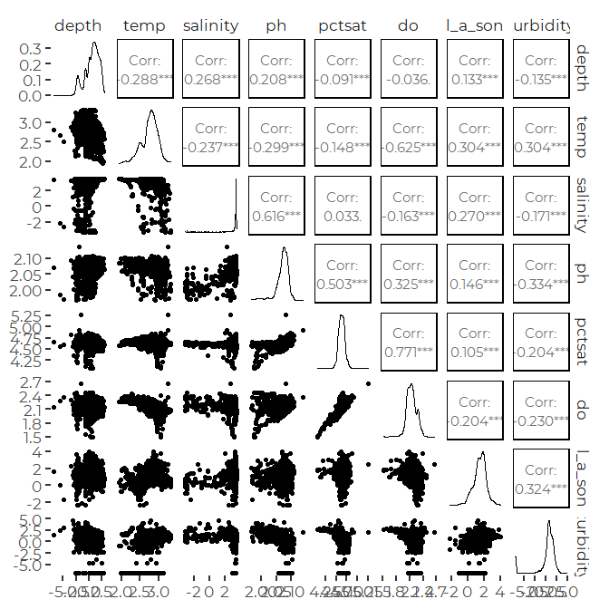
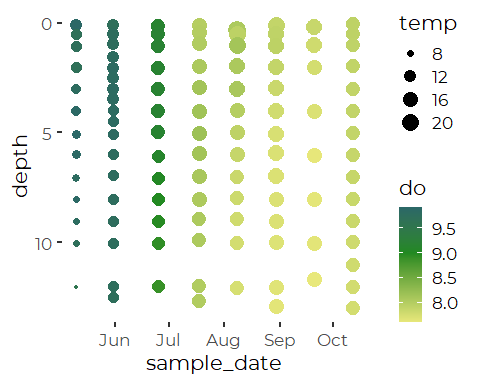
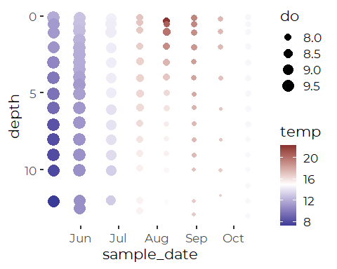

Initial Review of Maine DEP Vertical Profile Data from Sondes
================
Curtis C. Bohlen, Casco Bay Estuary Partnership.
04/26/2021

-   [Load Data](#load-data)
    -   [Delete Bad Temperature Data](#delete-bad-temperature-data)
-   [Summary of Metadata](#summary-of-metadata)
    -   [QA/QC Samples](#qaqc-samples)
    -   [Censoring Flags](#censoring-flags)
    -   [Units](#units)
-   [Review of Sonde Data](#review-of-sonde-data)
    -   [Scatterplot Matrix (Pairs
        Plot)](#scatterplot-matrix-pairs-plot)
    -   [Sites by Depths (Useless?)](#sites-by-depths-useless)
    -   [How often was each site
        sampled?](#how-often-was-each-site-sampled)


\#Load libraries

``` r
library(tidyverse)
#> Warning: package 'tidyverse' was built under R version 4.0.5
#> -- Attaching packages --------------------------------------- tidyverse 1.3.1 --
#> v ggplot2 3.3.5     v purrr   0.3.4
#> v tibble  3.1.6     v dplyr   1.0.7
#> v tidyr   1.1.4     v stringr 1.4.0
#> v readr   2.1.0     v forcats 0.5.1
#> Warning: package 'ggplot2' was built under R version 4.0.5
#> Warning: package 'tidyr' was built under R version 4.0.5
#> Warning: package 'dplyr' was built under R version 4.0.5
#> Warning: package 'forcats' was built under R version 4.0.5
#> -- Conflicts ------------------------------------------ tidyverse_conflicts() --
#> x dplyr::filter() masks stats::filter()
#> x dplyr::lag()    masks stats::lag()

library(GGally)
#> Warning: package 'GGally' was built under R version 4.0.5
#> Registered S3 method overwritten by 'GGally':
#>   method from   
#>   +.gg   ggplot2

library(CBEPgraphics)
load_cbep_fonts()
theme_set(theme_cbep())
```

# Load Data

``` r
sonde_data <- read_csv(file.path('dep_sonde_data.csv'),
                       col_types = cols(
                         site_name = col_character(),
                         site = col_character(),
                         dt = col_date(format = ""),
                         month = col_character(),
                         year = col_double(),
                         time = col_time(format = ""),
                         hour = col_double(),
                         depth = col_double(),
                         temp = col_double(),
                         salinity = col_double(),
                         ph = col_double(),
                         pctsat = col_double(),
                         do = col_double(),
                         chl_a_sonde = col_double(),
                         turbidity = col_double(),
                         turbidity_cens = col_logical())) %>%
              rename(sample_date = dt)
```

## Delete Bad Temperature Data

We note a series of low temperature data. These appear to be
problematic. There is a collection of temperature values below 1 C in
spring and summer months, which is unlikely. We delete those
questionable temperature values.

``` r
sonde_data <- sonde_data %>%
  mutate(temp = if_else(temp < 5,
                 NA_real_, temp))
```

# Summary of Metadata

## QA/QC Samples

We conducted no analysis of QA/QC samples, and simply deleted then from
the data to avoid confusion.

## Censoring Flags

While preparing our working data, we separated raw observations from
text annotations, including data quality flags. In the sonde-related
data, we only had to contend with (1) left censoring of turbidity data ,
and (2) data quality flags on all chlorophyll data.

Since all sonde-related chlorophyll data was flagged as of questionable
accuracy (with “J” flags), it does us no good to track that information
during further analysis. We retain all data, but recognize that it’s
accuracy is suspect, especially in comparison to laboratory results. We
believe the “J” flags reflect the fact that these are “raw” estimates of
chlorophyll based only on observed florescence, never recalibrated based
on laboratory samples.

We also had a few “U&lt;” flags in the Turbidity data. We separated out
a `TRUE` / `FALSE` flag to indicated censored values, with the name
’turbidity\_cens\`.

## Units

Our derived data files lack any indication of units. Units were
documented in the source Excel files. We summarize relevant information
here.

| Variable Name | Meaning                                         | Units                       |
|---------------|-------------------------------------------------|-----------------------------|
| site\_name    | DEP “Site ID”                                   |                             |
| site          | DEP “Sample Point ID” without depth designation |                             |
| sample\_date  | Date of sample collection                       | yyyy-mm-dd format           |
| month         | Month, derived from date                        | Three letter codes          |
| year          | Year, derived from date                         |                             |
| time          | time of sample                                  | 24 hour clock, hh:mm format |
| hour          | hour, derived from time                         |                             |
| depth         | Sample Depth                                    | Meters                      |
| temp          | Water Temperature                               | DEG C                       |
| salinity      | Salinity                                        | PPTH                        |
| ph            | pH                                              |                             |
| pctsat        | Dissolved Oxygen Saturation                     | %                           |
| do            | Dissolved Oxygen                                | MG/L                        |
| turbidity     | Turbidity                                       | NTU                         |
| chl\_a\_sonde | Chlorophyll A, measured with a sonde            | UG/L                        |

# Review of Sonde Data

## Scatterplot Matrix (Pairs Plot)

``` r
tmp <- sonde_data %>%
  select(depth:turbidity)
ggpairs(log(tmp), progress = FALSE)
#> Warning in ggally_statistic(data = data, mapping = mapping, na.rm = na.rm, :
#> Removed 57 rows containing missing values
#> Warning in ggally_statistic(data = data, mapping = mapping, na.rm = na.rm, :
#> Removed 3 rows containing missing values
#> Warning in ggally_statistic(data = data, mapping = mapping, na.rm = na.rm, :
#> Removed 139 rows containing missing values
#> Warning in ggally_statistic(data = data, mapping = mapping, na.rm = na.rm, :
#> Removed 2 rows containing missing values
#> Warning in ggally_statistic(data = data, mapping = mapping, na.rm = na.rm, :
#> Removed 9 rows containing missing values
#> Warning in ggally_statistic(data = data, mapping = mapping, na.rm = na.rm, :
#> Removed 638 rows containing missing values
#> Warning in ggally_statistic(data = data, mapping = mapping, na.rm = na.rm, :
#> Removed 641 rows containing missing values
#> Warning: Removed 57 rows containing missing values (geom_point).
#> Warning: Removed 57 rows containing non-finite values (stat_density).
#> Warning in ggally_statistic(data = data, mapping = mapping, na.rm = na.rm, :
#> Removed 59 rows containing missing values
#> Warning in ggally_statistic(data = data, mapping = mapping, na.rm = na.rm, :
#> Removed 192 rows containing missing values
#> Warning in ggally_statistic(data = data, mapping = mapping, na.rm = na.rm, :
#> Removed 58 rows containing missing values
#> Warning in ggally_statistic(data = data, mapping = mapping, na.rm = na.rm, :
#> Removed 65 rows containing missing values
#> Warning in ggally_statistic(data = data, mapping = mapping, na.rm = na.rm, :
#> Removed 644 rows containing missing values
#> Warning in ggally_statistic(data = data, mapping = mapping, na.rm = na.rm, :
#> Removed 690 rows containing missing values
#> Warning: Removed 3 rows containing missing values (geom_point).
#> Warning: Removed 59 rows containing missing values (geom_point).
#> Warning: Removed 3 rows containing non-finite values (stat_density).
#> Warning in ggally_statistic(data = data, mapping = mapping, na.rm = na.rm, :
#> Removed 142 rows containing missing values
#> Warning in ggally_statistic(data = data, mapping = mapping, na.rm = na.rm, :
#> Removed 3 rows containing missing values
#> Warning in ggally_statistic(data = data, mapping = mapping, na.rm = na.rm, :
#> Removed 10 rows containing missing values
#> Warning in ggally_statistic(data = data, mapping = mapping, na.rm = na.rm, :
#> Removed 639 rows containing missing values
#> Warning in ggally_statistic(data = data, mapping = mapping, na.rm = na.rm, :
#> Removed 643 rows containing missing values
#> Warning: Removed 139 rows containing missing values (geom_point).
#> Warning: Removed 192 rows containing missing values (geom_point).
#> Warning: Removed 142 rows containing missing values (geom_point).
#> Warning: Removed 139 rows containing non-finite values (stat_density).
#> Warning in ggally_statistic(data = data, mapping = mapping, na.rm = na.rm, :
#> Removed 141 rows containing missing values
#> Warning in ggally_statistic(data = data, mapping = mapping, na.rm = na.rm, :
#> Removed 148 rows containing missing values
#> Warning in ggally_statistic(data = data, mapping = mapping, na.rm = na.rm, :
#> Removed 693 rows containing missing values
#> Warning in ggally_statistic(data = data, mapping = mapping, na.rm = na.rm, :
#> Removed 774 rows containing missing values
#> Warning: Removed 2 rows containing missing values (geom_point).
#> Warning: Removed 58 rows containing missing values (geom_point).
#> Warning: Removed 3 rows containing missing values (geom_point).
#> Warning: Removed 141 rows containing missing values (geom_point).
#> Warning: Removed 2 rows containing non-finite values (stat_density).
#> Warning in ggally_statistic(data = data, mapping = mapping, na.rm = na.rm, :
#> Removed 9 rows containing missing values
#> Warning in ggally_statistic(data = data, mapping = mapping, na.rm = na.rm, :
#> Removed 639 rows containing missing values
#> Warning in ggally_statistic(data = data, mapping = mapping, na.rm = na.rm, :
#> Removed 642 rows containing missing values
#> Warning: Removed 9 rows containing missing values (geom_point).
#> Warning: Removed 65 rows containing missing values (geom_point).
#> Warning: Removed 10 rows containing missing values (geom_point).
#> Warning: Removed 148 rows containing missing values (geom_point).
#> Warning: Removed 9 rows containing missing values (geom_point).
#> Warning: Removed 9 rows containing non-finite values (stat_density).
#> Warning in ggally_statistic(data = data, mapping = mapping, na.rm = na.rm, :
#> Removed 639 rows containing missing values
#> Warning in ggally_statistic(data = data, mapping = mapping, na.rm = na.rm, :
#> Removed 649 rows containing missing values
#> Warning: Removed 638 rows containing missing values (geom_point).
#> Warning: Removed 644 rows containing missing values (geom_point).
#> Warning: Removed 639 rows containing missing values (geom_point).
#> Warning: Removed 693 rows containing missing values (geom_point).
#> Warning: Removed 639 rows containing missing values (geom_point).

#> Warning: Removed 639 rows containing missing values (geom_point).
#> Warning: Removed 638 rows containing non-finite values (stat_density).
#> Warning in ggally_statistic(data = data, mapping = mapping, na.rm = na.rm, :
#> Removed 1180 rows containing missing values
#> Warning: Removed 641 rows containing missing values (geom_point).
#> Warning: Removed 690 rows containing missing values (geom_point).
#> Warning: Removed 643 rows containing missing values (geom_point).
#> Warning: Removed 774 rows containing missing values (geom_point).
#> Warning: Removed 642 rows containing missing values (geom_point).
#> Warning: Removed 649 rows containing missing values (geom_point).
#> Warning: Removed 1180 rows containing missing values (geom_point).
#> Warning: Removed 641 rows containing non-finite values (stat_density).
```



Many of the low turbidity values are at NTU = 0.001, but they are not
flagged as censored observations. We suspect but can not document that
these are minimum possible values on the sensor, and thus may be
functionally censored values.

We see expected general correlations, somewhat blunted by complexity of
sampling histories, with multiple sites and dates.

## Sites by Depths (Useless?)

``` r
tmp <- sonde_data %>%
  mutate(dpth_clss = if_else(depth < 2, round(depth, 1), round(depth,0)))
xtabs(~ dpth_clss + site, data = tmp)
#>          site
#> dpth_clss BMR02 CBPR CR-31 CR-44 CR00 CRTRIB0 EEB18 FR03 FR04 FR05A FR05B FR07
#>       0       0    2     0     0    2       0     1    0    0     0     0    0
#>       0.1    15   21     6     3    2       3    20    2    3     2     1    2
#>       0.2    10    7     1     0    1       1     6    1    0     0     0    1
#>       0.3     3    2     1     0    0       1     2    0    0     0     0    0
#>       0.4     2    3     0     0    0       1     1    0    0     0     0    0
#>       0.5    16   24     6     3    2       3    23    3    3     2     0    3
#>       0.6     2    3     0     0    0       0     1    0    0     0     1    0
#>       0.7     0    0     0     0    0       0     1    0    0     0     0    0
#>       0.8     0    1     1     0    1       0     1    0    0     0     0    0
#>       0.9     2    1     0     0    0       0     1    0    0     0     0    0
#>       1      22   20     4     2    0       1    18    3    3     2     1    2
#>       1.1     4    6     1     1    1       0    11    0    0     0     0    1
#>       1.2     1    2     0     0    0       1     1    0    0     0     0    0
#>       1.3     0    2     0     0    0       0     2    0    0     0     0    0
#>       1.4     1    0     0     0    0       0     1    0    0     0     0    0
#>       1.5    15   17     3     2    1       1    20    2    0     0     1    0
#>       1.6     1    2     0     0    0       1     1    0    0     0     0    0
#>       1.7     0    1     0     0    0       0     1    0    0     0     0    0
#>       1.8     0    1     1     1    0       0     3    0    0     0     0    0
#>       1.9     0    0     1     0    0       0     1    0    0     0     0    0
#>       2      37   27     3     0    0       3    30    4    3     2     2    3
#>       3      44   27     4     0    0       0    13    4    3     2     0    3
#>       4      28    3     4     0    0       0     2    3    3     2     0    3
#>       5       9    0     2     0    0       0     0    3    3     2     0    3
#>       6       0    0     0     0    0       0     0    1    3     2     0    3
#>       7       0    0     0     0    0       0     0    0    3     2     0    3
#>       8       0    0     0     0    0       0     0    0    3     2     0    3
#>       9       0    0     0     0    0       0     0    0    4     2     0    3
#>       10      0    0     0     0    0       0     0    0    2     1     0    3
#>       11      0    0     0     0    0       0     0    0    1     2     0    2
#>       12      0    0     0     0    0       0     0    0    3     0     0    4
#>       13      0    0     0     0    0       0     0    0    1     0     0    0
#>       14      0    0     0     0    0       0     0    0    0     0     0    0
#>       15      0    0     0     0    0       0     0    0    0     0     0    0
#>       16      0    0     0     0    0       0     0    0    0     0     0    0
#>       17      0    0     0     0    0       0     0    0    0     0     0    0
#>       18      0    0     0     0    0       0     0    0    0     0     0    0
#>       19      0    0     0     0    0       0     0    0    0     0     0    0
#>       20      0    0     0     0    0       0     0    0    0     0     0    0
#>       21      0    0     0     0    0       0     0    0    0     0     0    0
#>          site
#> dpth_clss FR09 HR02 HR03 HR04 HR05 LC02 P6FGG P7CBI PR-17 PR-28 PRV70 RR-01
#>       0      0    0    0    0    0    0     0     0     1     0     1     0
#>       0.1   21    3    4    4    3    3     9     9    18    24    20     6
#>       0.2    7    0    1    1    0    0     8     4     6     5     6     1
#>       0.3    3    0    0    0    0    0     2     3     4     3     5     1
#>       0.4    1    0    0    0    0    0     0     0     0     1     2     0
#>       0.5   24    3    5    5    3    3     4     4    23    26    25     6
#>       0.6    2    0    0    0    0    0     0     0     0     1     0     0
#>       0.7    0    0    0    0    0    0     0     0     0     0     0     0
#>       0.8    0    0    0    0    0    0     0     0     3     0     0     0
#>       0.9    3    0    0    0    0    0     0     0     0     1     0     0
#>       1     22    3    5    5    3    2    13    13    22    22    23     4
#>       1.1    6    0    0    0    0    1     3     3     2     7     6     1
#>       1.2    0    0    0    0    0    0     0     0     3     0     0     1
#>       1.3    0    0    0    0    0    0     0     0     0     0     0     0
#>       1.4    0    0    0    0    0    0     0     0     0     0     0     0
#>       1.5    2    2    3    1    0    3     0     0    17     7    14     2
#>       1.6    1    1    1    0    0    0     0     0     2     0     4     0
#>       1.7    0    0    0    0    0    0     0     0     1     0     0     0
#>       1.8    0    0    0    0    0    0     0     0     3     0     0     0
#>       1.9    0    1    0    0    0    0     0     1     2     2     2     0
#>       2     31    4    5    5    3    5    16    15    27    31    32     4
#>       3     34    0    9    7    3    5    16    16    20    35    40     4
#>       4     34    0    4    5    3    1    16    16    19    34    21     2
#>       5     32    0    3    4    3    0    15    16     7    30    25     2
#>       6     31    0    0    5    4    0    16    16     0    18     4     0
#>       7     30    0    0    2    3    0    17    16     0    13     0     0
#>       8     31    0    0    0    3    0    15    16     0     7     0     0
#>       9     30    0    0    0    3    0    15    17     0     1     0     0
#>       10    29    0    0    0    3    0    15    14     0     0     0     0
#>       11    15    0    0    0    1    0    11    10     0     0     0     0
#>       12    26    0    0    0    0    0    13    11     0     0     0     0
#>       13     7    0    0    0    0    0     9     6     0     0     0     0
#>       14     1    0    0    0    0    0    12     1     0     0     0     0
#>       15     0    0    0    0    0    0     5     0     0     0     0     0
#>       16     0    0    0    0    0    0     5     0     0     0     0     0
#>       17     0    0    0    0    0    0     3     0     0     0     0     0
#>       18     0    0    0    0    0    0     2     0     0     0     0     0
#>       19     0    0    0    0    0    0     1     0     0     0     0     0
#>       20     0    0    0    0    0    0     1     0     0     0     0     0
#>       21     0    0    0    0    0    0     1     0     0     0     0     0
#>          site
#> dpth_clss RR-06 RR-13 RR-19 RR-20
#>       0       0     1     0     0
#>       0.1     7     6     4     3
#>       0.2     2     1     1     0
#>       0.3     1     2     0     1
#>       0.4     0     0     1     0
#>       0.5     8     8     4     3
#>       0.6     0     0     0     0
#>       0.7     0     0     0     0
#>       0.8     0     0     0     0
#>       0.9     0     0     0     0
#>       1       4     7     4     3
#>       1.1     4     1     1     0
#>       1.2     0     0     0     0
#>       1.3     0     0     0     0
#>       1.4     0     0     0     0
#>       1.5     5     6     3     3
#>       1.6     0     0     0     0
#>       1.7     0     0     0     0
#>       1.8     0     0     0     0
#>       1.9     0     0     0     0
#>       2      10     9     6     4
#>       3      10     9     9     0
#>       4       8     3     2     0
#>       5       2     2     1     0
#>       6       1     1     0     0
#>       7       0     0     0     0
#>       8       0     0     0     0
#>       9       0     0     0     0
#>       10      0     0     0     0
#>       11      0     0     0     0
#>       12      0     0     0     0
#>       13      0     0     0     0
#>       14      0     0     0     0
#>       15      0     0     0     0
#>       16      0     0     0     0
#>       17      0     0     0     0
#>       18      0     0     0     0
#>       19      0     0     0     0
#>       20      0     0     0     0
#>       21      0     0     0     0
rm(tmp)
```

Most sonde data appears to be downcast data, with data collected at (or
near) specific depths. It looks like there has been inconsistency of
handling shallow water samples. Some sites shallow samples may have been
used to estimate K<sub>d</sub>.

## How often was each site sampled?

We make an assumption here that sampling on one day is all related.

``` r
tmp <- sonde_data %>%
  group_by(site, sample_date) %>%
  summarize(was_sampled = sum(! is.na(depth)) > 1,
            .groups = 'drop')
xt <- xtabs(~ sample_date + site, data = tmp)
tot <- colSums(xt)
tot
#>   BMR02    CBPR   CR-31   CR-44    CR00 CRTRIB0   EEB18    FR03    FR04   FR05A 
#>      29      31       6       3       6       6      29       3       3       2 
#>   FR05B    FR07    FR09    HR02    HR03    HR04    HR05    LC02   P6FGG   P7CBI 
#>       1       3      31       3       5       5       3       3      17      16 
#>   PR-17   PR-28   PRV70   RR-01   RR-06   RR-13   RR-19   RR-20 
#>      25      31      30       6       8       8       5       3
names(tot[tot > 20])
#> [1] "BMR02" "CBPR"  "EEB18" "FR09"  "PR-17" "PR-28" "PRV70"
rm(tmp, xt)
```

We see clearly that certain sites had sonde data collected much more
frequently. Most of those are FOCB “profile” Sites, so it is likely
there is some data overlap with the FOCB downcast data.

We can emphasize data from selected sites, which may clarify what is
going on. WeE chose first to process data from sites with at least 29
sampling dates. lets look at site “FR09”

``` r
sonde_data %>%
  filter(site == 'FR09', year == 2018) %>%
ggplot(aes(sample_date, depth, color = do, size = temp)) +
  geom_point() +
  scale_color_gradient2(midpoint = 9, 
                         low = scales::muted("yellow", l = 90),
                         mid = scales::muted("lightgreen", l = 50),
                         high = scales::muted("lightblue", l = 20, c = 100)) +
   scale_y_reverse()
```



``` r
sonde_data %>%
  filter(site == 'FR09', year == 2018) %>%
ggplot(aes(sample_date, depth, color = temp, size = do)) +
  geom_point() +
  scale_colour_gradient2(midpoint = 15, 
                         high = scales::muted("red"), 
                         low = scales::muted("blue")) +
   scale_y_reverse()
```



To create a more typical depth-time plot we need to create data with
equally spaced (interpolated) values. That is beyond our current scope.
